# Sơ đồ Hoạt động và Sơ đồ Tuần tự - Use Case Giảng viên

## Mục lục

### Sơ đồ Hoạt động (Activity Diagrams)
1. [Đăng nhập hệ thống](#sơ-đồ-hoạt-động---đăng-nhập-hệ-thống) - UC-GV-01
2. [Tạo khóa học mới](#sơ-đồ-hoạt-động---tạo-khóa-học-mới) - UC-GV-02
3. [Chỉnh sửa khóa học](#sơ-đồ-hoạt-động---chỉnh-sửa-khóa-học) - UC-GV-03
4. [Xóa khóa học](#sơ-đồ-hoạt-động---xóa-khóa-học) - UC-GV-04
5. [Xuất bản khóa học](#sơ-đồ-hoạt-động---xuất-bản-khóa-học) - UC-GV-05
6. [Thêm nội dung vào khóa học](#sơ-đồ-hoạt-động---thêm-nội-dung-vào-khóa-học) - UC-GV-06
7. [Chỉnh sửa nội dung](#sơ-đồ-hoạt-động---chỉnh-sửa-nội-dung) - UC-GV-07
8. [Xóa nội dung](#sơ-đồ-hoạt-động---xóa-nội-dung) - UC-GV-08
9. [Sắp xếp thứ tự nội dung](#sơ-đồ-hoạt-động---sắp-xếp-thứ-tự-nội-dung) - UC-GV-09
10. [Xem danh sách học viên](#sơ-đồ-hoạt-động---xem-danh-sách-học-viên) - UC-GV-10
11. [Theo dõi tiến độ học viên](#sơ-đồ-hoạt-động---theo-dõi-tiến-độ-học-viên) - UC-GV-11
12. [Xem thống kê khóa học](#sơ-đồ-hoạt-động---xem-thống-kê-khóa-học) - UC-GV-12
13. [Tạo bài viết blog](#sơ-đồ-hoạt-động---tạo-bài-viết-blog) - UC-GV-13
14. [Chỉnh sửa bài viết blog](#sơ-đồ-hoạt-động---chỉnh-sửa-bài-viết-blog) - UC-GV-14
15. [Xóa bài viết blog](#sơ-đồ-hoạt-động---xóa-bài-viết-blog) - UC-GV-15
16. [Xem đánh giá khóa học](#sơ-đồ-hoạt-động---xem-đánh-giá-khóa-học) - UC-GV-16
17. [Quản lý profile](#sơ-đồ-hoạt-động---quản-lý-profile) - UC-GV-17
18. [Xem dashboard giảng viên](#sơ-đồ-hoạt-động---xem-dashboard-giảng-viên) - UC-GV-18

### Sơ đồ Tuần tự (Sequence Diagrams)
1. [Đăng nhập hệ thống](#sơ-đồ-tuần-tự---đăng-nhập-hệ-thống) - UC-GV-01
2. [Tạo khóa học mới](#sơ-đồ-tuần-tự---tạo-khóa-học-mới) - UC-GV-02
3. [Chỉnh sửa khóa học](#sơ-đồ-tuần-tự---chỉnh-sửa-khóa-học) - UC-GV-03
4. [Xóa khóa học](#sơ-đồ-tuần-tự---xóa-khóa-học) - UC-GV-04
5. [Xuất bản khóa học](#sơ-đồ-tuần-tự---xuất-bản-khóa-học) - UC-GV-05
6. [Thêm nội dung vào khóa học](#sơ-đồ-tuần-tự---thêm-nội-dung-vào-khóa-học) - UC-GV-06
7. [Chỉnh sửa nội dung](#sơ-đồ-tuần-tự---chỉnh-sửa-nội-dung) - UC-GV-07
8. [Xóa nội dung](#sơ-đồ-tuần-tự---xóa-nội-dung) - UC-GV-08
9. [Sắp xếp thứ tự nội dung](#sơ-đồ-tuần-tự---sắp-xếp-thứ-tự-nội-dung) - UC-GV-09
10. [Xem danh sách học viên](#sơ-đồ-tuần-tự---xem-danh-sách-học-viên) - UC-GV-10
11. [Theo dõi tiến độ học viên](#sơ-đồ-tuần-tự---theo-dõi-tiến-độ-học-viên) - UC-GV-11
12. [Xem thống kê khóa học](#sơ-đồ-tuần-tự---xem-thống-kê-khóa-học) - UC-GV-12
13. [Tạo bài viết blog](#sơ-đồ-tuần-tự---tạo-bài-viết-blog) - UC-GV-13
14. [Chỉnh sửa bài viết blog](#sơ-đồ-tuần-tự---chỉnh-sửa-bài-viết-blog) - UC-GV-14
15. [Xóa bài viết blog](#sơ-đồ-tuần-tự---xóa-bài-viết-blog) - UC-GV-15
16. [Xem đánh giá khóa học](#sơ-đồ-tuần-tự---xem-đánh-giá-khóa-học) - UC-GV-16
17. [Quản lý profile](#sơ-đồ-tuần-tự---quản-lý-profile) - UC-GV-17
18. [Xem dashboard giảng viên](#sơ-đồ-tuần-tự---xem-dashboard-giảng-viên) - UC-GV-18

---

## Sơ đồ Hoạt động - Đăng nhập hệ thống

**Use Case:** UC-GV-01

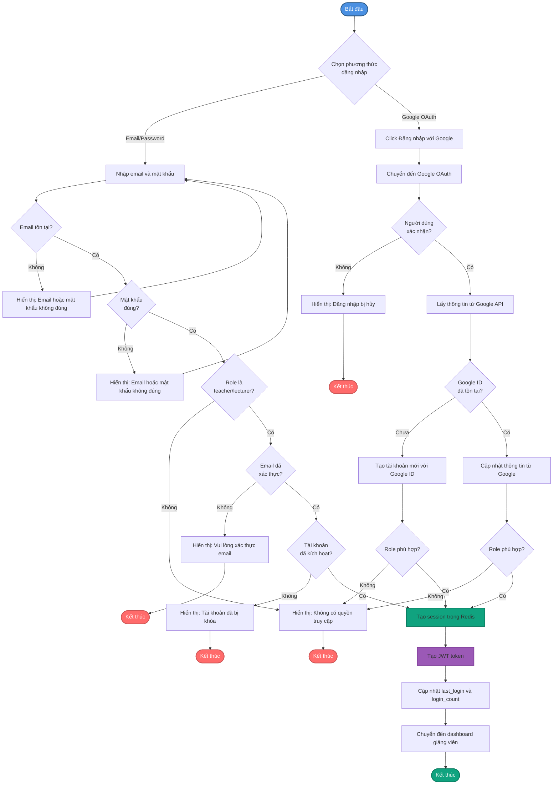

## Sơ đồ Hoạt động - Tạo khóa học mới

**Use Case:** UC-GV-02

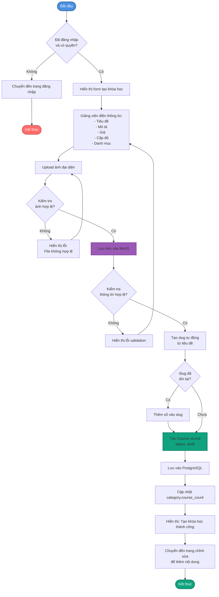

## Sơ đồ Hoạt động - Thêm nội dung vào khóa học

**Use Case:** UC-GV-06

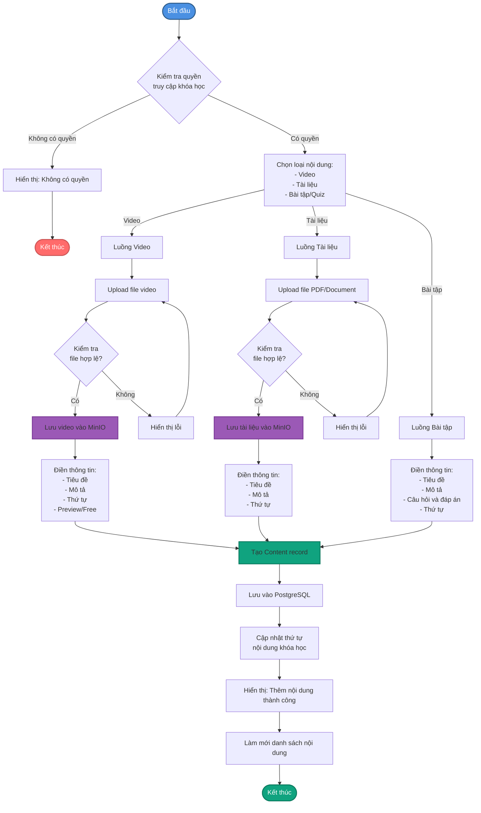

## Sơ đồ Hoạt động - Theo dõi tiến độ học viên

**Use Case:** UC-GV-11

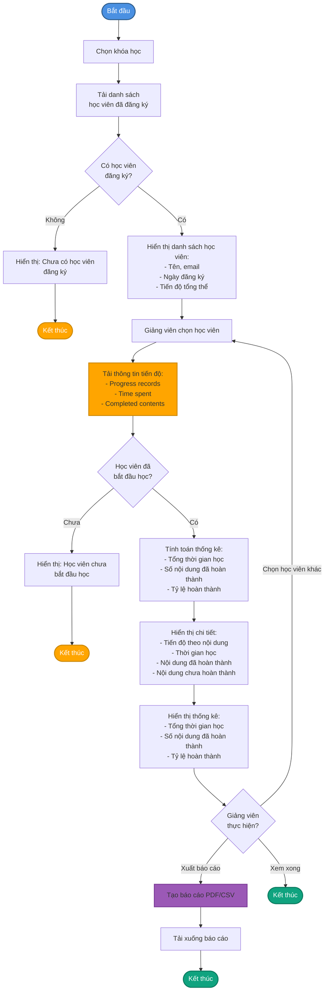

## Sơ đồ Hoạt động - Tạo bài viết blog

**Use Case:** UC-GV-13

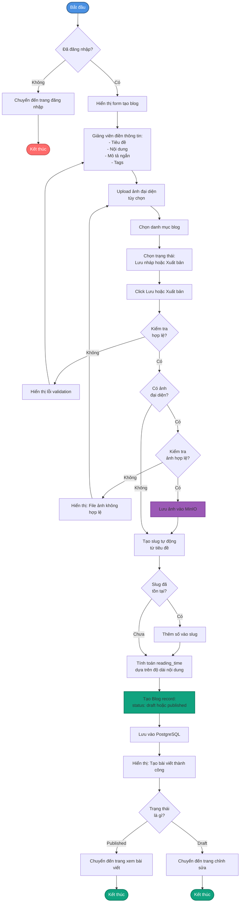

---

## Sơ đồ Tuần tự - Tạo khóa học mới

**Use Case:** UC-GV-02

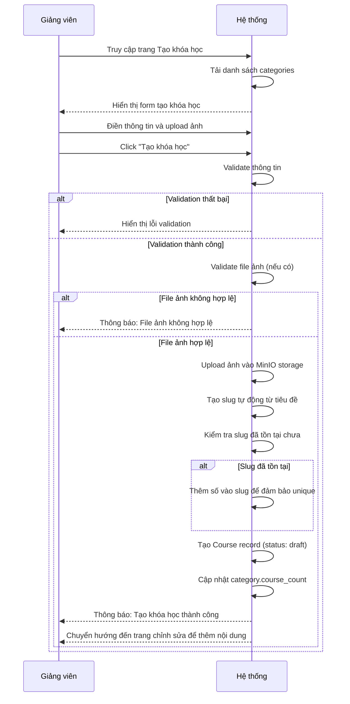

## Sơ đồ Tuần tự - Thêm nội dung vào khóa học

**Use Case:** UC-GV-06

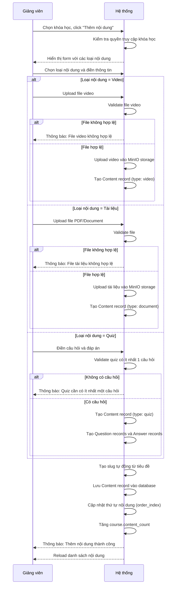

## Sơ đồ Tuần tự - Theo dõi tiến độ học viên

**Use Case:** UC-GV-11

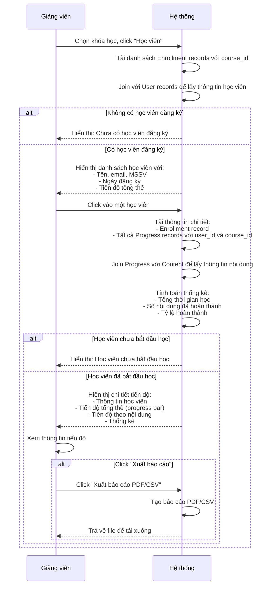

## Sơ đồ Tuần tự - Tạo bài viết blog

**Use Case:** UC-GV-13

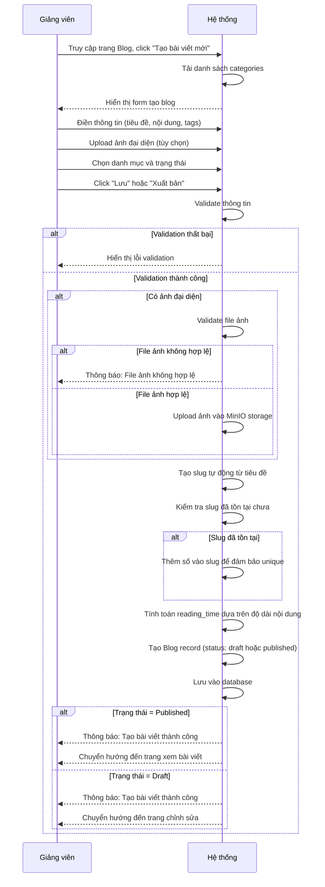

## Sơ đồ Hoạt động - Chỉnh sửa khóa học

**Use Case:** UC-GV-03

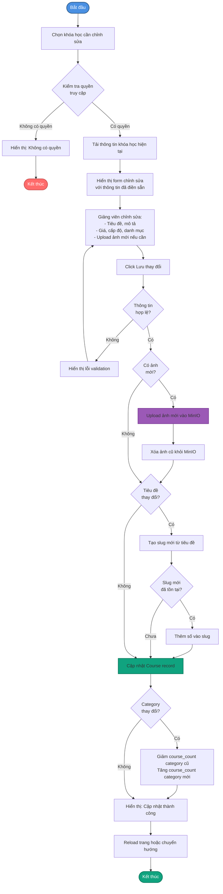

## Sơ đồ Hoạt động - Xóa khóa học

**Use Case:** UC-GV-04

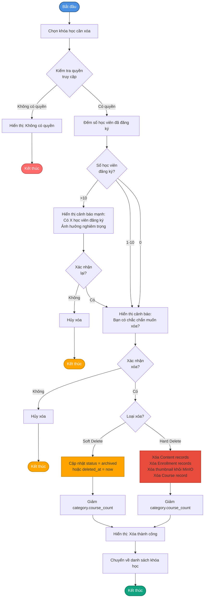

## Sơ đồ Hoạt động - Xuất bản khóa học

**Use Case:** UC-GV-05

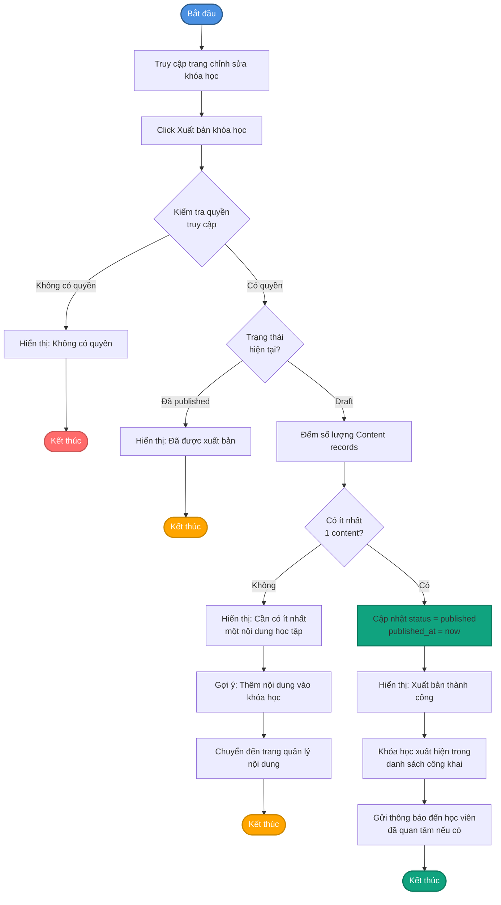

## Sơ đồ Hoạt động - Chỉnh sửa nội dung

**Use Case:** UC-GV-07

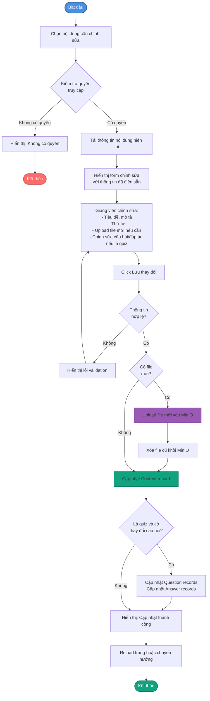

## Sơ đồ Hoạt động - Xóa nội dung

**Use Case:** UC-GV-08

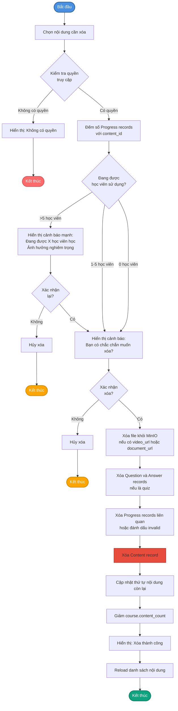

## Sơ đồ Hoạt động - Sắp xếp thứ tự nội dung

**Use Case:** UC-GV-09

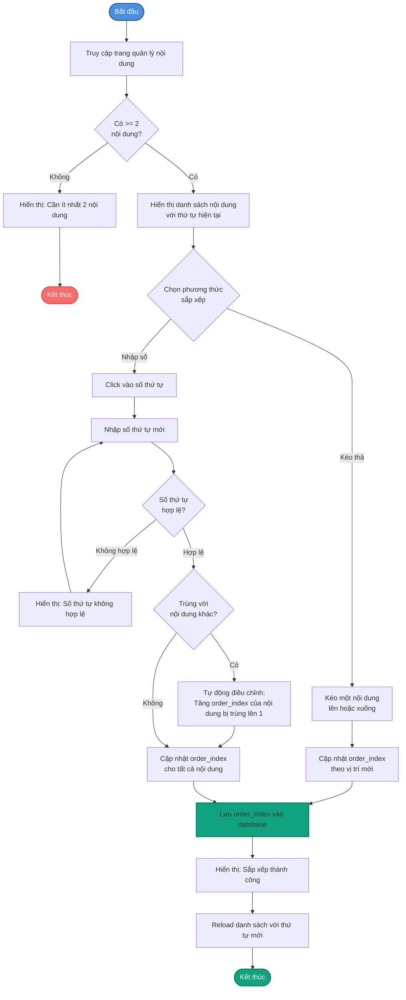

## Sơ đồ Hoạt động - Xem danh sách học viên

**Use Case:** UC-GV-10

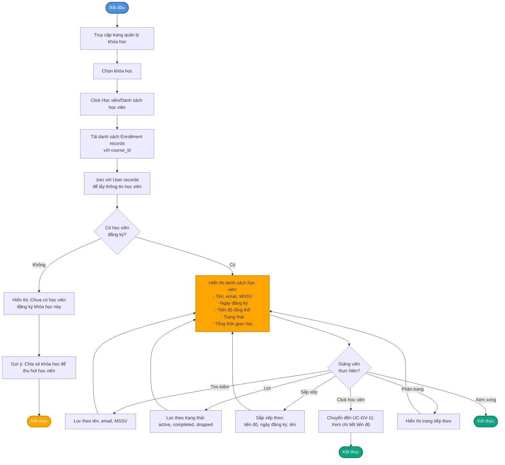

## Sơ đồ Hoạt động - Xem thống kê khóa học

**Use Case:** UC-GV-12

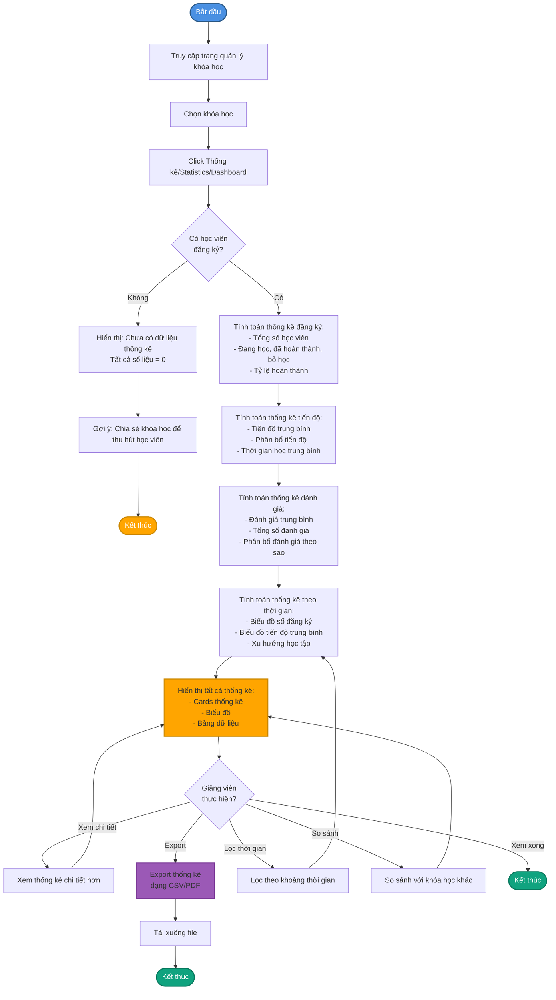

## Sơ đồ Hoạt động - Chỉnh sửa bài viết blog

**Use Case:** UC-GV-14

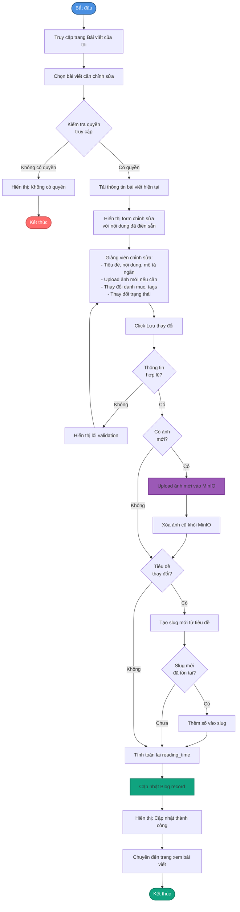

## Sơ đồ Hoạt động - Xóa bài viết blog

**Use Case:** UC-GV-15

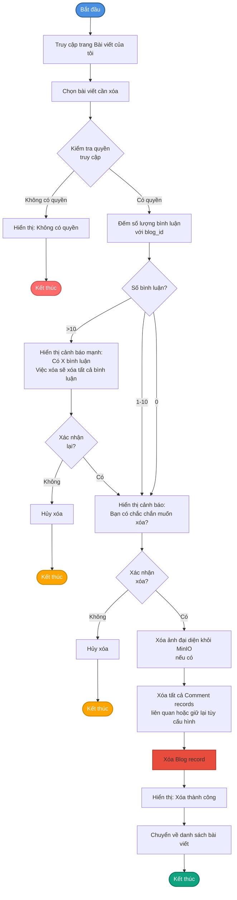

## Sơ đồ Hoạt động - Xem đánh giá khóa học

**Use Case:** UC-GV-16

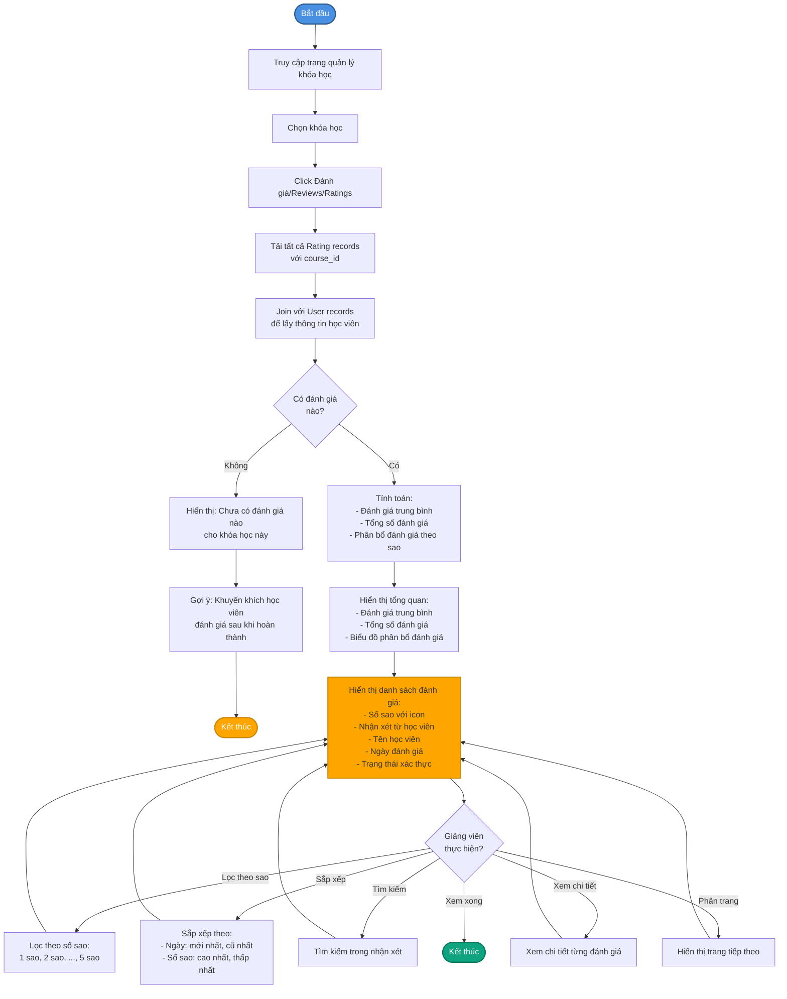

## Sơ đồ Hoạt động - Quản lý profile

**Use Case:** UC-GV-17

```mermaid
flowchart TD
    Start([Bắt đầu]) --> AccessProfile[Truy cập trang Profile]
    AccessProfile --> LoadUserInfo[Tải thông tin user hiện tại]
    LoadUserInfo --> DisplayInfo[Hiển thị thông tin:<br/>- Họ tên, email, MSSV<br/>- Avatar, vai trò<br/>- Ngày tham gia<br/>- Số khóa học đã tạo]
    
    DisplayInfo --> UserAction{Giảng viên<br/>thực hiện?}
    
    UserAction -->|Cập nhật thông tin| EditInfo[Chỉnh sửa họ tên, MSSV]
    EditInfo --> ValidateInfo{Thông tin<br/>hợp lệ?}
    ValidateInfo -->|Không| ShowError1[Hiển thị lỗi validation]
    ShowError1 --> EditInfo
    ValidateInfo -->|Có| UpdateUserInfo[Cập nhật User record]
    UpdateUserInfo --> ShowSuccess1[Hiển thị: Cập nhật thành công]
    ShowSuccess1 --> ReloadPage
    
    UserAction -->|Thay đổi avatar| ClickAvatar[Click Thay đổi avatar]
    ClickAvatar --> UploadAvatar[Upload ảnh mới]
    UploadAvatar --> ValidateAvatar{Ảnh<br/>hợp lệ?}
    ValidateAvatar -->|Không| ShowError2[Hiển thị: File ảnh không hợp lệ]
    ShowError2 --> UploadAvatar
    ValidateAvatar -->|Có| SaveAvatar[Upload ảnh vào MinIO<br/>hoặc uploads/avatars]
    SaveAvatar --> DeleteOldAvatar[Xóa avatar cũ nếu có]
    DeleteOldAvatar --> UpdateAvatarPath[Cập nhật User.avatar_path]
    UpdateAvatarPath --> ShowSuccess2[Hiển thị: Cập nhật thành công]
    ShowSuccess2 --> ReloadPage
    
    UserAction -->|Đổi mật khẩu| ClickChangePassword[Click Đổi mật khẩu]
    ClickChangePassword --> InputOldPassword[Nhập mật khẩu cũ]
    InputOldPassword --> InputNewPassword[Nhập mật khẩu mới]
    InputNewPassword --> InputConfirm[Nhập xác nhận mật khẩu mới]
    InputConfirm --> ValidatePassword{Kiểm tra:<br/>- Mật khẩu cũ đúng?<br/>- Mật khẩu mới >= 6 ký tự?<br/>- Mật khẩu mới và xác nhận khớp?}
    
    ValidatePassword -->|Mật khẩu cũ sai| ShowError3[Hiển thị: Mật khẩu cũ không đúng]
    ShowError3 --> InputOldPassword
    
    ValidatePassword -->|Mật khẩu mới và xác nhận không khớp| ShowError4[Hiển thị: Mật khẩu xác nhận không khớp]
    ShowError4 --> InputNewPassword
    
    ValidatePassword -->|Hợp lệ| HashPassword[Hash mật khẩu mới bằng bcrypt]
    HashPassword --> UpdatePassword[Cập nhật User.password]
    UpdatePassword --> ShowSuccess3[Hiển thị: Cập nhật thành công]
    ShowSuccess3 --> ReloadPage[Reload trang hoặc cập nhật hiển thị]
    
    ReloadPage --> End1([Kết thúc])
    
    style Start fill:#4A90E2,stroke:#2E5C8A,stroke-width:2px,color:#fff
    style End1 fill:#10A37F,stroke:#0A7A5F,stroke-width:2px,color:#fff
    style UpdateUserInfo fill:#10A37F,stroke:#0A7A5F,stroke-width:2px
    style UpdateAvatarPath fill:#10A37F,stroke:#0A7A5F,stroke-width:2px
    style UpdatePassword fill:#10A37F,stroke:#0A7A5F,stroke-width:2px
    style SaveAvatar fill:#9B59B6,stroke:#7D3C98,stroke-width:2px
```

## Sơ đồ Hoạt động - Xem dashboard giảng viên

**Use Case:** UC-GV-18

```mermaid
flowchart TD
    Start([Bắt đầu]) --> AccessDashboard[Truy cập trang Dashboard<br/>hoặc sau khi đăng nhập]
    AccessDashboard --> LoadData[Tải dữ liệu thống kê:<br/>- Course records với instructor_id<br/>- Enrollment records liên quan<br/>- Rating records cho các khóa học]
    
    LoadData --> CalculateOverview[Tính toán thống kê tổng quan:<br/>- Tổng số khóa học đã tạo<br/>- Số khóa học đã xuất bản<br/>- Số khóa học draft<br/>- Tổng số học viên đăng ký<br/>- Tổng số đánh giá<br/>- Đánh giá trung bình]
    
    CalculateOverview --> LoadRecentCourses[Tải khóa học gần đây:<br/>5-10 khóa học được truy cập gần nhất]
    
    LoadRecentCourses --> LoadActivities[Tải lịch sử hoạt động gần đây:<br/>- Tạo khóa học<br/>- Thêm nội dung<br/>- Xuất bản]
    
    LoadActivities --> CalculateCharts[Tính toán biểu đồ:<br/>- Số đăng ký theo thời gian<br/>- Tiến độ trung bình<br/>- Đánh giá theo thời gian]
    
    CalculateCharts --> DisplayDashboard[Hiển thị dashboard:<br/>- Cards thống kê tổng quan<br/>- Danh sách khóa học gần đây<br/>- Timeline hoạt động<br/>- Biểu đồ]
    
    DisplayDashboard --> UserAction{Giảng viên<br/>thực hiện?}
    
    UserAction -->|Click khóa học| ManageCourse[Chuyển đến quản lý khóa học]
    ManageCourse --> End1([Kết thúc])
    
    UserAction -->|Xem thống kê chi tiết| ViewDetailStats[Xem thống kê chi tiết hơn]
    ViewDetailStats --> DisplayDashboard
    
    UserAction -->|Export báo cáo| ExportReport[Export báo cáo]
    ExportReport --> Download[Tải xuống file]
    Download --> End2([Kết thúc])
    
    UserAction -->|Lọc thời gian| FilterTime[Lọc theo khoảng thời gian]
    FilterTime --> CalculateCharts
    
    UserAction -->|Auto refresh| AutoRefresh[Tự động refresh dữ liệu<br/>định kỳ nếu có real-time]
    AutoRefresh --> LoadData
    
    UserAction -->|Xem xong| End3([Kết thúc])
    
    style Start fill:#4A90E2,stroke:#2E5C8A,stroke-width:2px,color:#fff
    style End1 fill:#10A37F,stroke:#0A7A5F,stroke-width:2px,color:#fff
    style End2 fill:#10A37F,stroke:#0A7A5F,stroke-width:2px,color:#fff
    style End3 fill:#10A37F,stroke:#0A7A5F,stroke-width:2px,color:#fff
    style DisplayDashboard fill:#FFA500,stroke:#CC8800,stroke-width:2px
    style ExportReport fill:#9B59B6,stroke:#7D3C98,stroke-width:2px
```

---

## Sơ đồ Tuần tự - Đăng nhập hệ thống

**Use Case:** UC-GV-01

```mermaid
sequenceDiagram
    participant GV as Giảng viên
    participant HT as Hệ thống
    participant Google as Google OAuth

    alt Phương thức 1: Email/Password
        GV->>HT: Nhập email và mật khẩu
        HT->>HT: Kiểm tra email có tồn tại
        alt Email không tồn tại
            HT-->>GV: Thông báo: Email hoặc mật khẩu không đúng
        else Email tồn tại
            HT->>HT: So sánh mật khẩu đã hash
            alt Mật khẩu sai
                HT-->>GV: Thông báo: Email hoặc mật khẩu không đúng
            else Mật khẩu đúng
                HT->>HT: Kiểm tra role = teacher/lecturer
                alt Role không phù hợp
                    HT-->>GV: Thông báo: Không có quyền truy cập
                else Role phù hợp
                    HT->>HT: Kiểm tra email_verified = true
                    alt Email chưa xác thực
                        HT-->>GV: Thông báo: Vui lòng xác thực email
                    else Email đã xác thực
                        HT->>HT: Kiểm tra is_active = true
                        alt Tài khoản bị khóa
                            HT-->>GV: Thông báo: Tài khoản đã bị khóa
                        else Tài khoản active
                            HT->>HT: Tạo session trong Redis
                            HT->>HT: Tạo JWT token
                            HT->>HT: Cập nhật last_login và login_count
                            HT-->>GV: Chuyển hướng đến dashboard giảng viên
                        end
                    end
                end
            end
        end
    else Phương thức 2: Google OAuth
        GV->>HT: Click "Đăng nhập với Google"
        HT->>Google: Chuyển hướng đến Google OAuth
        Google-->>GV: Hiển thị consent screen
        GV->>Google: Chọn tài khoản và xác nhận
        Google-->>HT: Trả về authorization code
        HT->>Google: Đổi code lấy access token
        Google-->>HT: Trả về access token
        HT->>Google: Lấy thông tin người dùng
        Google-->>HT: Trả về thông tin người dùng
        HT->>HT: Kiểm tra google_id đã tồn tại
        alt Google ID chưa tồn tại
            HT->>HT: Tạo tài khoản mới với google_id
            HT->>HT: Kiểm tra role phù hợp
            alt Role không phù hợp
                HT-->>GV: Thông báo: Không có quyền truy cập
            else Role phù hợp
                HT->>HT: Tạo session và JWT token
                HT-->>GV: Chuyển hướng đến dashboard giảng viên
            end
        else Google ID đã tồn tại
            HT->>HT: Cập nhật thông tin từ Google
            HT->>HT: Kiểm tra role = teacher/lecturer
            alt Role không phù hợp
                HT-->>GV: Thông báo: Không có quyền truy cập
            else Role phù hợp
                HT->>HT: Tạo session và JWT token
                HT-->>GV: Chuyển hướng đến dashboard giảng viên
            end
        end
    end
```

## Sơ đồ Tuần tự - Chỉnh sửa khóa học

**Use Case:** UC-GV-03

```mermaid
sequenceDiagram
    participant GV as Giảng viên
    participant HT as Hệ thống

    GV->>HT: Chọn khóa học, click "Chỉnh sửa"
    HT->>HT: Kiểm tra quyền truy cập (instructor_id = user_id)
    
    alt Không có quyền
        HT-->>GV: Thông báo: Không có quyền chỉnh sửa
    else Có quyền
        HT->>HT: Tải thông tin khóa học hiện tại
        HT-->>GV: Hiển thị form chỉnh sửa với thông tin đã điền sẵn
        
        GV->>HT: Chỉnh sửa thông tin và upload ảnh mới (nếu có)
        GV->>HT: Click "Lưu thay đổi"
        HT->>HT: Validate thông tin
        
        alt Validation thất bại
            HT-->>GV: Hiển thị lỗi validation
        else Validation thành công
            alt Có ảnh mới
                HT->>HT: Upload ảnh mới vào MinIO
                HT->>HT: Xóa ảnh cũ khỏi MinIO (nếu có)
            end
            
            alt Tiêu đề thay đổi
                HT->>HT: Tạo slug mới từ tiêu đề
                HT->>HT: Kiểm tra slug mới có trùng không
                alt Slug đã tồn tại
                    HT->>HT: Thêm số vào slug để đảm bảo unique
                end
            end
            
            HT->>HT: Cập nhật Course record trong database
            
            alt Category thay đổi
                HT->>HT: Giảm course_count của category cũ
                HT->>HT: Tăng course_count của category mới
            end
            
            HT-->>GV: Thông báo: Cập nhật khóa học thành công
            HT-->>GV: Reload trang hoặc chuyển hướng
        end
    end
```

## Sơ đồ Tuần tự - Xóa khóa học

**Use Case:** UC-GV-04

```mermaid
sequenceDiagram
    participant GV as Giảng viên
    participant HT as Hệ thống

    GV->>HT: Chọn khóa học, click "Xóa"
    HT->>HT: Kiểm tra quyền truy cập
    HT->>HT: Đếm số lượng học viên đã đăng ký
    
    alt Không có quyền
        HT-->>GV: Thông báo: Không có quyền
    else Có quyền
        alt Có nhiều học viên đăng ký (>10)
            HT-->>GV: Hiển thị cảnh báo mạnh: Có X học viên đăng ký
            GV->>HT: Xác nhận lại
        else Có ít học viên hoặc không có
            HT-->>GV: Hiển thị cảnh báo: Có X học viên đăng ký (nếu có)
        end
        
        GV->>HT: Xác nhận xóa
        
        alt Giảng viên hủy
            HT-->>GV: Hủy xóa, chuyển về trang chi tiết
        else Giảng viên xác nhận
            alt Soft Delete
                HT->>HT: Cập nhật status = "archived" hoặc deleted_at = now()
            else Hard Delete
                HT->>HT: Xóa tất cả Content records liên quan
                HT->>HT: Xóa tất cả Enrollment records (hoặc đánh dấu dropped)
                HT->>HT: Xóa ảnh thumbnail khỏi MinIO
                HT->>HT: Xóa Course record
            end
            
            HT->>HT: Cập nhật category.course_count (giảm 1)
            HT-->>GV: Thông báo: Xóa khóa học thành công
            HT-->>GV: Chuyển hướng về danh sách khóa học
        end
    end
```

## Sơ đồ Tuần tự - Xuất bản khóa học

**Use Case:** UC-GV-05

```mermaid
sequenceDiagram
    participant GV as Giảng viên
    participant HT as Hệ thống

    GV->>HT: Truy cập trang chỉnh sửa khóa học
    GV->>HT: Click "Xuất bản khóa học"
    HT->>HT: Kiểm tra quyền truy cập
    
    alt Không có quyền
        HT-->>GV: Thông báo: Không có quyền
    else Có quyền
        HT->>HT: Kiểm tra trạng thái hiện tại
        
        alt Đã được xuất bản
            HT-->>GV: Hiển thị: Khóa học đã được xuất bản
        else Trạng thái draft
            HT->>HT: Đếm số lượng Content records với course_id
            HT->>HT: Kiểm tra có ít nhất 1 content
            
            alt Không có nội dung
                HT-->>GV: Thông báo: Cần có ít nhất một nội dung học tập
                HT-->>GV: Gợi ý: Thêm nội dung vào khóa học
                HT-->>GV: Chuyển hướng đến trang quản lý nội dung
            else Có nội dung
                HT->>HT: Cập nhật Course record:<br/>status = "published"<br/>published_at = now()
                HT-->>GV: Thông báo: Khóa học đã được xuất bản thành công
                HT-->>GV: Khóa học xuất hiện trong danh sách công khai
                HT->>HT: Gửi thông báo đến học viên đã quan tâm (nếu có)
            end
        end
    end
```

## Sơ đồ Tuần tự - Chỉnh sửa nội dung

**Use Case:** UC-GV-07

```mermaid
sequenceDiagram
    participant GV as Giảng viên
    participant HT as Hệ thống

    GV->>HT: Chọn nội dung, click "Chỉnh sửa"
    HT->>HT: Kiểm tra quyền truy cập (nội dung thuộc khóa học của giảng viên)
    
    alt Không có quyền
        HT-->>GV: Thông báo: Không có quyền chỉnh sửa
    else Có quyền
        HT->>HT: Tải thông tin nội dung hiện tại
        HT-->>GV: Hiển thị form chỉnh sửa với thông tin đã điền sẵn
        
        GV->>HT: Chỉnh sửa thông tin và upload file mới (nếu cần)
        GV->>HT: Click "Lưu thay đổi"
        HT->>HT: Validate thông tin
        
        alt Validation thất bại
            HT-->>GV: Hiển thị lỗi validation
        else Validation thành công
            alt Có file mới
                HT->>HT: Upload file mới vào MinIO
                HT->>HT: Xóa file cũ khỏi MinIO (nếu có)
            end
            
            HT->>HT: Cập nhật Content record trong database
            
            alt Là quiz và có thay đổi câu hỏi
                HT->>HT: Cập nhật Question records
                HT->>HT: Cập nhật Answer records
            end
            
            HT-->>GV: Thông báo: Cập nhật nội dung thành công
            HT-->>GV: Reload trang hoặc chuyển hướng
        end
    end
```

## Sơ đồ Tuần tự - Xóa nội dung

**Use Case:** UC-GV-08

```mermaid
sequenceDiagram
    participant GV as Giảng viên
    participant HT as Hệ thống

    GV->>HT: Chọn nội dung, click "Xóa"
    HT->>HT: Kiểm tra quyền truy cập
    HT->>HT: Đếm số Progress records với content_id
    
    alt Không có quyền
        HT-->>GV: Thông báo: Không có quyền
    else Có quyền
        alt Đang được nhiều học viên sử dụng (>5)
            HT-->>GV: Hiển thị cảnh báo mạnh: Đang được X học viên học
            GV->>HT: Xác nhận lại
        else Đang được ít học viên hoặc không có
            HT-->>GV: Hiển thị cảnh báo: Đang được X học viên học (nếu có)
        end
        
        GV->>HT: Xác nhận xóa
        
        alt Giảng viên hủy
            HT-->>GV: Hủy xóa, chuyển về trang quản lý nội dung
        else Giảng viên xác nhận
            HT->>HT: Xóa file khỏi MinIO (nếu có video_url hoặc document_url)
            HT->>HT: Xóa Question records và Answer records (nếu là quiz)
            HT->>HT: Xóa Progress records liên quan (hoặc đánh dấu invalid)
            HT->>HT: Xóa Content record
            HT->>HT: Cập nhật thứ tự nội dung còn lại (order_index)
            HT->>HT: Giảm course.content_count
            HT-->>GV: Thông báo: Xóa nội dung thành công
            HT-->>GV: Reload danh sách nội dung
        end
    end
```

## Sơ đồ Tuần tự - Sắp xếp thứ tự nội dung

**Use Case:** UC-GV-09

```mermaid
sequenceDiagram
    participant GV as Giảng viên
    participant HT as Hệ thống

    GV->>HT: Truy cập trang quản lý nội dung
    HT-->>GV: Hiển thị danh sách nội dung với thứ tự hiện tại
    
    alt Phương thức 1: Kéo thả
        GV->>HT: Kéo một nội dung lên hoặc xuống
        HT->>HT: Cập nhật order_index theo vị trí mới
    else Phương thức 2: Nhập số thứ tự
        GV->>HT: Click vào số thứ tự của một nội dung
        GV->>HT: Nhập số thứ tự mới
        HT->>HT: Validate số thứ tự (>= 0, không trùng)
        
        alt Số thứ tự không hợp lệ
            HT-->>GV: Thông báo: Số thứ tự không hợp lệ
        else Số thứ tự trùng với nội dung khác
            HT->>HT: Tự động điều chỉnh: tăng order_index của nội dung bị trùng lên 1
            HT->>HT: Cập nhật order_index cho tất cả nội dung
        else Số thứ tự hợp lệ
            HT->>HT: Tự động điều chỉnh order_index của các nội dung khác
            HT->>HT: Cập nhật order_index cho tất cả nội dung
        end
    end
    
    HT->>HT: Lưu order_index vào database
    HT-->>GV: Thông báo: Sắp xếp thành công (có thể tự động)
    HT-->>GV: Reload danh sách nội dung với thứ tự mới
```

## Sơ đồ Tuần tự - Xem danh sách học viên

**Use Case:** UC-GV-10

```mermaid
sequenceDiagram
    participant GV as Giảng viên
    participant HT as Hệ thống

    GV->>HT: Chọn khóa học, click "Học viên"
    HT->>HT: Tải danh sách Enrollment records với course_id
    HT->>HT: Join với User records để lấy thông tin học viên
    
    alt Không có học viên đăng ký
        HT-->>GV: Hiển thị: Chưa có học viên đăng ký khóa học này
        HT-->>GV: Gợi ý: Chia sẻ khóa học để thu hút học viên
    else Có học viên đăng ký
        HT-->>GV: Hiển thị danh sách học viên với:<br/>- Tên, email, MSSV<br/>- Ngày đăng ký<br/>- Tiến độ tổng thể<br/>- Trạng thái<br/>- Tổng thời gian học
        
        alt Giảng viên tìm kiếm
            GV->>HT: Tìm kiếm theo tên, email, MSSV
            HT->>HT: Lọc danh sách theo từ khóa
            HT-->>GV: Hiển thị kết quả tìm kiếm
        end
        
        alt Giảng viên lọc
            GV->>HT: Lọc theo trạng thái (active, completed, dropped)
            HT->>HT: Lọc danh sách
            HT-->>GV: Hiển thị danh sách đã lọc
        end
        
        alt Giảng viên sắp xếp
            GV->>HT: Sắp xếp theo tiến độ, ngày đăng ký, tên
            HT->>HT: Sắp xếp danh sách
            HT-->>GV: Hiển thị danh sách đã sắp xếp
        end
        
        alt Giảng viên click vào học viên
            GV->>HT: Click vào một học viên
            HT-->>GV: Chuyển đến UC-GV-11: Xem chi tiết tiến độ
        end
        
        alt Phân trang
            GV->>HT: Chuyển trang
            HT->>HT: Tải danh sách trang tiếp theo
            HT-->>GV: Hiển thị danh sách trang mới
        end
    end
```

## Sơ đồ Tuần tự - Xem thống kê khóa học

**Use Case:** UC-GV-12

```mermaid
sequenceDiagram
    participant GV as Giảng viên
    participant HT as Hệ thống

    GV->>HT: Chọn khóa học, click "Thống kê"
    HT->>HT: Kiểm tra có học viên đăng ký
    
    alt Không có học viên đăng ký
        HT-->>GV: Hiển thị: Chưa có dữ liệu thống kê<br/>Tất cả số liệu = 0
        HT-->>GV: Gợi ý: Chia sẻ khóa học để thu hút học viên
    else Có học viên đăng ký
        HT->>HT: Tính toán thống kê đăng ký:<br/>- Tổng số học viên<br/>- Đang học, đã hoàn thành, bỏ học<br/>- Tỷ lệ hoàn thành
        HT->>HT: Tính toán thống kê tiến độ:<br/>- Tiến độ trung bình<br/>- Phân bổ tiến độ<br/>- Thời gian học trung bình
        HT->>HT: Tính toán thống kê đánh giá:<br/>- Đánh giá trung bình<br/>- Tổng số đánh giá<br/>- Phân bổ đánh giá theo sao
        HT->>HT: Tính toán thống kê theo thời gian:<br/>- Biểu đồ số đăng ký<br/>- Biểu đồ tiến độ trung bình<br/>- Xu hướng học tập
        
        HT-->>GV: Hiển thị tất cả thống kê:<br/>- Cards thống kê<br/>- Biểu đồ<br/>- Bảng dữ liệu
        
        alt Giảng viên xem chi tiết
            GV->>HT: Click xem chi tiết
            HT->>HT: Tải thống kê chi tiết hơn
            HT-->>GV: Hiển thị thống kê chi tiết
        end
        
        alt Giảng viên export
            GV->>HT: Click "Export CSV/PDF"
            HT->>HT: Tạo file CSV/PDF
            HT-->>GV: Trả về file để tải xuống
        end
        
        alt Giảng viên lọc thời gian
            GV->>HT: Chọn khoảng thời gian
            HT->>HT: Tính toán lại thống kê theo khoảng thời gian
            HT-->>GV: Hiển thị thống kê đã lọc
        end
    end
```

## Sơ đồ Tuần tự - Chỉnh sửa bài viết blog

**Use Case:** UC-GV-14

```mermaid
sequenceDiagram
    participant GV as Giảng viên
    participant HT as Hệ thống

    GV->>HT: Chọn bài viết, click "Chỉnh sửa"
    HT->>HT: Kiểm tra quyền truy cập (author_id = user_id)
    
    alt Không có quyền
        HT-->>GV: Thông báo: Không có quyền chỉnh sửa
    else Có quyền
        HT->>HT: Tải thông tin bài viết hiện tại
        HT-->>GV: Hiển thị form chỉnh sửa với nội dung đã điền sẵn
        
        GV->>HT: Chỉnh sửa nội dung và upload ảnh mới (nếu có)
        GV->>HT: Click "Lưu thay đổi"
        HT->>HT: Validate thông tin
        
        alt Validation thất bại
            HT-->>GV: Hiển thị lỗi validation
        else Validation thành công
            alt Có ảnh mới
                HT->>HT: Upload ảnh mới vào MinIO
                HT->>HT: Xóa ảnh cũ khỏi MinIO (nếu có)
            end
            
            alt Tiêu đề thay đổi
                HT->>HT: Tạo slug mới từ tiêu đề
                HT->>HT: Kiểm tra slug mới có trùng không
                alt Slug đã tồn tại
                    HT->>HT: Thêm số vào slug để đảm bảo unique
                end
            end
            
            HT->>HT: Tính toán lại reading_time
            HT->>HT: Cập nhật Blog record trong database
            HT-->>GV: Thông báo: Cập nhật bài viết thành công
            HT-->>GV: Chuyển hướng đến trang xem bài viết
        end
    end
```

## Sơ đồ Tuần tự - Xóa bài viết blog

**Use Case:** UC-GV-15

```mermaid
sequenceDiagram
    participant GV as Giảng viên
    participant HT as Hệ thống

    GV->>HT: Chọn bài viết, click "Xóa"
    HT->>HT: Kiểm tra quyền truy cập
    HT->>HT: Đếm số lượng bình luận với blog_id
    
    alt Không có quyền
        HT-->>GV: Thông báo: Không có quyền
    else Có quyền
        alt Có nhiều bình luận (>10)
            HT-->>GV: Hiển thị cảnh báo mạnh: Có X bình luận
            GV->>HT: Xác nhận lại
        else Có ít bình luận hoặc không có
            HT-->>GV: Hiển thị cảnh báo: Có X bình luận (nếu có)
        end
        
        GV->>HT: Xác nhận xóa
        
        alt Giảng viên hủy
            HT-->>GV: Hủy xóa, chuyển về trang chi tiết bài viết
        else Giảng viên xác nhận
            HT->>HT: Xóa ảnh đại diện khỏi MinIO (nếu có)
            HT->>HT: Xóa tất cả Comment records liên quan (hoặc giữ lại tùy cấu hình)
            HT->>HT: Xóa Blog record
            HT-->>GV: Thông báo: Xóa bài viết thành công
            HT-->>GV: Chuyển hướng về danh sách bài viết
        end
    end
```

## Sơ đồ Tuần tự - Xem đánh giá khóa học

**Use Case:** UC-GV-16

```mermaid
sequenceDiagram
    participant GV as Giảng viên
    participant HT as Hệ thống

    GV->>HT: Chọn khóa học, click "Đánh giá"
    HT->>HT: Tải tất cả Rating records với course_id
    HT->>HT: Join với User records để lấy thông tin học viên
    
    alt Không có đánh giá nào
        HT-->>GV: Hiển thị: Chưa có đánh giá nào cho khóa học này
        HT-->>GV: Gợi ý: Khuyến khích học viên đánh giá sau khi hoàn thành
    else Có đánh giá
        HT->>HT: Tính toán:<br/>- Đánh giá trung bình<br/>- Tổng số đánh giá<br/>- Phân bổ đánh giá theo sao
        HT-->>GV: Hiển thị tổng quan:<br/>- Đánh giá trung bình<br/>- Tổng số đánh giá<br/>- Biểu đồ phân bổ đánh giá
        HT-->>GV: Hiển thị danh sách đánh giá:<br/>- Số sao với icon<br/>- Nhận xét từ học viên<br/>- Tên học viên<br/>- Ngày đánh giá<br/>- Trạng thái xác thực
        
        alt Giảng viên lọc theo sao
            GV->>HT: Lọc theo số sao (1-5)
            HT->>HT: Lọc danh sách
            HT-->>GV: Hiển thị danh sách đã lọc
        end
        
        alt Giảng viên sắp xếp
            GV->>HT: Sắp xếp theo ngày hoặc số sao
            HT->>HT: Sắp xếp danh sách
            HT-->>GV: Hiển thị danh sách đã sắp xếp
        end
        
        alt Giảng viên tìm kiếm
            GV->>HT: Tìm kiếm trong nhận xét
            HT->>HT: Lọc theo từ khóa
            HT-->>GV: Hiển thị kết quả tìm kiếm
        end
        
        alt Phân trang
            GV->>HT: Chuyển trang
            HT->>HT: Tải danh sách trang tiếp theo
            HT-->>GV: Hiển thị danh sách trang mới
        end
    end
```

## Sơ đồ Tuần tự - Quản lý profile

**Use Case:** UC-GV-17

```mermaid
sequenceDiagram
    participant GV as Giảng viên
    participant HT as Hệ thống

    GV->>HT: Truy cập trang Profile
    HT->>HT: Tải thông tin user hiện tại
    HT-->>GV: Hiển thị thông tin:<br/>- Họ tên, email, MSSV<br/>- Avatar, vai trò<br/>- Ngày tham gia<br/>- Số khóa học đã tạo
    
    alt Cập nhật thông tin
        GV->>HT: Chỉnh sửa họ tên, MSSV
        GV->>HT: Click "Lưu thay đổi"
        HT->>HT: Validate thông tin
        alt Validation thất bại
            HT-->>GV: Hiển thị lỗi validation
        else Validation thành công
            HT->>HT: Cập nhật User record
            HT-->>GV: Thông báo: Cập nhật thành công
        end
    end
    
    alt Thay đổi avatar
        GV->>HT: Click "Thay đổi avatar"
        GV->>HT: Upload ảnh mới
        HT->>HT: Validate ảnh (định dạng, kích thước)
        alt File không hợp lệ
            HT-->>GV: Thông báo: File ảnh không hợp lệ
        else File hợp lệ
            HT->>HT: Upload ảnh vào MinIO hoặc uploads/avatars
            HT->>HT: Xóa avatar cũ (nếu có)
            HT->>HT: Cập nhật User.avatar_path
            HT-->>GV: Thông báo: Cập nhật thành công
        end
    end
    
    alt Đổi mật khẩu
        GV->>HT: Click "Đổi mật khẩu"
        GV->>HT: Nhập mật khẩu cũ, mật khẩu mới, xác nhận
        GV->>HT: Click "Đổi mật khẩu"
        HT->>HT: Validate:<br/>- Mật khẩu cũ đúng?<br/>- Mật khẩu mới >= 6 ký tự?<br/>- Mật khẩu mới và xác nhận khớp?
        
        alt Mật khẩu cũ sai
            HT-->>GV: Thông báo: Mật khẩu cũ không đúng
        else Mật khẩu mới và xác nhận không khớp
            HT-->>GV: Thông báo: Mật khẩu xác nhận không khớp
        else Validation thành công
            HT->>HT: Hash mật khẩu mới bằng bcrypt
            HT->>HT: Cập nhật User.password
            HT-->>GV: Thông báo: Cập nhật thành công
        end
    end
    
    HT->>HT: Reload trang hoặc cập nhật thông tin hiển thị
```

## Sơ đồ Tuần tự - Xem dashboard giảng viên

**Use Case:** UC-GV-18

```mermaid
sequenceDiagram
    participant GV as Giảng viên
    participant HT as Hệ thống

    GV->>HT: Truy cập trang Dashboard hoặc sau khi đăng nhập
    HT->>HT: Tải dữ liệu thống kê:<br/>- Course records với instructor_id = user_id<br/>- Enrollment records liên quan<br/>- Rating records cho các khóa học
    
    HT->>HT: Tính toán thống kê tổng quan:<br/>- Tổng số khóa học đã tạo<br/>- Số khóa học đã xuất bản<br/>- Số khóa học draft<br/>- Tổng số học viên đăng ký<br/>- Tổng số đánh giá<br/>- Đánh giá trung bình
    
    HT->>HT: Tải khóa học gần đây (5-10 khóa học)
    HT->>HT: Tải lịch sử hoạt động gần đây
    HT->>HT: Tính toán biểu đồ:<br/>- Số đăng ký theo thời gian<br/>- Tiến độ trung bình<br/>- Đánh giá theo thời gian
    
    HT-->>GV: Hiển thị dashboard:<br/>- Cards thống kê tổng quan<br/>- Danh sách khóa học gần đây<br/>- Timeline hoạt động<br/>- Biểu đồ
    
    alt Giảng viên click vào khóa học
        GV->>HT: Click vào một khóa học
        HT-->>GV: Chuyển đến trang quản lý khóa học
    end
    
    alt Giảng viên xem thống kê chi tiết
        GV->>HT: Click "Xem thống kê chi tiết"
        HT->>HT: Tải thống kê chi tiết hơn
        HT-->>GV: Hiển thị thống kê chi tiết
    end
    
    alt Giảng viên export báo cáo
        GV->>HT: Click "Export báo cáo"
        HT->>HT: Tạo báo cáo CSV/PDF
        HT-->>GV: Trả về file để tải xuống
    end
    
    alt Giảng viên lọc thời gian
        GV->>HT: Chọn khoảng thời gian
        HT->>HT: Tính toán lại biểu đồ theo khoảng thời gian
        HT-->>GV: Hiển thị biểu đồ đã lọc
    end
    
    alt Auto refresh (nếu có real-time)
        HT->>HT: Tự động refresh dữ liệu định kỳ
        HT-->>GV: Cập nhật dashboard với dữ liệu mới
    end
```

---

**🏛️ Trường Đại học Công nghệ Thông tin**  
**🌍 Đại học Quốc gia TP. Hồ Chí Minh**
