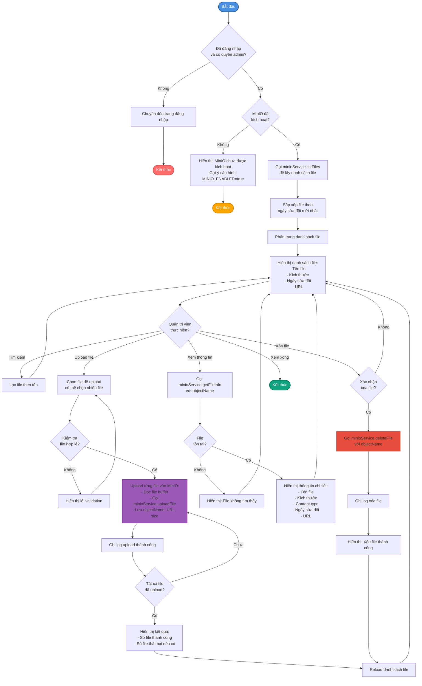
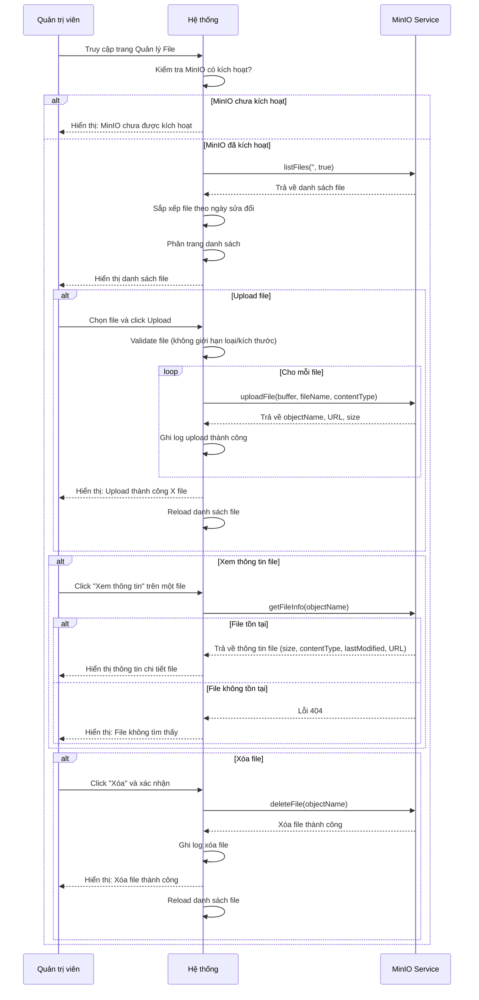

# 3.4. Use Case cho Quản trị viên (Admin)

Quản trị viên là đối tượng người dùng có quyền hạn cao nhất trong hệ thống StudyMate, có quyền truy cập vào các chức năng quản trị toàn diện, bao gồm quản lý người dùng, khóa học, danh mục, nội dung, đăng ký, liên hệ, và hệ thống file. Quản trị viên có thể xem thống kê chi tiết, theo dõi hoạt động của hệ thống, và thực hiện các thao tác quản lý như cập nhật trạng thái, thay đổi role, duyệt đăng ký, và quản lý file trong MinIO storage. Các use case được mô tả dưới đây dựa trên các chức năng thực tế được triển khai trong hệ thống.

## UC-ADMIN-01: Đăng nhập hệ thống

| Thuộc tính | Mô tả |
|------------|-------|
| **Tên UC sử dụng** | Quản trị viên đăng nhập hệ thống |
| **ID** | UC-ADMIN-01 |
| **Tác nhân** | Quản trị viên (Admin) |
| **Mô tả tóm tắt** | Quản trị viên đăng nhập vào hệ thống StudyMate bằng email/mật khẩu hoặc Google OAuth để sử dụng các chức năng quản trị hệ thống |
| **Tiền điều kiện** | - Quản trị viên đã có tài khoản trong hệ thống với role `admin` - Tài khoản đã được xác thực email - Quản trị viên đang ở trang đăng nhập |
| **Hậu điều kiện** | - Quản trị viên đã đăng nhập thành công - Hệ thống đã tạo session và JWT token - Quản trị viên có thể truy cập admin dashboard và tất cả chức năng quản trị |
| **Luồng sự kiện** | **Phương thức 1: Đăng nhập bằng email/mật khẩu** 1. Quản trị viên truy cập trang đăng nhập 2. Quản trị viên nhập email và mật khẩu vào form 3. Hệ thống kiểm tra email có tồn tại trong database 4. Hệ thống so sánh mật khẩu đã hash với mật khẩu trong database 5. Hệ thống kiểm tra role có phải `admin` không 6. Hệ thống kiểm tra tài khoản đã được kích hoạt (email_verified = true, is_active = true) 7. Hệ thống tạo session trong Redis 8. Hệ thống tạo JWT token cho API authentication 9. Hệ thống cập nhật last_login và increment login_count 10. Hệ thống chuyển hướng đến admin dashboard  **Phương thức 2: Đăng nhập bằng Google OAuth** 1. Quản trị viên click nút "Đăng nhập với Google" 2. Hệ thống chuyển hướng đến Google OAuth consent screen 3. Quản trị viên chọn tài khoản Google và xác nhận quyền truy cập 4. Google trả về authorization code 5. Hệ thống đổi authorization code lấy access token 6. Hệ thống lấy thông tin người dùng từ Google API 7. Hệ thống kiểm tra google_id đã tồn tại trong database 8. Nếu chưa có: Hệ thống tạo tài khoản mới với google_id và role = "admin" 9. Nếu đã có: Hệ thống cập nhật thông tin từ Google và kiểm tra role = "admin" 10. Hệ thống tạo session và JWT token 11. Hệ thống chuyển hướng đến admin dashboard |
| **Luồng thay thế** | **3a. Email không tồn tại:** - Hệ thống thông báo lỗi "Email hoặc mật khẩu không đúng" - Quản trị viên kiểm tra lại thông tin và thử lại  **4a. Mật khẩu sai:** - Hệ thống thông báo lỗi "Email hoặc mật khẩu không đúng" - Hệ thống có thể tăng số lần thử đăng nhập sai  **5a. Tài khoản không có quyền admin:** - Hệ thống từ chối đăng nhập với thông báo "Tài khoản của bạn không có quyền truy cập" - Quản trị viên cần liên hệ super admin để được phân quyền  **6a. Tài khoản chưa xác thực email:** - Hệ thống thông báo "Vui lòng xác thực email trước khi đăng nhập" - Hệ thống cung cấp link để gửi lại email xác thực  **6b. Tài khoản bị khóa (is_active = false):** - Hệ thống thông báo "Tài khoản của bạn đã bị khóa" - Quản trị viên cần liên hệ super admin  **7a. Google OAuth bị từ chối:** - Hệ thống chuyển hướng về trang đăng nhập - Hệ thống thông báo "Đăng nhập bằng Google bị hủy" |

## UC-ADMIN-02: Xem dashboard quản trị

| Thuộc tính | Mô tả |
|------------|-------|
| **Tên UC sử dụng** | Quản trị viên xem dashboard quản trị |
| **ID** | UC-ADMIN-02 |
| **Tác nhân** | Quản trị viên |
| **Mô tả tóm tắt** | Quản trị viên xem dashboard tổng quan về hệ thống với các thống kê và thông tin quan trọng |
| **Tiền điều kiện** | - Quản trị viên đã đăng nhập - Quản trị viên có quyền admin |
| **Hậu điều kiện** | - Quản trị viên đã xem dashboard tổng quan - Quản trị viên có thể truy cập các chức năng quản trị khác |
| **Luồng sự kiện** | 1. Quản trị viên truy cập trang admin dashboard (sau khi đăng nhập hoặc từ menu) 2. Hệ thống tải dữ liệu thống kê:    - Tổng số khóa học (totalCourses)    - Số khóa học đã xuất bản (publishedCourses)    - Số khóa học ở trạng thái draft (draftCourses)    - Tổng số người dùng (totalUsers)    - Tổng số đăng ký (totalEnrollments)    - Tổng số đánh giá (totalRatings) 3. Hệ thống tải danh sách khóa học gần đây (10 khóa học mới nhất) với thông tin:    - Tiêu đề khóa học    - Giảng viên (instructor)    - Danh mục (category)    - Ngày tạo 4. Hệ thống hiển thị dashboard với:    - Các card thống kê tổng quan    - Bảng danh sách khóa học gần đây    - Các link nhanh đến các chức năng quản trị 5. Quản trị viên có thể click vào các link để truy cập các chức năng quản trị khác |
| **Luồng thay thế** | **2a. Không có dữ liệu:** - Hệ thống hiển thị 0 cho tất cả thống kê - Hệ thống hiển thị "Chưa có khóa học nào" trong danh sách |

## UC-ADMIN-03: Xem thống kê chi tiết

| Thuộc tính | Mô tả |
|------------|-------|
| **Tên UC sử dụng** | Quản trị viên xem thống kê chi tiết |
| **ID** | UC-ADMIN-03 |
| **Tác nhân** | Quản trị viên |
| **Mô tả tóm tắt** | Quản trị viên xem thống kê chi tiết về người dùng, khóa học, đăng ký, và các chỉ số khác của hệ thống |
| **Tiền điều kiện** | - Quản trị viên đã đăng nhập - Quản trị viên có quyền admin |
| **Hậu điều kiện** | - Quản trị viên đã xem thống kê chi tiết - Quản trị viên có thể phân tích và đưa ra quyết định quản trị |
| **Luồng sự kiện** | 1. Quản trị viên truy cập trang "Thống kê" từ menu admin 2. Hệ thống tính toán và hiển thị thống kê:    **2a. Thống kê tổng quan:**    - Tổng số người dùng, người dùng active    - Tổng số khóa học, khóa học đã xuất bản    - Tổng số đăng ký, đăng ký active, đăng ký đã hoàn thành    - Tổng số danh mục active     **2b. Thống kê người dùng theo role:**    - Số lượng người dùng theo từng role (student, teacher, lecturer, admin)    - Biểu đồ phân bổ role     **2c. Thống kê khóa học theo trạng thái:**    - Số lượng khóa học theo từng trạng thái (draft, published, archived)    - Biểu đồ phân bổ trạng thái     **2d. Thống kê khóa học theo cấp độ:**    - Số lượng khóa học theo từng cấp độ (beginner, intermediate, advanced, expert)    - Biểu đồ phân bổ cấp độ     **2e. Thống kê đăng ký theo trạng thái:**    - Số lượng đăng ký theo từng trạng thái (pending, active, completed, dropped)    - Biểu đồ phân bổ trạng thái     **2f. Top khóa học theo số đăng ký:**    - Danh sách 10 khóa học có nhiều đăng ký nhất    - Thông tin: tiêu đề, số đăng ký, đánh giá trung bình     **2g. Thống kê tăng trưởng (30 ngày gần nhất):**    - Số người dùng mới trong 30 ngày    - Số khóa học mới trong 30 ngày    - Số đăng ký mới trong 30 ngày     **2h. Biểu đồ tăng trưởng (7 ngày gần nhất):**    - Biểu đồ số đăng ký theo ngày (7 ngày)    - Biểu đồ số người dùng mới theo ngày (7 ngày) 3. Quản trị viên có thể:    - Xem chi tiết từng phần thống kê    - Export thống kê dạng Excel/CSV    - Lọc theo khoảng thời gian |
| **Luồng thay thế** | **2a. Không có dữ liệu:** - Hệ thống hiển thị 0 cho tất cả thống kê - Biểu đồ hiển thị trống |

## UC-ADMIN-04: Quản lý khóa học

| Thuộc tính | Mô tả |
|------------|-------|
| **Tên UC sử dụng** | Quản trị viên quản lý khóa học |
| **ID** | UC-ADMIN-04 |
| **Tác nhân** | Quản trị viên |
| **Mô tả tóm tắt** | Quản trị viên xem danh sách, tạo, chỉnh sửa, xóa, và quản lý trạng thái khóa học trong hệ thống |
| **Tiền điều kiện** | - Quản trị viên đã đăng nhập - Quản trị viên có quyền admin |
| **Hậu điều kiện** | - Khóa học đã được quản lý (tạo/chỉnh sửa/xóa/cập nhật trạng thái) - Hệ thống đã cập nhật thông tin khóa học |
| **Luồng sự kiện** | **4a. Xem danh sách khóa học:** 1. Quản trị viên truy cập trang "Quản lý khóa học" 2. Hệ thống tải danh sách khóa học với phân trang 3. Hệ thống hiển thị thông tin:    - Tiêu đề, giảng viên, danh mục    - Trạng thái, số đăng ký, đánh giá trung bình    - Ngày tạo, ngày cập nhật 4. Quản trị viên có thể:    - Tìm kiếm khóa học    - Lọc theo trạng thái, danh mục, giảng viên    - Sắp xếp theo các tiêu chí    - Export danh sách ra Excel  **4b. Tạo khóa học mới:** 1. Quản trị viên click "Tạo khóa học mới" 2. Hệ thống hiển thị form tạo khóa học (tương tự UC-GV-02) 3. Quản trị viên điền thông tin và upload ảnh 4. Hệ thống tạo khóa học với instructor_id có thể là admin hoặc giảng viên được chọn  **4c. Chỉnh sửa khóa học:** 1. Quản trị viên click "Chỉnh sửa" trên một khóa học 2. Hệ thống hiển thị form chỉnh sửa với thông tin hiện tại 3. Quản trị viên chỉnh sửa thông tin 4. Hệ thống cập nhật khóa học  **4d. Cập nhật trạng thái khóa học:** 1. Quản trị viên chọn khóa học và click "Cập nhật trạng thái" 2. Quản trị viên chọn trạng thái mới (draft, published, archived) 3. Hệ thống cập nhật trạng thái khóa học  **4e. Xóa khóa học:** 1. Quản trị viên click "Xóa" trên một khóa học 2. Hệ thống hiển thị cảnh báo và yêu cầu xác nhận 3. Quản trị viên xác nhận xóa 4. Hệ thống xóa khóa học và các dữ liệu liên quan |
| **Luồng thay thế** | **4b. Thông tin không hợp lệ:** - Hệ thống hiển thị lỗi validation - Quản trị viên sửa lại và thử lại  **4e. Khóa học có nhiều đăng ký:** - Hệ thống cảnh báo mạnh hơn về ảnh hưởng đến học viên - Quản trị viên có thể hủy hoặc xác nhận lại |

## UC-ADMIN-05: Quản lý người dùng

| Thuộc tính | Mô tả |
|------------|-------|
| **Tên UC sử dụng** | Quản trị viên quản lý người dùng |
| **ID** | UC-ADMIN-05 |
| **Tác nhân** | Quản trị viên |
| **Mô tả tóm tắt** | Quản trị viên xem danh sách, chi tiết, cập nhật trạng thái, thay đổi role, và xóa người dùng trong hệ thống |
| **Tiền điều kiện** | - Quản trị viên đã đăng nhập - Quản trị viên có quyền admin |
| **Hậu điều kiện** | - Người dùng đã được quản lý (cập nhật trạng thái/role/xóa) - Hệ thống đã cập nhật thông tin người dùng |
| **Luồng sự kiện** | **5a. Xem danh sách người dùng:** 1. Quản trị viên truy cập trang "Quản lý người dùng" 2. Hệ thống tải danh sách người dùng với phân trang 3. Hệ thống hiển thị thông tin:    - Tên, email, MSSV    - Role, trạng thái (active/inactive)    - Ngày tạo, lần đăng nhập cuối 4. Quản trị viên có thể:    - Tìm kiếm người dùng    - Lọc theo role, trạng thái    - Sắp xếp theo các tiêu chí    - Export danh sách ra Excel  **5b. Xem chi tiết người dùng:** 1. Quản trị viên click vào một người dùng 2. Hệ thống hiển thị thông tin chi tiết:    - Thông tin cá nhân (tên, email, MSSV, avatar)    - Thông tin tài khoản (role, trạng thái, ngày tạo)    - Thống kê (số khóa học đã đăng ký, số khóa học đã hoàn thành)    - Lịch sử hoạt động gần đây  **5c. Cập nhật trạng thái người dùng:** 1. Quản trị viên chọn người dùng và click "Cập nhật trạng thái" 2. Quản trị viên chọn trạng thái mới (active/inactive) 3. Hệ thống cập nhật is_active của người dùng 4. Nếu inactive: Người dùng không thể đăng nhập  **5d. Thay đổi role người dùng:** 1. Quản trị viên chọn người dùng và click "Thay đổi role" 2. Quản trị viên chọn role mới (student, teacher, lecturer, admin) 3. Hệ thống validate: Không thể thay đổi role của chính mình thành non-admin 4. Hệ thống cập nhật role của người dùng  **5e. Xóa người dùng (soft delete):** 1. Quản trị viên chọn người dùng và click "Xóa" 2. Hệ thống hiển thị cảnh báo và yêu cầu xác nhận 3. Hệ thống kiểm tra: Không thể xóa chính mình 4. Quản trị viên xác nhận xóa 5. Hệ thống đánh dấu người dùng là inactive (soft delete) |
| **Luồng thay thế** | **5d. Thay đổi role của chính mình thành non-admin:** - Hệ thống từ chối với thông báo "Không thể thay đổi role của chính mình"  **5e. Xóa chính mình:** - Hệ thống từ chối với thông báo "Không thể xóa chính mình"  **5e. Người dùng có nhiều dữ liệu liên quan:** - Hệ thống cảnh báo về ảnh hưởng đến khóa học, đăng ký, etc. - Quản trị viên có thể hủy hoặc xác nhận lại |

## UC-ADMIN-06: Quản lý danh mục

| Thuộc tính | Mô tả |
|------------|-------|
| **Tên UC sử dụng** | Quản trị viên quản lý danh mục |
| **ID** | UC-ADMIN-06 |
| **Tác nhân** | Quản trị viên |
| **Mô tả tóm tắt** | Quản trị viên tạo, chỉnh sửa, xóa, và quản lý trạng thái các danh mục khóa học |
| **Tiền điều kiện** | - Quản trị viên đã đăng nhập - Quản trị viên có quyền admin |
| **Hậu điều kiện** | - Danh mục đã được quản lý (tạo/chỉnh sửa/xóa/cập nhật trạng thái) - Hệ thống đã cập nhật thông tin danh mục |
| **Luồng sự kiện** | **6a. Xem danh sách danh mục:** 1. Quản trị viên truy cập trang "Quản lý danh mục" 2. Hệ thống tải danh sách danh mục 3. Hệ thống hiển thị thông tin:    - Tên danh mục, mô tả    - Trạng thái (active/inactive)    - Số khóa học trong danh mục    - Ngày tạo 4. Quản trị viên có thể tìm kiếm và lọc danh mục  **6b. Tạo danh mục mới:** 1. Quản trị viên click "Tạo danh mục mới" 2. Hệ thống hiển thị form với các trường:    - Tên danh mục (bắt buộc)    - Mô tả (tùy chọn)    - Slug (tự động tạo từ tên) 3. Quản trị viên điền thông tin và click "Lưu" 4. Hệ thống validate và tạo Category record  **6c. Chỉnh sửa danh mục:** 1. Quản trị viên click "Chỉnh sửa" trên một danh mục 2. Hệ thống hiển thị form chỉnh sửa với thông tin hiện tại 3. Quản trị viên chỉnh sửa thông tin 4. Hệ thống cập nhật danh mục  **6d. Cập nhật trạng thái danh mục:** 1. Quản trị viên chọn danh mục và click "Cập nhật trạng thái" 2. Quản trị viên chọn trạng thái mới (active/inactive) 3. Hệ thống cập nhật is_active của danh mục  **6e. Xóa danh mục:** 1. Quản trị viên click "Xóa" trên một danh mục 2. Hệ thống kiểm tra số khóa học trong danh mục 3. Hệ thống hiển thị cảnh báo và yêu cầu xác nhận 4. Quản trị viên xác nhận xóa 5. Hệ thống xóa danh mục (hoặc đánh dấu inactive nếu có khóa học) |
| **Luồng thay thế** | **6b. Tên danh mục đã tồn tại:** - Hệ thống thông báo "Tên danh mục đã tồn tại" - Quản trị viên chọn tên khác  **6e. Danh mục có khóa học:** - Hệ thống cảnh báo "Danh mục này có X khóa học. Việc xóa sẽ ảnh hưởng đến các khóa học." - Hệ thống có thể đề xuất chuyển khóa học sang danh mục khác trước khi xóa |

## UC-ADMIN-07: Quản lý liên hệ

| Thuộc tính | Mô tả |
|------------|-------|
| **Tên UC sử dụng** | Quản trị viên quản lý liên hệ |
| **ID** | UC-ADMIN-07 |
| **Tác nhân** | Quản trị viên |
| **Mô tả tóm tắt** | Quản trị viên xem, cập nhật trạng thái, ưu tiên, ghi chú, và xóa các yêu cầu liên hệ từ người dùng |
| **Tiền điều kiện** | - Quản trị viên đã đăng nhập - Quản trị viên có quyền admin - Có yêu cầu liên hệ từ người dùng |
| **Hậu điều kiện** | - Yêu cầu liên hệ đã được xử lý (cập nhật trạng thái/ưu tiên/ghi chú/xóa) - Hệ thống đã cập nhật thông tin liên hệ |
| **Luồng sự kiện** | **7a. Xem danh sách liên hệ:** 1. Quản trị viên truy cập trang "Quản lý liên hệ" 2. Hệ thống tải danh sách Contact records với phân trang 3. Hệ thống hiển thị thông tin:    - Tên, email, số điện thoại người gửi    - Tiêu đề, nội dung yêu cầu    - Trạng thái (pending, in_progress, resolved, closed)    - Mức độ ưu tiên (low, medium, high, urgent)    - Ngày gửi 4. Quản trị viên có thể:    - Tìm kiếm liên hệ    - Lọc theo trạng thái, mức độ ưu tiên    - Sắp xếp theo các tiêu chí  **7b. Xem chi tiết liên hệ:** 1. Quản trị viên click vào một liên hệ 2. Hệ thống hiển thị thông tin chi tiết:    - Thông tin người gửi    - Nội dung yêu cầu đầy đủ    - Trạng thái, mức độ ưu tiên    - Ghi chú của admin (nếu có)    - Lịch sử cập nhật  **7c. Cập nhật trạng thái liên hệ:** 1. Quản trị viên chọn liên hệ và click "Cập nhật trạng thái" 2. Quản trị viên chọn trạng thái mới (pending, in_progress, resolved, closed) 3. Hệ thống cập nhật status của Contact record  **7d. Cập nhật mức độ ưu tiên:** 1. Quản trị viên chọn liên hệ và click "Cập nhật ưu tiên" 2. Quản trị viên chọn mức độ ưu tiên mới (low, medium, high, urgent) 3. Hệ thống cập nhật priority của Contact record  **7e. Thêm/sửa ghi chú admin:** 1. Quản trị viên chọn liên hệ và click "Ghi chú" 2. Quản trị viên nhập hoặc chỉnh sửa ghi chú 3. Hệ thống cập nhật admin_notes của Contact record  **7f. Xóa liên hệ:** 1. Quản trị viên click "Xóa" trên một liên hệ 2. Hệ thống hiển thị cảnh báo và yêu cầu xác nhận 3. Quản trị viên xác nhận xóa 4. Hệ thống xóa Contact record |
| **Luồng thay thế** | **7f. Xóa liên hệ quan trọng:** - Hệ thống cảnh báo nếu liên hệ có mức độ ưu tiên cao - Quản trị viên có thể hủy hoặc xác nhận lại |

## UC-ADMIN-08: Quản lý đăng ký

| Thuộc tính | Mô tả |
|------------|-------|
| **Tên UC sử dụng** | Quản trị viên quản lý đăng ký khóa học |
| **ID** | UC-ADMIN-08 |
| **Tác nhân** | Quản trị viên |
| **Mô tả tóm tắt** | Quản trị viên xem, duyệt, cập nhật trạng thái, tiến độ, và xóa các đăng ký khóa học của học viên |
| **Tiền điều kiện** | - Quản trị viên đã đăng nhập - Quản trị viên có quyền admin |
| **Hậu điều kiện** | - Đăng ký đã được quản lý (duyệt/cập nhật trạng thái/tiến độ/xóa) - Hệ thống đã cập nhật thông tin đăng ký |
| **Luồng sự kiện** | **8a. Xem danh sách đăng ký:** 1. Quản trị viên truy cập trang "Quản lý đăng ký" 2. Hệ thống tải danh sách Enrollment records với phân trang 3. Hệ thống hiển thị thông tin:    - Tên học viên, tên khóa học    - Trạng thái (pending, active, completed, dropped)    - Tiến độ (progress_percentage)    - Ngày đăng ký 4. Quản trị viên có thể:    - Tìm kiếm đăng ký    - Lọc theo trạng thái, khóa học, học viên    - Sắp xếp theo các tiêu chí    - Export danh sách ra Excel  **8b. Xem chi tiết đăng ký:** 1. Quản trị viên click vào một đăng ký 2. Hệ thống hiển thị thông tin chi tiết:    - Thông tin học viên    - Thông tin khóa học    - Trạng thái, tiến độ, thời gian học    - Lịch sử cập nhật  **8c. Duyệt đăng ký (quick action):** 1. Quản trị viên chọn đăng ký có trạng thái "pending" 2. Quản trị viên click "Duyệt" 3. Hệ thống cập nhật status = "active" 4. Hệ thống có thể gửi email thông báo cho học viên  **8d. Cập nhật trạng thái đăng ký:** 1. Quản trị viên chọn đăng ký và click "Cập nhật trạng thái" 2. Quản trị viên chọn trạng thái mới (pending, active, completed, dropped) 3. Hệ thống cập nhật status của Enrollment record  **8e. Cập nhật tiến độ đăng ký:** 1. Quản trị viên chọn đăng ký và click "Cập nhật tiến độ" 2. Quản trị viên nhập progress_percentage mới (0-100) 3. Hệ thống validate và cập nhật progress_percentage  **8f. Xóa đăng ký:** 1. Quản trị viên click "Xóa" trên một đăng ký 2. Hệ thống hiển thị cảnh báo và yêu cầu xác nhận 3. Quản trị viên xác nhận xóa 4. Hệ thống xóa Enrollment record và các Progress records liên quan |
| **Luồng thay thế** | **8e. Tiến độ không hợp lệ:** - Hệ thống thông báo "Tiến độ phải từ 0 đến 100" - Quản trị viên nhập lại  **8f. Đăng ký có dữ liệu liên quan:** - Hệ thống cảnh báo về ảnh hưởng đến tiến độ, chứng chỉ - Quản trị viên có thể hủy hoặc xác nhận lại |

## UC-ADMIN-09: Quản lý nội dung

| Thuộc tính | Mô tả |
|------------|-------|
| **Tên UC sử dụng** | Quản trị viên quản lý nội dung khóa học |
| **ID** | UC-ADMIN-09 |
| **Tác nhân** | Quản trị viên |
| **Mô tả tóm tắt** | Quản trị viên xem, tạo, chỉnh sửa, xóa, và quản lý trạng thái nội dung trong các khóa học |
| **Tiền điều kiện** | - Quản trị viên đã đăng nhập - Quản trị viên có quyền admin |
| **Hậu điều kiện** | - Nội dung đã được quản lý (tạo/chỉnh sửa/xóa/cập nhật trạng thái) - Hệ thống đã cập nhật thông tin nội dung |
| **Luồng sự kiện** | **9a. Xem danh sách nội dung:** 1. Quản trị viên truy cập trang "Quản lý nội dung" 2. Hệ thống tải danh sách Content records với phân trang 3. Hệ thống hiển thị thông tin:    - Tiêu đề, loại nội dung (video/document/quiz)    - Khóa học thuộc về    - Trạng thái (draft, published, archived)    - Thứ tự (order_index) 4. Quản trị viên có thể:    - Tìm kiếm nội dung    - Lọc theo loại, trạng thái, khóa học    - Sắp xếp theo các tiêu chí  **9b. Tạo nội dung mới:** 1. Quản trị viên click "Tạo nội dung mới" 2. Hệ thống hiển thị form với các loại nội dung (tương tự UC-GV-06) 3. Quản trị viên chọn loại và điền thông tin 4. Hệ thống tạo Content record  **9c. Chỉnh sửa nội dung:** 1. Quản trị viên click "Chỉnh sửa" trên một nội dung 2. Hệ thống hiển thị form chỉnh sửa với thông tin hiện tại 3. Quản trị viên chỉnh sửa thông tin 4. Hệ thống cập nhật nội dung  **9d. Cập nhật trạng thái nội dung:** 1. Quản trị viên chọn nội dung và click "Cập nhật trạng thái" 2. Quản trị viên chọn trạng thái mới (draft, published, archived) 3. Hệ thống cập nhật status của Content record  **9e. Xóa nội dung:** 1. Quản trị viên click "Xóa" trên một nội dung 2. Hệ thống kiểm tra nội dung có đang được học viên sử dụng không 3. Hệ thống hiển thị cảnh báo và yêu cầu xác nhận 4. Quản trị viên xác nhận xóa 5. Hệ thống xóa Content record và các dữ liệu liên quan |
| **Luồng thay thế** | **9b. Thông tin không hợp lệ:** - Hệ thống hiển thị lỗi validation - Quản trị viên sửa lại và thử lại  **9e. Nội dung đang được sử dụng:** - Hệ thống cảnh báo "Nội dung này đang được X học viên học" - Quản trị viên có thể hủy hoặc xác nhận lại |

## UC-ADMIN-10: Quản lý file

| Thuộc tính | Mô tả |
|------------|-------|
| **Tên UC sử dụng** | Quản trị viên quản lý file trong MinIO storage |
| **ID** | UC-ADMIN-10 |
| **Tác nhân** | Quản trị viên |
| **Mô tả tóm tắt** | Quản trị viên xem danh sách, upload, xóa, và xem thông tin các file được lưu trữ trong MinIO |
| **Tiền điều kiện** | - Quản trị viên đã đăng nhập - Quản trị viên có quyền admin - MinIO đã được kích hoạt (MINIO_ENABLED=true) |
| **Hậu điều kiện** | - File đã được quản lý (upload/xóa/xem thông tin) - Hệ thống đã cập nhật file trong MinIO storage |
| **Luồng sự kiện** | **10a. Xem danh sách file:** 1. Quản trị viên truy cập trang "Quản lý File" 2. Hệ thống kiểm tra MinIO có được kích hoạt không 3. **Nếu MinIO chưa kích hoạt:**    - Hệ thống hiển thị thông báo "MinIO chưa được kích hoạt"    - Hệ thống gợi ý cấu hình MINIO_ENABLED=true trong .env 4. **Nếu MinIO đã kích hoạt:**    - Hệ thống gọi minioService.listFiles() để lấy danh sách file    - Hệ thống sắp xếp file theo ngày sửa đổi (mới nhất trước)    - Hệ thống phân trang danh sách file 5. Hệ thống hiển thị danh sách file với thông tin:    - Tên file (objectName)    - Kích thước file    - Ngày sửa đổi cuối cùng    - URL để tải xuống 6. Quản trị viên có thể:    - Tìm kiếm file theo tên    - Xem chi tiết từng file    - Upload file mới    - Xóa file  **10b. Upload file:** 1. Quản trị viên click "Upload File" hoặc kéo thả file vào vùng upload 2. Quản trị viên chọn file (có thể chọn nhiều file, tối đa 50 file) 3. Hệ thống validate file:    - Kiểm tra file có tồn tại không    - Không giới hạn loại file (cho phép tất cả)    - Không giới hạn kích thước file 4. Hệ thống upload từng file vào MinIO storage:    - Đọc file buffer từ multer memory storage    - Gọi minioService.uploadFile() với buffer, fileName, contentType    - MinIO trả về objectName, URL, size 5. Hệ thống ghi log mỗi file upload thành công 6. Hệ thống trả về kết quả:    - Danh sách file upload thành công    - Danh sách file upload thất bại (nếu có) 7. Hệ thống hiển thị thông báo: "Upload thành công X file" 8. Hệ thống reload danh sách file  **10c. Xem thông tin file:** 1. Quản trị viên click "Xem thông tin" trên một file 2. Hệ thống gọi minioService.getFileInfo(objectName) 3. Hệ thống hiển thị thông tin chi tiết:    - Tên file (objectName)    - Kích thước (size)    - Content type (MIME type)    - Ngày tạo (lastModified)    - URL để tải xuống    - ETag (nếu có)  **10d. Xóa file:** 1. Quản trị viên chọn file và click "Xóa" 2. Hệ thống hiển thị cảnh báo và yêu cầu xác nhận:    - "Bạn có chắc chắn muốn xóa file này?"    - "Việc xóa không thể hoàn tác" 3. Quản trị viên xác nhận xóa 4. Hệ thống gọi minioService.deleteFile(objectName) 5. Hệ thống ghi log xóa file 6. Hệ thống thông báo "Xóa file thành công" 7. Hệ thống reload danh sách file |
| **Luồng thay thế** | **3a. MinIO chưa kích hoạt:** - Hệ thống hiển thị thông báo lỗi và gợi ý cấu hình - Quản trị viên không thể upload hoặc xóa file  **4a. Lỗi khi lấy danh sách file:** - Hệ thống hiển thị thông báo lỗi "Lỗi khi tải danh sách file" - Hệ thống chuyển hướng về admin dashboard  **10b. File upload thất bại:** - Hệ thống ghi log lỗi cho từng file - Hệ thống hiển thị danh sách file lỗi với thông báo lỗi cụ thể - Hệ thống vẫn hiển thị các file upload thành công  **10b. Không có file được chọn:** - Hệ thống trả về lỗi "Không có file được upload" - Quản trị viên chọn file và thử lại  **10c. File không tồn tại:** - Hệ thống trả về lỗi 404 "File không tìm thấy" - Hệ thống thông báo cho quản trị viên  **10d. Lỗi khi xóa file:** - Hệ thống ghi log lỗi - Hệ thống trả về lỗi "Lỗi khi xóa file: [chi tiết lỗi]" - File không bị xóa |

---

## Sơ đồ Hoạt động - Quản lý file

## Sơ đồ Tuần tự - Quản lý file

---

**🏛️ Trường Đại học Công nghệ Thông tin**  
**🌍 Đại học Quốc gia TP. Hồ Chí Minh**
