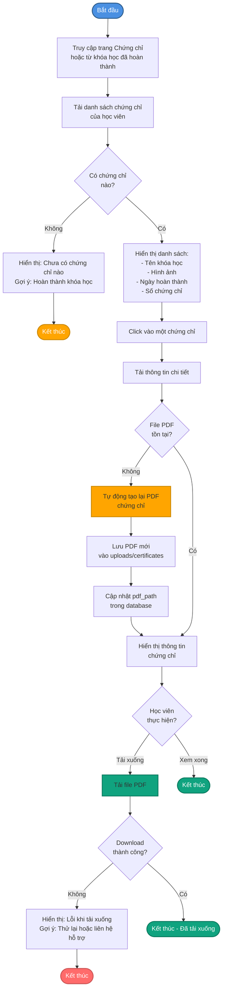
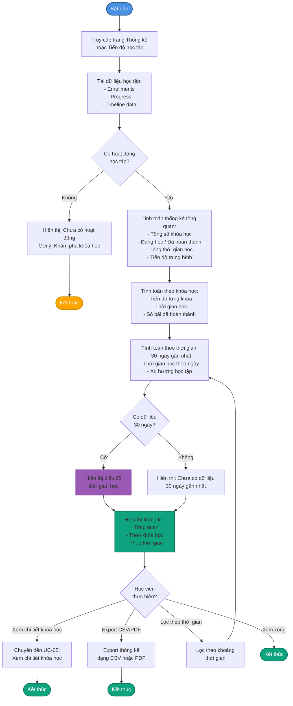
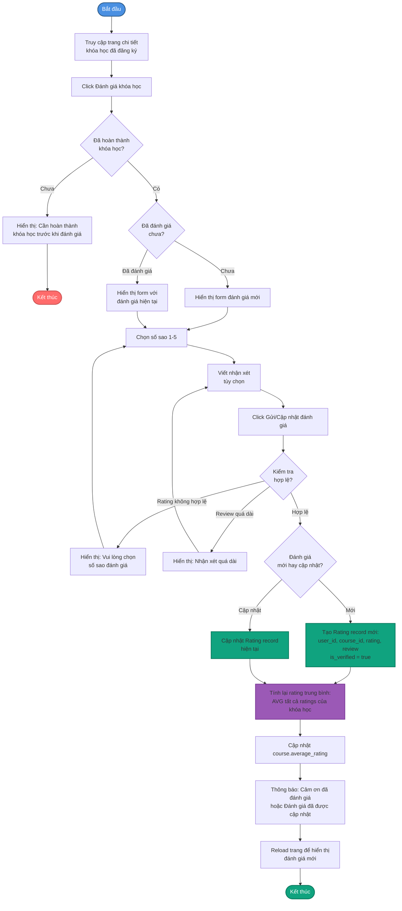
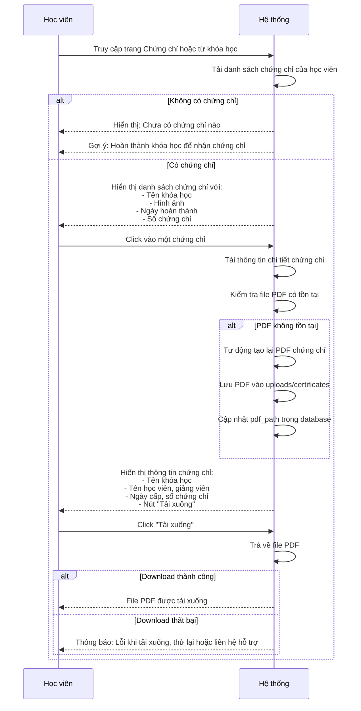
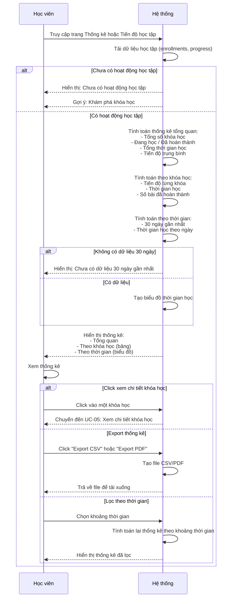
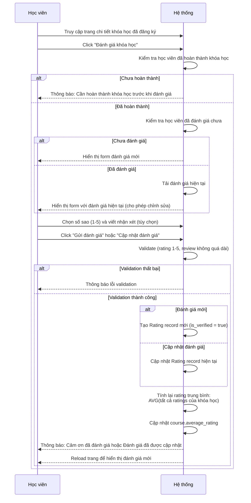
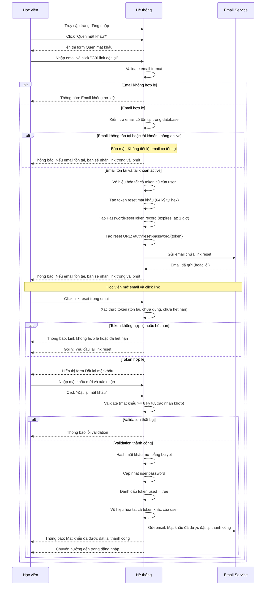

# 3.5. Use Case Cuối cùng

## UC-16: Xem chứng chỉ hoàn thành

| Thuộc tính | Mô tả |
|------------|-------|
| **Tên UC sử dụng** | Học viên xem chứng chỉ hoàn thành |
| **ID** | UC-16 |
| **Tác nhân** | Học viên |
| **Mô tả tóm tắt** | Học viên xem và tải xuống chứng chỉ PDF khi đã hoàn thành khóa học (progress = 100%) |
| **Tiền điều kiện** | - Học viên đã đăng nhập<br>- Học viên đã hoàn thành khóa học (enrollment status = "completed", progress_percentage = 100%)<br>- Chứng chỉ đã được tạo tự động khi hoàn thành khóa học |
| **Hậu điều kiện** | - Học viên đã xem hoặc tải xuống chứng chỉ<br>- View count của chứng chỉ có thể được tăng (nếu có tracking) |
| **Luồng sự kiện** | 1. Học viên truy cập trang "Chứng chỉ" hoặc từ trang khóa học đã hoàn thành<br>2. Hệ thống tải danh sách chứng chỉ của học viên (liên kết với user_id)<br>3. Hệ thống hiển thị danh sách chứng chỉ với:<br>   - Tên khóa học<br>   - Hình ảnh khóa học (thumbnail)<br>   - Ngày hoàn thành (issued_at)<br>   - Số chứng chỉ (certificate_number)<br>4. Học viên click vào một chứng chỉ để xem chi tiết<br>5. Hệ thống tải thông tin chi tiết chứng chỉ:<br>   - Tên khóa học đầy đủ<br>   - Tên học viên<br>   - Tên giảng viên<br>   - Ngày cấp chứng chỉ (issued_at)<br>   - Số chứng chỉ (certificate_number)<br>   - Đường dẫn PDF (pdf_path)<br>6. Hệ thống kiểm tra file PDF có tồn tại không<br>7. **Nếu PDF tồn tại:**<br>   7a. Hệ thống hiển thị preview chứng chỉ hoặc thông tin chứng chỉ<br>   7b. Học viên có thể click "Tải xuống" để tải file PDF<br>   7c. Hệ thống trả về file PDF để tải xuống<br><br>8. **Nếu PDF không tồn tại (file bị mất):**<br>   8a. Hệ thống tự động tạo lại PDF chứng chỉ<br>   8b. Hệ thống lưu PDF mới vào thư mục uploads/certificates<br>   8c. Hệ thống cập nhật pdf_path trong database<br>   8d. Hệ thống hiển thị và cho phép tải xuống |
| **Luồng thay thế** | **2a. Không có chứng chỉ nào:**<br>- Hệ thống hiển thị thông báo "Bạn chưa có chứng chỉ nào"<br>- Hệ thống gợi ý "Hoàn thành khóa học để nhận chứng chỉ"<br>- Hệ thống hiển thị danh sách khóa học đang học<br><br>**5a. Chứng chỉ không tồn tại trong database:**<br>- Hệ thống hiển thị lỗi 404 "Chứng chỉ không tồn tại"<br>- Hệ thống gợi ý quay lại danh sách chứng chỉ<br><br>**7c. Lỗi khi tải xuống PDF:**<br>- Hệ thống thông báo "Lỗi khi tải xuống chứng chỉ"<br>- Hệ thống gợi ý thử lại hoặc liên hệ hỗ trợ |

## UC-17: Xem thống kê học tập chi tiết

| Thuộc tính | Mô tả |
|------------|-------|
| **Tên UC sử dụng** | Học viên xem thống kê học tập chi tiết |
| **ID** | UC-17 |
| **Tác nhân** | Học viên |
| **Mô tả tóm tắt** | Học viên xem thống kê chi tiết về quá trình học tập của mình bao gồm tổng quan, theo khóa học, và theo thời gian để đánh giá tiến độ học tập |
| **Tiền điều kiện** | - Học viên đã đăng nhập<br>- Học viên đã có hoạt động học tập (đã đăng ký ít nhất một khóa học) |
| **Hậu điều kiện** | - Học viên đã xem thống kê học tập chi tiết<br>- Học viên có thể đã export thống kê (nếu có chức năng) |
| **Luồng sự kiện** | 1. Học viên truy cập trang "Thống kê" hoặc "Tiến độ học tập"<br>2. Hệ thống tải dữ liệu học tập của học viên<br>3. Hệ thống tính toán và hiển thị các thống kê:<br>   **3a. Thống kê tổng quan:**<br>   - Tổng số khóa học đã đăng ký (tất cả enrollments)<br>   - Số khóa học đang học (status = "active")<br>   - Số khóa học đã hoàn thành (status = "completed")<br>   - Tổng thời gian học tập (tính từ total_time_spent trong Enrollment, đơn vị: giờ/phút)<br>   - Tiến độ trung bình (% trung bình của tất cả enrollments)<br><br>   **3b. Thống kê theo khóa học:**<br>   - Danh sách từng khóa học với:<br>     * Tên khóa học<br>     * Tiến độ (progress_percentage)<br>     * Thời gian học (total_time_spent)<br>     * Số bài học đã hoàn thành (tính từ Progress records với status = "completed")<br>     * Trạng thái (active, completed, dropped)<br>     * Ngày đăng ký và ngày hoàn thành (nếu có)<br><br>   **3c. Thống kê theo thời gian:**<br>   - Biểu đồ thời gian học theo ngày (30 ngày gần nhất)<br>   - Dữ liệu: ngày và tổng thời gian học trong ngày đó<br>   - Xu hướng học tập (tăng/giảm theo thời gian)<br>   - Có thể xem theo: ngày, tuần, tháng<br>4. Hệ thống hiển thị các biểu đồ và bảng thống kê<br>5. Học viên có thể:<br>   - Xem chi tiết từng khóa học<br>   - Xem biểu đồ thời gian học<br>   - Export thống kê dạng CSV hoặc PDF (nếu có chức năng)<br>   - Lọc theo khoảng thời gian |
| **Luồng thay thế** | **2a. Học viên chưa có hoạt động học tập:**<br>- Hệ thống hiển thị thông báo "Bạn chưa có hoạt động học tập nào"<br>- Hệ thống gợi ý "Khám phá khóa học" hoặc "Xem danh sách khóa học"<br><br>**3c. Không có dữ liệu trong 30 ngày gần nhất:**<br>- Hệ thống hiển thị "Chưa có dữ liệu trong 30 ngày gần nhất"<br>- Hệ thống có thể mở rộng khoảng thời gian hoặc hiển thị thông báo khuyến khích học tập |

## UC-18: Đánh giá khóa học

| Thuộc tính | Mô tả |
|------------|-------|
| **Tên UC sử dụng** | Học viên đánh giá khóa học |
| **ID** | UC-18 |
| **Tác nhân** | Học viên |
| **Mô tả tóm tắt** | Học viên đánh giá và để lại nhận xét cho khóa học đã học để giúp học viên khác và cải thiện chất lượng khóa học |
| **Tiền điều kiện** | - Học viên đã đăng nhập<br>- Học viên đã đăng ký khóa học<br>- Học viên đã hoàn thành khóa học (status = "completed") hoặc đã học một phần (tùy chính sách) |
| **Hậu điều kiện** | - Đánh giá đã được lưu vào database<br>- Rating trung bình của khóa học đã được cập nhật<br>- Đánh giá được hiển thị công khai trên trang chi tiết khóa học |
| **Luồng sự kiện** | 1. Học viên truy cập trang chi tiết khóa học đã đăng ký<br>2. Học viên click "Đánh giá khóa học" hoặc "Viết đánh giá"<br>3. Hệ thống kiểm tra học viên đã đánh giá chưa<br>4. **Nếu chưa đánh giá:**<br>   4a. Hệ thống hiển thị form đánh giá<br>   4b. Học viên chọn số sao (1-5 sao) bằng cách click vào các ngôi sao<br>   4c. Học viên viết nhận xét (tùy chọn, có thể để trống)<br>   4d. Học viên click "Gửi đánh giá"<br>   4e. Hệ thống validate:<br>       - Rating phải từ 1 đến 5<br>       - Review không vượt quá độ dài tối đa (nếu có)<br>   4f. Hệ thống tạo Rating record mới:<br>       - user_id, course_id<br>       - rating (1-5)<br>       - review (text, có thể null)<br>       - is_verified = true (vì học viên đã hoàn thành khóa học)<br>   4g. Hệ thống tính lại rating trung bình của khóa học:<br>       - Lấy tất cả ratings của khóa học<br>       - Tính trung bình: tổng rating / số lượng ratings<br>       - Làm tròn đến 2 chữ số thập phân<br>   4h. Hệ thống cập nhật course.average_rating<br>   4i. Hệ thống thông báo "Cảm ơn bạn đã đánh giá khóa học!"<br>   4j. Hệ thống reload trang để hiển thị đánh giá mới<br><br>5. **Nếu đã đánh giá:**<br>   5a. Hệ thống hiển thị form với đánh giá hiện tại (số sao và nhận xét)<br>   5b. Học viên có thể chỉnh sửa đánh giá<br>   5c. Học viên click "Cập nhật đánh giá"<br>   5d. Hệ thống cập nhật Rating record hiện tại<br>   5e. Hệ thống tính lại và cập nhật average_rating<br>   5f. Hệ thống thông báo "Đánh giá đã được cập nhật!" |
| **Luồng thay thế** | **3a. Học viên chưa hoàn thành khóa học:**<br>- Hệ thống thông báo "Bạn cần hoàn thành khóa học trước khi đánh giá"<br>- Hệ thống gợi ý "Tiếp tục học để hoàn thành khóa học"<br><br>**4e. Rating không hợp lệ:**<br>- Hệ thống thông báo "Vui lòng chọn số sao đánh giá" hoặc "Đánh giá phải từ 1 đến 5 sao"<br>- Học viên chọn lại số sao<br><br>**4e. Review quá dài:**<br>- Hệ thống thông báo "Nhận xét quá dài, vui lòng rút ngắn"<br>- Học viên rút ngắn nhận xét |

## UC-19: Quên mật khẩu và đặt lại

| Thuộc tính | Mô tả |
|------------|-------|
| **Tên UC sử dụng** | Học viên quên mật khẩu và đặt lại |
| **ID** | UC-19 |
| **Tác nhân** | Học viên |
| **Mô tả tóm tắt** | Học viên yêu cầu đặt lại mật khẩu khi quên mật khẩu thông qua email xác thực và token bảo mật |
| **Tiền điều kiện** | - Học viên có tài khoản trong hệ thống<br>- Học viên có email đã được xác thực (email_verified = true) |
| **Hậu điều kiện** | - Mật khẩu đã được đặt lại thành công<br>- Token reset đã được vô hiệu hóa<br>- Học viên có thể đăng nhập với mật khẩu mới |
| **Luồng sự kiện** | 1. Học viên truy cập trang đăng nhập<br>2. Học viên click "Quên mật khẩu?" hoặc "Đặt lại mật khẩu"<br>3. Hệ thống chuyển hướng đến trang "Quên mật khẩu"<br>4. Học viên nhập email vào form<br>5. Học viên click "Gửi link đặt lại mật khẩu"<br>6. Hệ thống validate email (format hợp lệ)<br>7. Hệ thống kiểm tra email có tồn tại trong database không<br>8. **Nếu email tồn tại và tài khoản active:**<br>   8a. Hệ thống tạo token reset mật khẩu (64 ký tự hex, random)<br>   8b. Hệ thống vô hiệu hóa tất cả token cũ của user (set used = true)<br>   8c. Hệ thống tạo PasswordResetToken record:<br>       - user_id<br>       - token (64 ký tự hex)<br>       - expires_at (1 giờ từ bây giờ)<br>       - used = false<br>   8d. Hệ thống tạo reset URL: {protocol}://{host}/auth/reset-password/{token}<br>   8e. Hệ thống gửi email chứa link reset mật khẩu đến email của học viên<br>   8f. Hệ thống hiển thị thông báo thành công (generic, không tiết lộ email có tồn tại hay không)<br><br>9. **Nếu email không tồn tại hoặc tài khoản không active:**<br>   9a. Hệ thống vẫn hiển thị thông báo thành công (bảo mật, không tiết lộ thông tin)<br><br>10. Học viên mở email và click link reset mật khẩu<br>11. Hệ thống xác thực token:<br>    - Kiểm tra token có tồn tại trong database<br>    - Kiểm tra token chưa được sử dụng (used = false)<br>    - Kiểm tra token chưa hết hạn (expires_at > now)<br>12. **Nếu token hợp lệ:**<br>    12a. Hệ thống hiển thị form đặt lại mật khẩu<br>    12b. Học viên nhập mật khẩu mới<br>    12c. Học viên nhập xác nhận mật khẩu mới<br>    12d. Học viên click "Đặt lại mật khẩu"<br>    12e. Hệ thống validate:<br>        - Mật khẩu không được rỗng<br>        - Mật khẩu phải có ít nhất 6 ký tự (hoặc độ dài tối thiểu khác)<br>        - Mật khẩu mới và xác nhận phải khớp<br>    12f. Hệ thống hash mật khẩu mới bằng bcrypt<br>    12g. Hệ thống cập nhật user.password với mật khẩu mới đã hash<br>    12h. Hệ thống đánh dấu token đã sử dụng (used = true)<br>    12i. Hệ thống vô hiệu hóa tất cả token khác của user (set used = true)<br>    12j. Hệ thống gửi email thông báo "Mật khẩu đã được đặt lại thành công"<br>    12k. Hệ thống thông báo "Mật khẩu đã được đặt lại thành công! Bạn có thể đăng nhập ngay bây giờ."<br>    12l. Hệ thống chuyển hướng đến trang đăng nhập<br><br>13. **Nếu token không hợp lệ hoặc hết hạn:**<br>    13a. Hệ thống thông báo "Link đặt lại mật khẩu không hợp lệ hoặc đã hết hạn."<br>    13b. Hệ thống gợi ý "Vui lòng yêu cầu lại link đặt lại mật khẩu"<br>    13c. Hệ thống chuyển hướng đến trang "Quên mật khẩu" |
| **Luồng thay thế** | **6a. Email không hợp lệ:**<br>- Hệ thống thông báo "Email không hợp lệ"<br>- Học viên nhập lại email đúng format<br><br>**8e. Email không được gửi (lỗi SMTP):**<br>- Hệ thống vẫn tạo token và lưu vào database<br>- Hệ thống ghi log lỗi để theo dõi<br>- Hệ thống có thể hiển thị token trong console (development) hoặc thông báo liên hệ hỗ trợ<br><br>**12e. Mật khẩu mới không hợp lệ:**<br>- Hệ thống thông báo lỗi validation cụ thể<br>- Học viên sửa lại mật khẩu<br><br>**12e. Mật khẩu mới và xác nhận không khớp:**<br>- Hệ thống thông báo "Mật khẩu xác nhận không khớp"<br>- Học viên nhập lại<br><br>**13a. Token đã được sử dụng:**<br>- Hệ thống thông báo "Link đặt lại mật khẩu đã được sử dụng"<br>- Hệ thống yêu cầu yêu cầu lại link mới |

## Sơ đồ Hoạt động - Xem chứng chỉ hoàn thành



## Sơ đồ Hoạt động - Xem thống kê học tập chi tiết



## Sơ đồ Hoạt động - Đánh giá khóa học



## Sơ đồ Hoạt động - Quên mật khẩu và đặt lại

```mermaid
flowchart TD
    Start([Bắt đầu]) --> AccessLogin[Truy cập trang đăng nhập]
    AccessLogin --> ClickForgot[Click Quên mật khẩu?]
    ClickForgot --> ShowForgotForm[Hiển thị form<br/>Quên mật khẩu]
    ShowForgotForm --> EnterEmail[Nhập email]
    EnterEmail --> SubmitEmail[Click Gửi link đặt lại]
    
    SubmitEmail --> ValidateEmail{Email<br/>hợp lệ?}
    ValidateEmail -->|Không| ShowError1[Hiển thị: Email không hợp lệ]
    ShowError1 --> EnterEmail
    
    ValidateEmail -->|Có| CheckExists{Email có<br/>tồn tại?}
    CheckExists -->|Không| ShowSuccess1[Hiển thị: Nếu email tồn tại,<br/>bạn sẽ nhận link trong vài phút<br/>Bảo mật: không tiết lộ]
    CheckExists -->|Có| CheckActive{Tài khoản<br/>đang active?}
    
    CheckActive -->|Không| ShowSuccess1
    CheckActive -->|Có| InvalidateOldTokens[Vô hiệu hóa token cũ<br/>của user]
    InvalidateOldTokens --> GenerateToken[Tạo token reset mật khẩu<br/>64 ký tự hex random]
    GenerateToken --> CreateTokenRecord[Tạo PasswordResetToken:<br/>user_id, token, expires_at 1 giờ<br/>used = false]
    CreateTokenRecord --> BuildResetURL[Tạo reset URL:<br/>/auth/reset-password/{token}]
    BuildResetURL --> SendEmail[Gửi email chứa link reset]
    SendEmail --> CheckEmailSent{Email<br/>đã gửi?}
    
    CheckEmailSent -->|Không| LogError[Ghi log lỗi<br/>Token vẫn được tạo]
    CheckEmailSent -->|Có| ShowSuccess1
    LogError --> ShowSuccess1
    
    ShowSuccess1 --> WaitEmail[Chờ học viên mở email]
    WaitEmail --> ClickLink[Học viên click link<br/>trong email]
    ClickLink --> ValidateToken{Xác thực token:<br/>- Tồn tại?<br/>- Chưa dùng?<br/>- Chưa hết hạn?}
    
    ValidateToken -->|Không hợp lệ| ShowError2[Hiển thị: Link không hợp lệ<br/>hoặc đã hết hạn]
    ShowError2 --> OfferResend[Gợi ý: Yêu cầu lại link]
    OfferResend --> ShowForgotForm
    
    ValidateToken -->|Hợp lệ| ShowResetForm[Hiển thị form<br/>Đặt lại mật khẩu]
    ShowResetForm --> EnterNewPass[Nhập mật khẩu mới]
    EnterNewPass --> EnterConfirm[Nhập xác nhận mật khẩu]
    EnterConfirm --> SubmitReset[Click Đặt lại mật khẩu]
    
    SubmitReset --> ValidatePassword{Kiểm tra<br/>hợp lệ?}
    ValidatePassword -->|Mật khẩu rỗng| ShowError3[Hiển thị: Mật khẩu không được<br/>để trống]
    ValidatePassword -->|Mật khẩu < 6 ký tự| ShowError4[Hiển thị: Mật khẩu phải<br/>>= 6 ký tự]
    ValidatePassword -->|Xác nhận không khớp| ShowError5[Hiển thị: Mật khẩu xác nhận<br/>không khớp]
    
    ShowError3 --> EnterNewPass
    ShowError4 --> EnterNewPass
    ShowError5 --> EnterConfirm
    
    ValidatePassword -->|Hợp lệ| HashPassword[Hash mật khẩu mới<br/>bằng bcrypt]
    HashPassword --> UpdatePassword[Cập nhật user.password<br/>với mật khẩu mới]
    UpdatePassword --> MarkTokenUsed[Đánh dấu token<br/>used = true]
    MarkTokenUsed --> InvalidateOtherTokens[Vô hiệu hóa tất cả<br/>token khác của user]
    InvalidateOtherTokens --> SendSuccessEmail[Gửi email: Mật khẩu<br/>đã được đặt lại thành công]
    SendSuccessEmail --> ShowSuccess2[Thông báo: Mật khẩu đã được<br/>đặt lại thành công]
    ShowSuccess2 --> RedirectLogin[Chuyển hướng đến<br/>trang đăng nhập]
    RedirectLogin --> End([Kết thúc])
    
    style Start fill:#4A90E2,stroke:#2E5C8A,stroke-width:2px,color:#fff
    style End fill:#10A37F,stroke:#0A7A5F,stroke-width:2px,color:#fff
    style GenerateToken fill:#9B59B6,stroke:#7D3C98,stroke-width:2px
    style SendEmail fill:#FFA500,stroke:#CC8800,stroke-width:2px
    style HashPassword fill:#10A37F,stroke:#0A7A5F,stroke-width:2px
    style UpdatePassword fill:#10A37F,stroke:#0A7A5F,stroke-width:2px
```

## Sơ đồ Tuần tự - Xem chứng chỉ hoàn thành



## Sơ đồ Tuần tự - Xem thống kê học tập chi tiết



## Sơ đồ Tuần tự - Đánh giá khóa học



## Sơ đồ Tuần tự - Quên mật khẩu và đặt lại



---

**🏛️ Trường Đại học Công nghệ Thông tin**  
**🌍 Đại học Quốc gia TP. Hồ Chí Minh**
