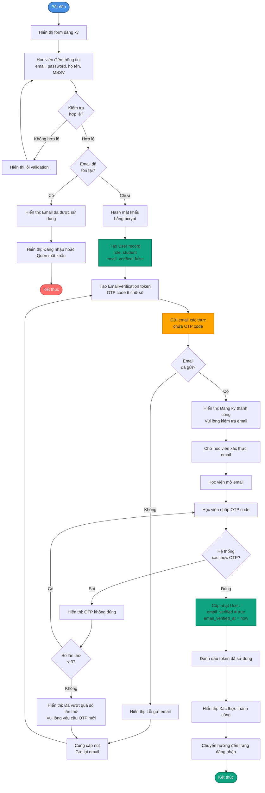
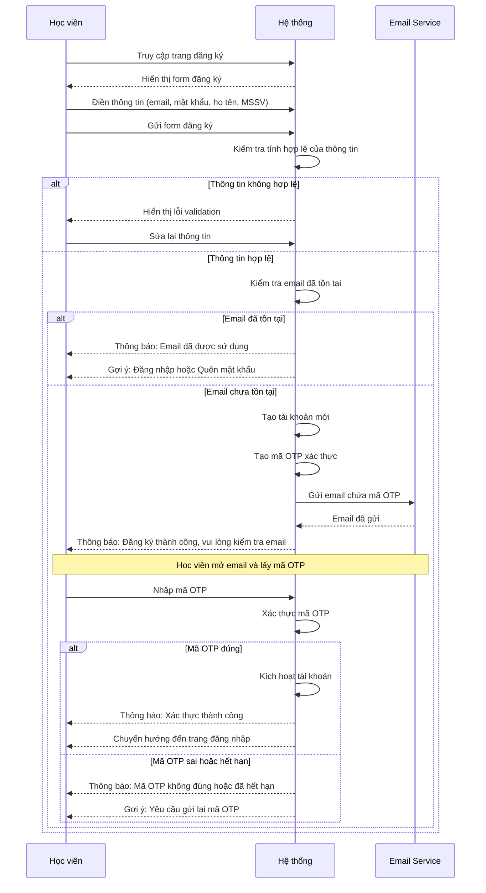
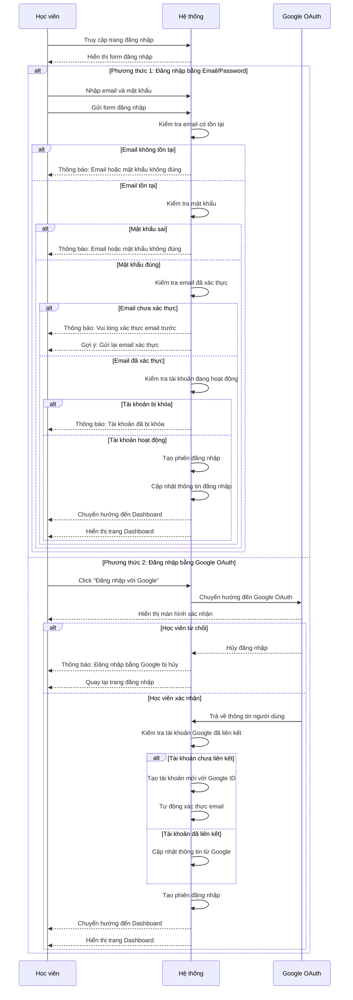

# 3.1. Use Case Đăng ký và Đăng nhập

## UC-01: Đăng ký tài khoản

| Thuộc tính | Mô tả |
|------------|-------|
| **Tên UC sử dụng** | Học viên đăng ký tài khoản |
| **ID** | UC-01 |
| **Tác nhân** | Học viên (chưa có tài khoản) |
| **Mô tả tóm tắt** | Học viên đăng ký tài khoản mới trên hệ thống StudyMate bằng cách điền thông tin cá nhân và xác thực email |
| **Tiền điều kiện** | - Học viên chưa có tài khoản trong hệ thống<br>- Học viên có email hợp lệ<br>- Học viên đang ở trang đăng ký |
| **Hậu điều kiện** | - Học viên có tài khoản mới trong hệ thống<br>- Tài khoản đã được kích hoạt sau khi xác thực email<br>- Học viên có thể đăng nhập vào hệ thống |
| **Luồng sự kiện** | 1. Học viên truy cập trang đăng ký<br>2. Học viên điền thông tin: email, mật khẩu, họ tên, MSSV<br>3. Hệ thống kiểm tra email đã tồn tại chưa<br>4. Hệ thống kiểm tra tính hợp lệ của thông tin (email format, password strength)<br>5. Hệ thống hash mật khẩu bằng bcrypt<br>6. Hệ thống tạo tài khoản mới với role mặc định là 'student'<br>7. Hệ thống tạo email verification token<br>8. Hệ thống gửi email xác thực chứa link kích hoạt<br>9. Học viên mở email và click link xác thực<br>10. Hệ thống xác thực token và kích hoạt tài khoản<br>11. Hệ thống thông báo đăng ký thành công |
| **Luồng thay thế** | **3a. Email đã tồn tại:**<br>- Hệ thống thông báo lỗi "Email đã được sử dụng"<br>- Hệ thống yêu cầu học viên đăng nhập hoặc sử dụng chức năng quên mật khẩu<br><br>**4a. Thông tin không hợp lệ:**<br>- Hệ thống hiển thị lỗi validation (email không đúng format, mật khẩu quá yếu)<br>- Học viên sửa lại thông tin và thử lại<br><br>**8a. Email xác thực không được gửi:**<br>- Học viên có thể yêu cầu gửi lại email xác thực<br>- Hệ thống tạo token mới và gửi lại email<br><br>**10a. Token hết hạn hoặc không hợp lệ:**<br>- Hệ thống thông báo lỗi "Link xác thực không hợp lệ hoặc đã hết hạn"<br>- Học viên có thể yêu cầu gửi lại email xác thực |

## UC-02: Đăng nhập hệ thống

| Thuộc tính | Mô tả |
|------------|-------|
| **Tên UC sử dụng** | Học viên đăng nhập |
| **ID** | UC-02 |
| **Tác nhân** | Học viên |
| **Mô tả tóm tắt** | Học viên đăng nhập vào hệ thống StudyMate bằng email/mật khẩu hoặc Google OAuth để sử dụng các chức năng và học khóa học |
| **Tiền điều kiện** | - Học viên đã có tài khoản trong hệ thống<br>- Tài khoản đã được xác thực email<br>- Học viên đang ở trang đăng nhập |
| **Hậu điều kiện** | - Học viên đã đăng nhập thành công<br>- Hệ thống đã tạo session và JWT token<br>- Học viên có thể truy cập các chức năng của hệ thống |
| **Luồng sự kiện** | **Phương thức 1: Đăng nhập bằng email/mật khẩu**<br>1. Học viên truy cập trang đăng nhập<br>2. Học viên nhập email và mật khẩu vào form<br>3. Hệ thống kiểm tra email có tồn tại trong database<br>4. Hệ thống so sánh mật khẩu đã hash với mật khẩu trong database<br>5. Hệ thống kiểm tra tài khoản đã được kích hoạt (email_verified = true)<br>6. Hệ thống tạo session trong Redis<br>7. Hệ thống tạo JWT token cho API authentication<br>8. Hệ thống cập nhật last_login và increment login_count<br>9. Hệ thống chuyển hướng đến dashboard<br><br>**Phương thức 2: Đăng nhập bằng Google OAuth**<br>1. Học viên click nút "Đăng nhập với Google"<br>2. Hệ thống chuyển hướng đến Google OAuth consent screen<br>3. Học viên chọn tài khoản Google và xác nhận quyền truy cập<br>4. Google trả về authorization code<br>5. Hệ thống đổi authorization code lấy access token<br>6. Hệ thống lấy thông tin người dùng từ Google API<br>7. Hệ thống kiểm tra google_id đã tồn tại trong database<br>8. Nếu chưa có: Hệ thống tạo tài khoản mới với google_id<br>9. Nếu đã có: Hệ thống cập nhật thông tin từ Google<br>10. Hệ thống tạo session và JWT token<br>11. Hệ thống chuyển hướng đến dashboard |
| **Luồng thay thế** | **3a. Email không tồn tại:**<br>- Hệ thống thông báo lỗi "Email hoặc mật khẩu không đúng" (không tiết lộ email có tồn tại hay không vì lý do bảo mật)<br>- Học viên kiểm tra lại thông tin và thử lại<br><br>**4a. Mật khẩu sai:**<br>- Hệ thống thông báo lỗi "Email hoặc mật khẩu không đúng"<br>- Hệ thống có thể tăng số lần thử đăng nhập sai<br>- Sau nhiều lần sai, hệ thống có thể khóa tài khoản tạm thời<br><br>**5a. Tài khoản chưa xác thực email:**<br>- Hệ thống thông báo "Vui lòng xác thực email trước khi đăng nhập"<br>- Hệ thống cung cấp link để gửi lại email xác thực<br><br>**5b. Tài khoản bị khóa (is_active = false):**<br>- Hệ thống thông báo "Tài khoản của bạn đã bị khóa"<br>- Học viên cần liên hệ quản trị viên<br><br>**7a. Google OAuth bị từ chối:**<br>- Hệ thống chuyển hướng về trang đăng nhập<br>- Hệ thống thông báo "Đăng nhập bằng Google bị hủy" |

## Sơ đồ Hoạt động - Đăng ký tài khoản



## Sơ đồ Hoạt động - Đăng nhập hệ thống

```mermaid
flowchart TD
    Start([Bắt đầu]) --> ShowForm[Hiển thị form đăng nhập]
    ShowForm --> ChooseMethod{Chọn phương thức<br/>đăng nhập}
    
    ChooseMethod -->|Email/Password| EnterEmailPass[Nhập email và mật khẩu]
    ChooseMethod -->|Google OAuth| ClickGoogle[Click "Đăng nhập với Google"]
    
    EnterEmailPass --> SubmitForm[Gửi form đăng nhập]
    SubmitForm --> ValidateEmail{Email có<br/>tồn tại?}
    
    ValidateEmail -->|Không| ShowError1[Hiển thị: Email hoặc mật khẩu không đúng]
    ShowError1 --> EnterEmailPass
    
    ValidateEmail -->|Có| CheckPassword{Mật khẩu<br/>đúng?}
    CheckPassword -->|Sai| ShowError2[Hiển thị: Email hoặc mật khẩu không đúng]
    ShowError2 --> CheckAttempts{Số lần thử<br/>< 5?}
    CheckAttempts -->|Có| EnterEmailPass
    CheckAttempts -->|Không| LockAccount[Khóa tài khoản tạm thời]
    LockAccount --> End1([Kết thúc])
    
    CheckPassword -->|Đúng| CheckVerified{Email đã<br/>xác thực?}
    CheckVerified -->|Chưa| ShowError3[Hiển thị: Vui lòng xác thực email trước]
    ShowError3 --> OfferResend[Hiển thị link: Gửi lại email xác thực]
    OfferResend --> End2([Kết thúc])
    
    CheckVerified -->|Đã| CheckActive{Tài khoản<br/>đang hoạt động?}
    CheckActive -->|Không| ShowError4[Hiển thị: Tài khoản đã bị khóa]
    ShowError4 --> End3([Kết thúc])
    
    CheckActive -->|Có| CreateSession[Tạo phiên đăng nhập]
    CreateSession --> UpdateLogin[Cập nhật thông tin đăng nhập]
    UpdateLogin --> RedirectDashboard[Chuyển hướng đến Dashboard]
    RedirectDashboard --> End4([Kết thúc - Đăng nhập thành công])
    
    ClickGoogle --> RedirectGoogle[Chuyển hướng đến Google OAuth]
    RedirectGoogle --> GoogleConsent[Google hiển thị màn hình xác nhận]
    GoogleConsent --> UserConfirm{Học viên<br/>xác nhận?}
    
    UserConfirm -->|Từ chối| ShowError5[Hiển thị: Đăng nhập bằng Google bị hủy]
    ShowError5 --> ShowForm
    
    UserConfirm -->|Xác nhận| GetGoogleInfo[Lấy thông tin từ Google]
    GetGoogleInfo --> CheckGoogleAccount{Tài khoản Google<br/>đã liên kết?}
    
    CheckGoogleAccount -->|Chưa| CreateNewAccount[Tạo tài khoản mới<br/>với Google ID]
    CreateNewAccount --> CreateSession
    
    CheckGoogleAccount -->|Đã có| UpdateGoogleInfo[Cập nhật thông tin từ Google]
    UpdateGoogleInfo --> CreateSession
    
    style Start fill:#4A90E2,stroke:#2E5C8A,stroke-width:2px,color:#fff
    style End1 fill:#FF6B6B,stroke:#CC5555,stroke-width:2px,color:#fff
    style End2 fill:#FF6B6B,stroke:#CC5555,stroke-width:2px,color:#fff
    style End3 fill:#FF6B6B,stroke:#CC5555,stroke-width:2px,color:#fff
    style End4 fill:#10A37F,stroke:#0A7A5F,stroke-width:2px,color:#fff
    style CreateSession fill:#10A37F,stroke:#0A7A5F,stroke-width:2px
    style CreateNewAccount fill:#10A37F,stroke:#0A7A5F,stroke-width:2px
    style RedirectGoogle fill:#FFA500,stroke:#CC8800,stroke-width:2px
```

## Sơ đồ Tuần tự - Đăng ký tài khoản



## Sơ đồ Tuần tự - Đăng nhập hệ thống



---

**🏛️ Trường Đại học Công nghệ Thông tin**  
**🌍 Đại học Quốc gia TP. Hồ Chí Minh**
