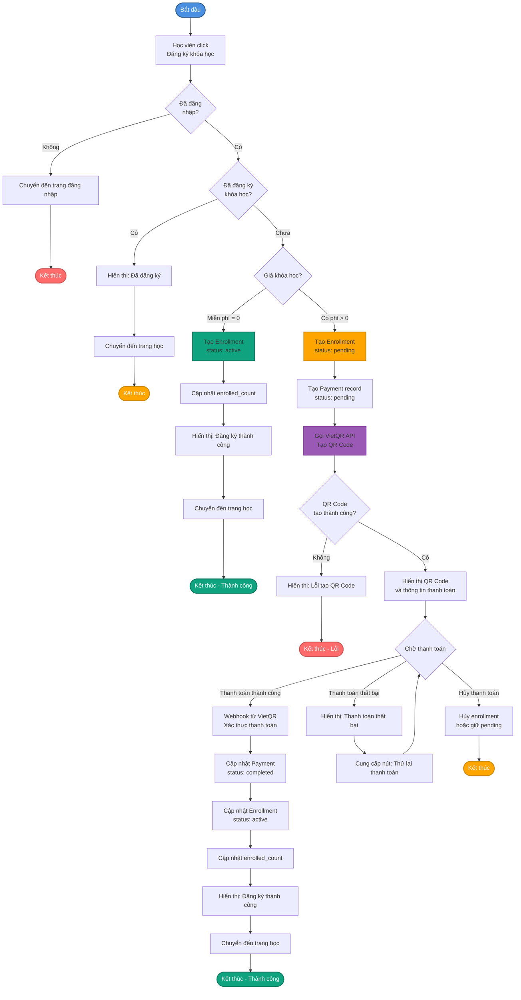
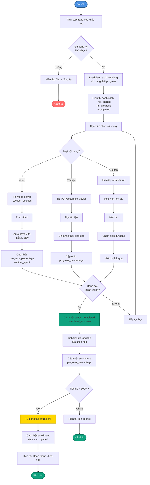
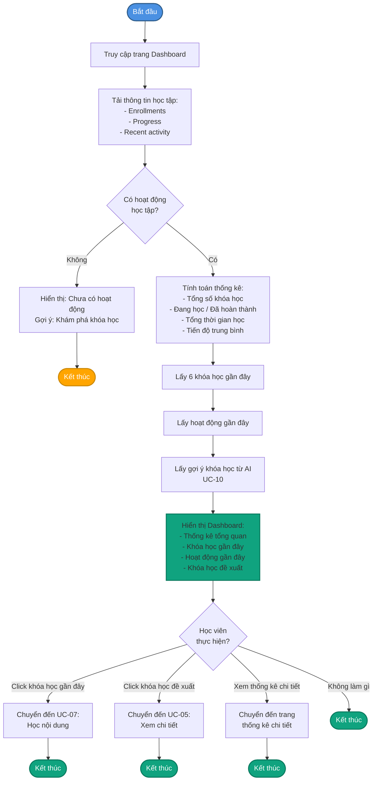
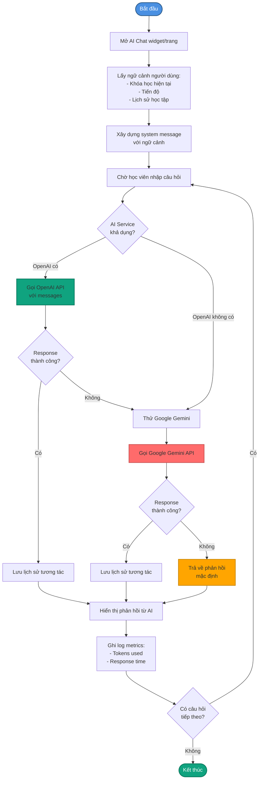
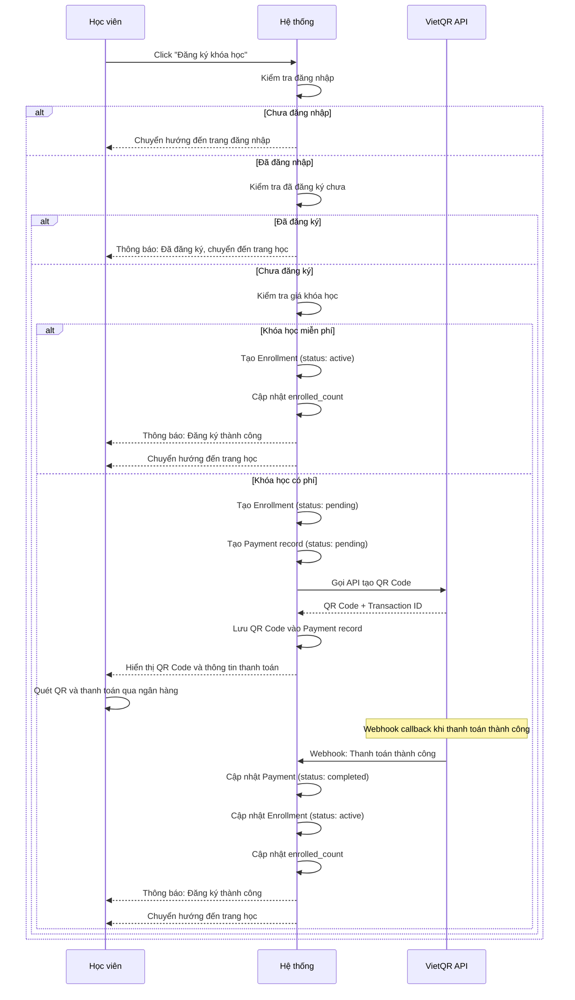
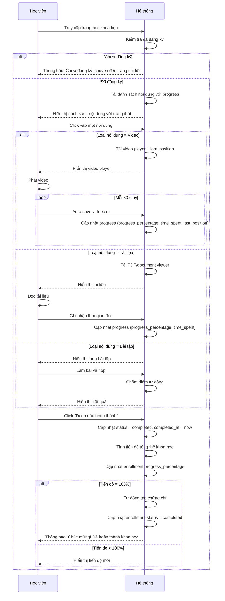
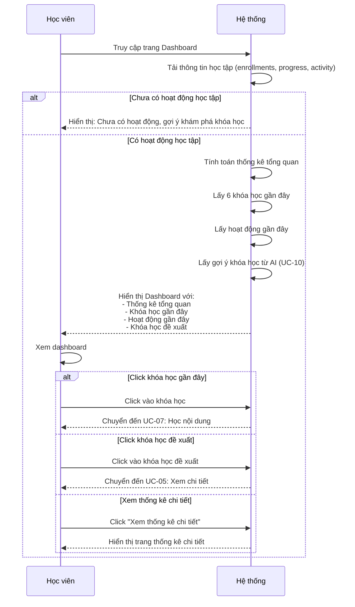
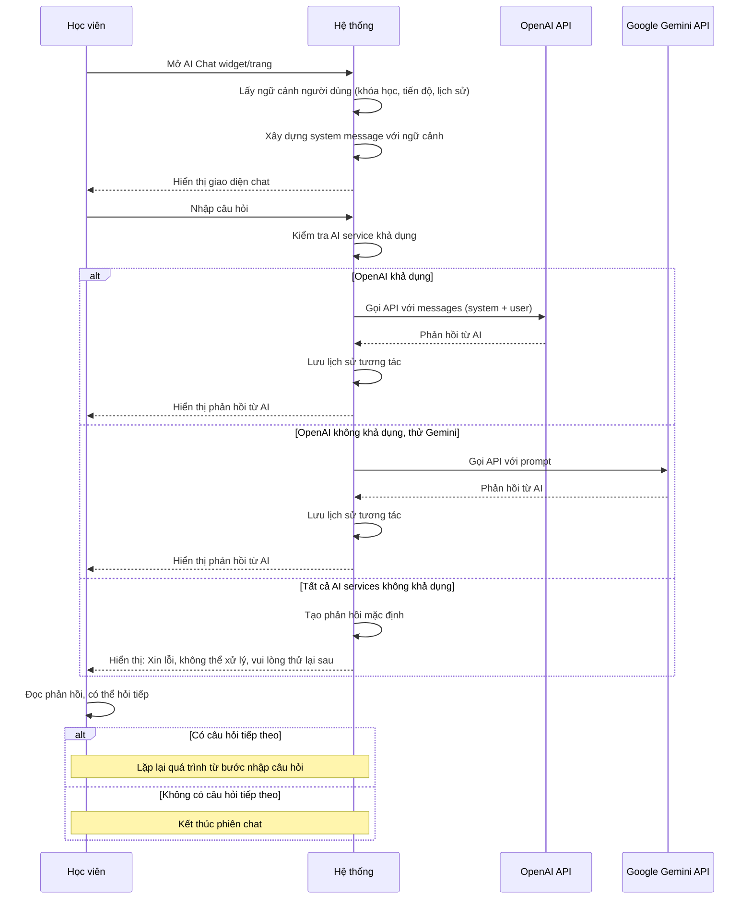
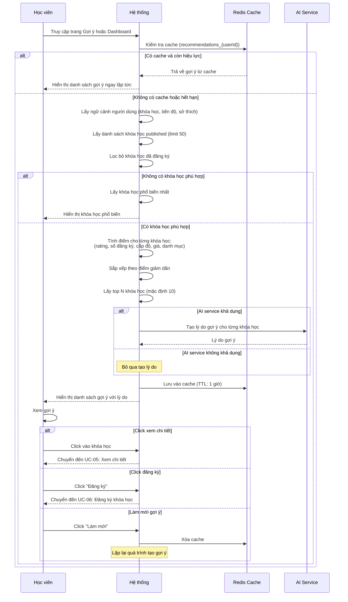

# 3.3. Use Case Học tập và AI

## UC-06: Đăng ký khóa học

| Thuộc tính | Mô tả |
|------------|-------|
| **Tên UC sử dụng** | Học viên đăng ký khóa học |
| **ID** | UC-06 |
| **Tác nhân** | Học viên |
| **Mô tả tóm tắt** | Học viên đăng ký tham gia một khóa học, bao gồm cả khóa học miễn phí và khóa học có phí với thanh toán qua VietQR |
| **Tiền điều kiện** | - Học viên đã đăng nhập<br>- Học viên đang xem chi tiết khóa học<br>- Khóa học có trạng thái "published"<br>- Học viên chưa đăng ký khóa học này |
| **Hậu điều kiện** | - Học viên đã đăng ký khóa học thành công<br>- Enrollment được tạo với trạng thái "active" (miễn phí) hoặc "pending" (có phí)<br>- Học viên có thể bắt đầu học ngay (miễn phí) hoặc sau khi thanh toán (có phí) |
| **Luồng sự kiện** | 1. Học viên click nút "Đăng ký khóa học" hoặc "Thanh toán ngay"<br>2. Hệ thống kiểm tra học viên đã đăng ký chưa<br>3. Hệ thống kiểm tra loại khóa học (miễn phí hay có phí)<br><br>**Nếu khóa học miễn phí (price = 0):**<br>4a. Hệ thống tạo enrollment với status = "active"<br>5a. Hệ thống cập nhật số lượng người đăng ký của khóa học<br>6a. Hệ thống thông báo "Đăng ký thành công"<br>7a. Hệ thống chuyển hướng đến trang học của khóa học<br><br>**Nếu khóa học có phí (price > 0):**<br>4b. Hệ thống tạo enrollment với status = "pending"<br>5b. Hệ thống tạo payment record với status = "pending"<br>6b. Hệ thống gọi VietQR API để tạo QR Code thanh toán<br>7b. Hệ thống hiển thị QR Code và thông tin thanh toán<br>8b. Học viên quét QR Code và thanh toán qua ứng dụng ngân hàng<br>9b. Hệ thống nhận webhook từ VietQR khi thanh toán thành công<br>10b. Hệ thống cập nhật payment status = "completed"<br>11b. Hệ thống cập nhật enrollment status = "active"<br>12b. Hệ thống cập nhật số lượng người đăng ký<br>13b. Hệ thống thông báo "Đăng ký thành công"<br>14b. Hệ thống chuyển hướng đến trang học |
| **Luồng thay thế** | **2a. Học viên đã đăng ký:**<br>- Hệ thống thông báo "Bạn đã đăng ký khóa học này"<br>- Hệ thống chuyển hướng đến trang học<br><br>**3a. Khóa học chưa published:**<br>- Hệ thống thông báo "Khóa học chưa được công khai"<br>- Hệ thống không cho phép đăng ký<br><br>**6b. VietQR API lỗi:**<br>- Hệ thống thông báo "Lỗi khi tạo QR Code thanh toán"<br>- Hệ thống yêu cầu thử lại hoặc liên hệ hỗ trợ<br><br>**8b. Thanh toán thất bại hoặc hủy:**<br>- Hệ thống giữ enrollment ở trạng thái "pending"<br>- Hệ thống thông báo "Thanh toán chưa hoàn tất"<br>- Học viên có thể thử lại thanh toán<br><br>**9b. Webhook không đến hoặc chậm:**<br>- Hệ thống cho phép học viên kiểm tra trạng thái thanh toán<br>- Hệ thống có thể polling để kiểm tra thanh toán |

## UC-07: Học nội dung khóa học

| Thuộc tính | Mô tả |
|------------|-------|
| **Tên UC sử dụng** | Học viên học nội dung khóa học |
| **ID** | UC-07 |
| **Tác nhân** | Học viên |
| **Mô tả tóm tắt** | Học viên xem và học các nội dung (video, tài liệu, bài tập) trong khóa học đã đăng ký, hệ thống tự động theo dõi tiến độ học tập |
| **Tiền điều kiện** | - Học viên đã đăng nhập<br>- Học viên đã đăng ký khóa học<br>- Khóa học có nội dung học tập<br>- Enrollment có status = "active" |
| **Hậu điều kiện** | - Tiến độ học tập của học viên đã được cập nhật<br>- Nội dung được đánh dấu là đã hoàn thành (nếu học viên đánh dấu)<br>- Tiến độ tổng thể của khóa học được cập nhật<br>- Chứng chỉ được tạo tự động nếu hoàn thành 100% |
| **Luồng sự kiện** | 1. Học viên truy cập trang học của khóa học<br>2. Hệ thống tải danh sách nội dung học tập với trạng thái progress của học viên<br>3. Hệ thống hiển thị danh sách nội dung với trạng thái:<br>   - Chưa bắt đầu (not_started)<br>   - Đang học (in_progress)<br>   - Đã hoàn thành (completed)<br>4. Học viên click vào một nội dung để học<br>5. Hệ thống kiểm tra loại nội dung và hiển thị tương ứng:<br>   **5a. Video:**<br>   - Hiển thị video player<br>   - Tải vị trí xem cuối cùng (last_position) nếu có<br>   - Học viên phát video<br>   - Hệ thống tự động lưu vị trí xem mỗi 30 giây<br>   - Hệ thống cập nhật progress_percentage và time_spent<br><br>   **5b. Tài liệu (PDF/Document):**<br>   - Hiển thị PDF viewer hoặc document viewer<br>   - Học viên đọc tài liệu<br>   - Hệ thống ghi nhận thời gian đọc<br>   - Hệ thống cập nhật progress_percentage<br><br>   **5c. Bài tập (Quiz/Exercise):**<br>   - Hiển thị form bài tập với câu hỏi<br>   - Học viên làm bài và nộp<br>   - Hệ thống chấm điểm tự động<br>   - Hệ thống hiển thị kết quả<br>6. Học viên có thể đánh dấu nội dung là "Đã hoàn thành"<br>7. Hệ thống cập nhật trạng thái nội dung thành "completed" và completed_at = now<br>8. Hệ thống tính tiến độ tổng thể của khóa học (số nội dung đã hoàn thành / tổng số nội dung)<br>9. Hệ thống cập nhật enrollment.progress_percentage<br>10. Nếu tiến độ = 100%:<br>    10a. Hệ thống tự động tạo chứng chỉ hoàn thành<br>    10b. Hệ thống cập nhật enrollment status = "completed"<br>    10c. Hệ thống thông báo "Chúc mừng! Bạn đã hoàn thành khóa học" |
| **Luồng thay thế** | **2a. Chưa đăng ký khóa học:**<br>- Hệ thống thông báo "Bạn chưa đăng ký khóa học này"<br>- Hệ thống chuyển hướng đến trang chi tiết khóa học<br><br>**4a. Nội dung bị lỗi hoặc không tải được:**<br>- Hệ thống thông báo "Lỗi khi tải nội dung"<br>- Hệ thống gợi ý học viên báo cáo lỗi hoặc thử lại sau<br><br>**5c. Bài tập nộp sai hoặc không đạt điểm tối thiểu:**<br>- Hệ thống hiển thị kết quả và giải thích đáp án<br>- Học viên có thể xem lại và học lại<br>- Học viên có thể làm lại bài tập (nếu cho phép) |

## UC-08: Xem dashboard và thống kê

| Thuộc tính | Mô tả |
|------------|-------|
| **Tên UC sử dụng** | Học viên xem dashboard và thống kê |
| **ID** | UC-08 |
| **Tác nhân** | Học viên |
| **Mô tả tóm tắt** | Học viên xem dashboard tổng quan về tiến độ học tập, thống kê, khóa học gần đây, và gợi ý khóa học từ AI |
| **Tiền điều kiện** | - Học viên đã đăng nhập |
| **Hậu điều kiện** | - Học viên đã xem thông tin tổng quan về tiến độ học tập<br>- Học viên có thể truy cập nhanh vào các khóa học đang học |
| **Luồng sự kiện** | 1. Học viên truy cập trang Dashboard<br>2. Hệ thống tải thông tin học tập của học viên<br>3. Hệ thống hiển thị các phần:<br>   **3a. Thống kê tổng quan:**<br>   - Tổng số khóa học đã đăng ký<br>   - Số khóa học đang học (status = "active")<br>   - Số khóa học đã hoàn thành (status = "completed")<br>   - Tổng thời gian học tập (tính từ time_spent trong Progress)<br>   - Tiến độ trung bình (% trung bình của tất cả khóa học)<br><br>   **3b. Khóa học gần đây:**<br>   - Danh sách 6 khóa học được truy cập gần nhất<br>   - Mỗi khóa học hiển thị: tiêu đề, hình ảnh, tiến độ, nút "Tiếp tục học"<br><br>   **3c. Hoạt động gần đây:**<br>   - Lịch sử các hoạt động học tập (theo thời gian giảm dần)<br>   - Hiển thị: tên nội dung, khóa học, thời gian, trạng thái (đã hoàn thành, đang học)<br><br>   **3d. Khóa học đề xuất:**<br>   - Gợi ý khóa học từ AI (xem UC-10)<br>   - Hiển thị top 6-10 khóa học được gợi ý<br>4. Học viên có thể:<br>   - Click vào khóa học gần đây để tiếp tục học<br>   - Click vào khóa học đề xuất để xem chi tiết hoặc đăng ký<br>   - Xem thống kê chi tiết (nếu có trang riêng) |
| **Luồng thay thế** | **2a. Học viên chưa có hoạt động học tập:**<br>- Hệ thống hiển thị thông báo "Bạn chưa có hoạt động học tập nào"<br>- Hệ thống gợi ý "Khám phá khóa học" hoặc "Xem danh sách khóa học"<br><br>**3d. Không có gợi ý từ AI:**<br>- Hệ thống hiển thị danh sách khóa học phổ biến thay thế<br>- Hệ thống sắp xếp theo số người đăng ký và đánh giá |

## UC-09: Sử dụng AI Chatbot

| Thuộc tính | Mô tả |
|------------|-------|
| **Tên UC sử dụng** | Học viên sử dụng AI Chatbot |
| **ID** | UC-09 |
| **Tác nhân** | Học viên |
| **Mô tả tóm tắt** | Học viên tương tác với AI chatbot để nhận hỗ trợ học tập, giải đáp thắc mắc, và nhận hướng dẫn học tập dựa trên ngữ cảnh cá nhân |
| **Tiền điều kiện** | - Học viên đã đăng nhập<br>- Dịch vụ AI (OpenAI hoặc Google Gemini) đang hoạt động |
| **Hậu điều kiện** | - Học viên đã nhận được hỗ trợ từ AI<br>- Lịch sử tương tác được lưu lại trong database<br>- Học viên có thể tiếp tục đặt câu hỏi |
| **Luồng sự kiện** | 1. Học viên truy cập trang AI Chat hoặc mở widget AI Chat<br>2. Hệ thống lấy ngữ cảnh người dùng:<br>   - Thông tin profile (tên, vai trò)<br>   - Khóa học hiện tại đang học<br>   - Tiến độ học tập<br>   - Lịch sử hoạt động gần đây<br>3. Hệ thống xây dựng system message với ngữ cảnh<br>4. Học viên nhập câu hỏi hoặc yêu cầu vào ô chat<br>5. Hệ thống gửi câu hỏi đến AI service:<br>   **5a. Thử OpenAI GPT trước:**<br>   - Gọi OpenAI API với messages (system + user message)<br>   - Nếu thành công: nhận phản hồi từ OpenAI<br>   - Nếu thất bại: chuyển sang Gemini<br><br>   **5b. Fallback sang Google Gemini:**<br>   - Gọi Google Gemini API với prompt<br>   - Nếu thành công: nhận phản hồi từ Gemini<br>   - Nếu thất bại: trả về phản hồi mặc định<br>6. AI xử lý câu hỏi dựa trên ngữ cảnh người dùng và trả về phản hồi<br>7. Hệ thống hiển thị phản hồi từ AI trong giao diện chat<br>8. Hệ thống lưu lịch sử tương tác vào database:<br>   - User input<br>   - AI response<br>   - Model used (OpenAI/Gemini)<br>   - Tokens used<br>   - Response time<br>   - Context data<br>9. Học viên có thể tiếp tục đặt câu hỏi (lặp lại từ bước 4) |
| **Luồng thay thế** | **5a. OpenAI không khả dụng:**<br>- Hệ thống tự động chuyển sang Google Gemini<br>- Hệ thống không thông báo lỗi cho học viên<br><br>**5b. Tất cả AI services không khả dụng:**<br>- Hệ thống hiển thị phản hồi mặc định: "Xin lỗi, tôi hiện tại không thể xử lý yêu cầu của bạn. Vui lòng thử lại sau."<br>- Hệ thống ghi log lỗi để theo dõi<br><br>**4a. Câu hỏi quá dài hoặc không hợp lệ:**<br>- Hệ thống có thể yêu cầu học viên rút ngắn câu hỏi<br>- Hệ thống gợi ý các câu hỏi mẫu |

## UC-10: Nhận gợi ý khóa học từ AI

| Thuộc tính | Mô tả |
|------------|-------|
| **Tên UC sử dụng** | Học viên nhận gợi ý khóa học từ AI |
| **ID** | UC-10 |
| **Tác nhân** | Học viên |
| **Mô tả tóm tắt** | Học viên nhận gợi ý khóa học phù hợp dựa trên AI phân tích sở thích, lịch sử học tập, và tiến độ hiện tại |
| **Tiền điều kiện** | - Học viên đã đăng nhập<br>- Học viên đã có lịch sử học tập hoặc sở thích (tùy chọn) |
| **Hậu điều kiện** | - Học viên đã xem danh sách khóa học được gợi ý<br>- Gợi ý được lưu vào cache để tăng tốc độ truy cập lần sau |
| **Luồng sự kiện** | 1. Học viên truy cập trang "Gợi ý khóa học" hoặc xem gợi ý trên dashboard<br>2. Hệ thống kiểm tra cache Redis cho gợi ý đã có (cache key: recommendations_{userId})<br>3. **Nếu có cache (TTL còn hiệu lực):**<br>   3a. Hệ thống lấy gợi ý từ cache<br>   3b. Hệ thống hiển thị danh sách gợi ý ngay lập tức<br><br>4. **Nếu không có cache hoặc cache hết hạn:**<br>   4a. Hệ thống lấy ngữ cảnh người dùng:<br>       - Khóa học hiện tại đang học<br>       - Tiến độ của từng khóa học<br>       - Sở thích và phong cách học<br>       - Lịch sử hoạt động học tập<br>   4b. Hệ thống lấy danh sách khóa học có sẵn (status = "published", limit 50)<br>   4c. Hệ thống lọc bỏ các khóa học đã đăng ký<br>   4d. Hệ thống tính điểm cho từng khóa học dựa trên:<br>       - Rating trung bình (weight: 30%)<br>       - Số lượng người đăng ký (weight: 25%)<br>       - Cấp độ phù hợp với học viên (weight: 20%)<br>       - Giá cả (ưu tiên miễn phí hoặc giá thấp) (weight: 15%)<br>       - Danh mục khóa học hiện tại (weight: 10%)<br>   4e. Hệ thống sắp xếp khóa học theo điểm số (giảm dần)<br>   4f. Hệ thống lấy top N khóa học (mặc định 10 khóa học)<br>   4g. (Tùy chọn) Hệ thống sử dụng AI để tạo lý do gợi ý cho từng khóa học<br>   4h. Hệ thống lưu vào cache Redis với TTL = 1 giờ<br>5. Hệ thống hiển thị danh sách khóa học được gợi ý với:<br>   - Tiêu đề và mô tả<br>   - Hình ảnh<br>   - Giảng viên<br>   - Cấp độ và giá<br>   - Lý do gợi ý (nếu có)<br>6. Học viên có thể:<br>   - Click để xem chi tiết khóa học (UC-05)<br>   - Đăng ký khóa học ngay (UC-06)<br>   - Làm mới gợi ý (xóa cache và tạo lại) |
| **Luồng thay thế** | **4b. Không có khóa học nào phù hợp:**<br>- Hệ thống hiển thị danh sách khóa học phổ biến nhất<br>- Hệ thống sắp xếp theo số người đăng ký và đánh giá<br><br>**4c. Tất cả khóa học đã được đăng ký:**<br>- Hệ thống thông báo "Bạn đã đăng ký tất cả khóa học phù hợp"<br>- Hệ thống gợi ý "Khám phá khóa học mới" hoặc "Xem tất cả khóa học"<br><br>**4g. AI service không khả dụng khi tạo lý do:**<br>- Hệ thống bỏ qua bước tạo lý do<br>- Hệ thống vẫn hiển thị gợi ý nhưng không có lý do chi tiết |

## Sơ đồ Hoạt động - Đăng ký khóa học



## Sơ đồ Hoạt động - Học nội dung khóa học



## Sơ đồ Hoạt động - Xem dashboard và thống kê



## Sơ đồ Hoạt động - Sử dụng AI Chatbot



## Sơ đồ Hoạt động - Nhận gợi ý khóa học từ AI

```mermaid
flowchart TD
    Start([Bắt đầu]) --> AccessRecommendations[Truy cập trang Gợi ý<br/>hoặc Dashboard]
    AccessRecommendations --> CheckCache{Kiểm tra cache<br/>Redis}
    
    CheckCache -->|Có cache| GetCached[Lấy gợi ý từ cache]
    GetCached --> DisplayCached[Hiển thị danh sách gợi ý<br/>từ cache]
    DisplayCached --> End1([Kết thúc])
    
    CheckCache -->|Không có cache| GetUserContext[Lấy ngữ cảnh người dùng:<br/>- Khóa học hiện tại<br/>- Tiến độ<br/>- Sở thích]
    GetUserContext --> GetAvailableCourses[Lấy danh sách khóa học<br/>published, limit 50]
    GetAvailableCourses --> FilterEnrolled[Lọc bỏ khóa học<br/>đã đăng ký]
    
    FilterEnrolled --> CheckCourses{Có khóa học<br/>phù hợp?}
    CheckCourses -->|Không| ShowPopular[Hiển thị khóa học<br/>phổ biến nhất]
    ShowPopular --> End2([Kết thúc])
    
    CheckCourses -->|Có| CalculateScore[Tính điểm cho từng khóa học:<br/>- Rating (30%)<br/>- Số đăng ký (25%)<br/>- Cấp độ (20%)<br/>- Giá (15%)<br/>- Danh mục (10%)]
    CalculateScore --> SortByScore[Sắp xếp theo điểm<br/>giảm dần]
    SortByScore --> GetTopN[Lấy top N khóa học<br/>mặc định 10]
    
    GetTopN --> CheckAI{AI service<br/>khả dụng?}
    CheckAI -->|Có| GenerateReasons[AI tạo lý do gợi ý<br/>cho từng khóa học]
    CheckAI -->|Không| SkipReasons[Bỏ qua tạo lý do]
    
    GenerateReasons --> CacheResults[Lưu vào cache Redis<br/>TTL: 1 giờ]
    SkipReasons --> CacheResults
    
    CacheResults --> DisplayRecommendations[Hiển thị danh sách gợi ý:<br/>- Thông tin khóa học<br/>- Lý do gợi ý nếu có]
    DisplayRecommendations --> UserAction{Học viên<br/>thực hiện?}
    
    UserAction -->|Xem chi tiết| ViewDetail[Chuyển đến UC-05]
    UserAction -->|Đăng ký| Enroll[Chuyển đến UC-06]
    UserAction -->|Làm mới| RefreshCache[Xóa cache<br/>Tạo lại gợi ý]
    UserAction -->|Không làm gì| End3([Kết thúc])
    
    RefreshCache --> GetUserContext
    ViewDetail --> End4([Kết thúc])
    Enroll --> End5([Kết thúc])
    
    style Start fill:#4A90E2,stroke:#2E5C8A,stroke-width:2px,color:#fff
    style End1 fill:#10A37F,stroke:#0A7A5F,stroke-width:2px,color:#fff
    style End2 fill:#10A37F,stroke:#0A7A5F,stroke-width:2px,color:#fff
    style End3 fill:#10A37F,stroke:#0A7A5F,stroke-width:2px,color:#fff
    style End4 fill:#10A37F,stroke:#0A7A5F,stroke-width:2px,color:#fff
    style End5 fill:#10A37F,stroke:#0A7A5F,stroke-width:2px,color:#fff
    style CalculateScore fill:#10A37F,stroke:#0A7A5F,stroke-width:2px
    style GenerateReasons fill:#FF6B6B,stroke:#CC5555,stroke-width:2px
    style CacheResults fill:#9B59B6,stroke:#7D3C98,stroke-width:2px
```

## Sơ đồ Tuần tự - Đăng ký khóa học



## Sơ đồ Tuần tự - Học nội dung khóa học



## Sơ đồ Tuần tự - Xem dashboard và thống kê



## Sơ đồ Tuần tự - Sử dụng AI Chatbot



## Sơ đồ Tuần tự - Nhận gợi ý khóa học từ AI



---

**🏛️ Trường Đại học Công nghệ Thông tin**  
**🌍 Đại học Quốc gia TP. Hồ Chí Minh**
