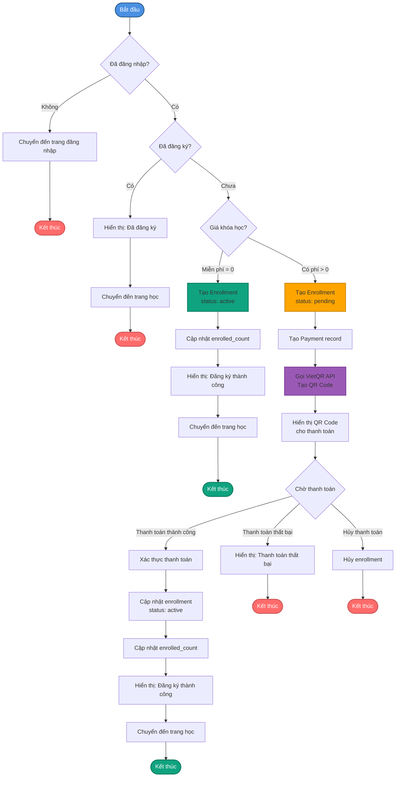
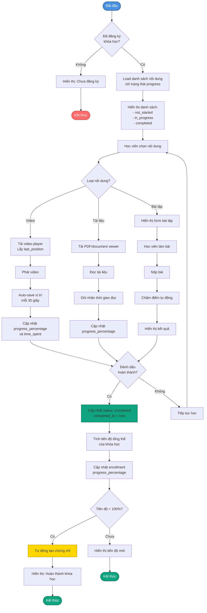
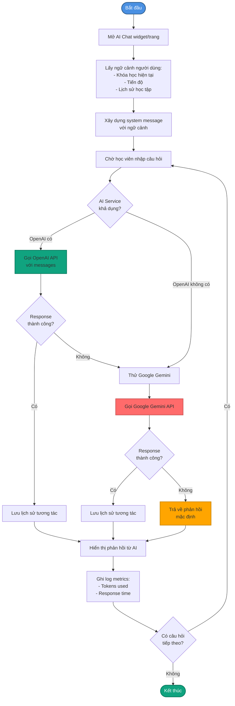
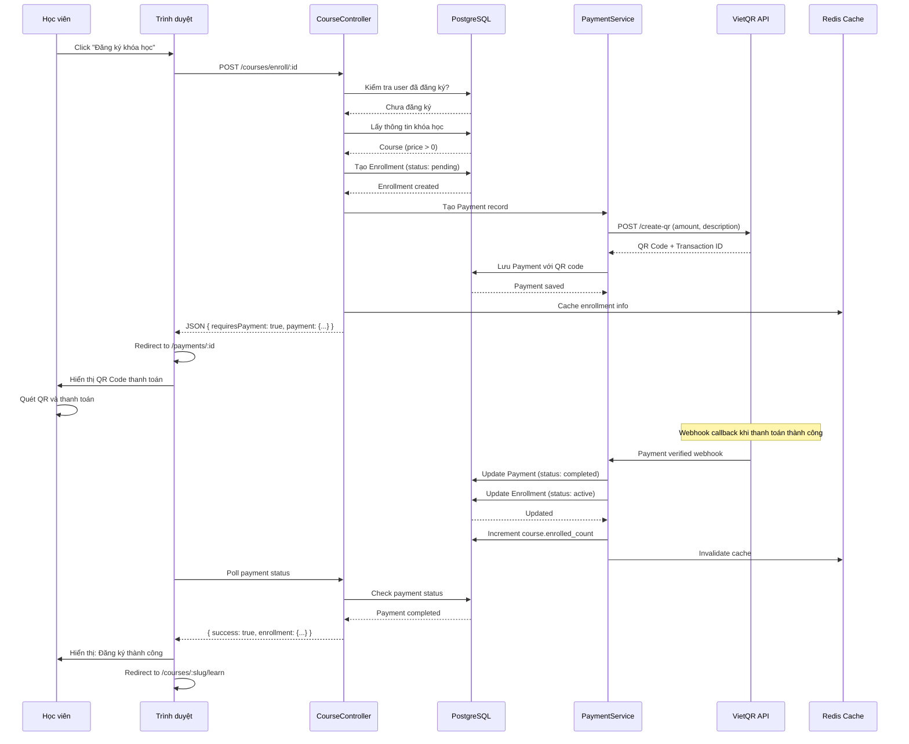
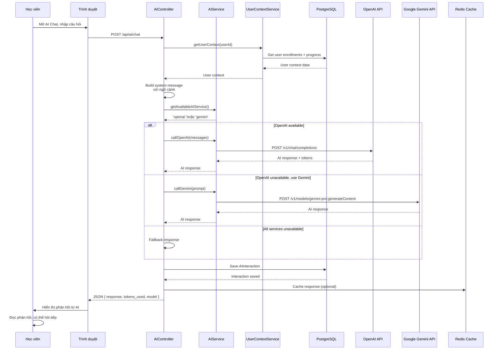
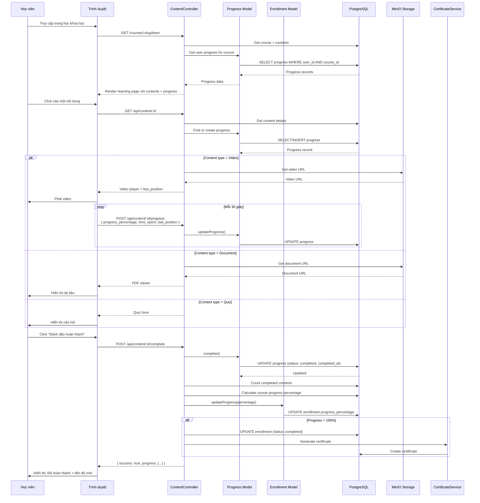

# 3.2. Use Case cho Học viên

## Tổng quan

Học viên là đối tượng người dùng chính của hệ thống StudyMate, có quyền truy cập vào các chức năng học tập, quản lý tiến độ, tương tác với AI, và giao tiếp với người dùng khác. Các use case được mô tả dưới đây dựa trên các chức năng thực tế được triển khai trong hệ thống.

## Bảng Phân Loại Use Case

| Tên UC | ID | Tác nhân | Mô tả tóm tắt | Tiền điều kiện | Hậu điều kiện | Luồng sự kiện | Luồng thay thế |
|--------|----|----------|---------------|----------------|---------------|---------------|----------------|
| Đăng ký tài khoản | UC-01 | Học viên | Học viên đăng ký tài khoản mới trên hệ thống | Chưa có tài khoản, có email hợp lệ | Có tài khoản mới, có thể đăng nhập | Điền thông tin → Kiểm tra email → Tạo tài khoản → Gửi email xác thực → Xác thực email | Email đã tồn tại, Email xác thực không được gửi |
| Đăng nhập hệ thống | UC-02 | Học viên | Học viên đăng nhập bằng email/password hoặc Google OAuth | Có tài khoản, đã xác thực email | Đã đăng nhập, có thể sử dụng hệ thống | Chọn phương thức → Nhập thông tin → Xác thực → Tạo session/JWT | Thông tin sai, chưa xác thực email |
| Xem danh sách khóa học | UC-03 | Học viên | Xem tất cả khóa học có sẵn với phân trang | Đã đăng nhập | Đã xem danh sách khóa học | Truy cập trang → Hiển thị danh sách (12/trang) → Xem các trang tiếp theo | Không có khóa học |
| Tìm kiếm và lọc khóa học | UC-04 | Học viên | Tìm kiếm khóa học theo từ khóa, danh mục, cấp độ | Đã đăng nhập, ở trang danh sách | Đã xem kết quả tìm kiếm | Nhập từ khóa/lọc → Tìm kiếm → Hiển thị kết quả | Không tìm thấy |
| Xem chi tiết khóa học | UC-05 | Học viên | Xem thông tin chi tiết của một khóa học | Đã đăng nhập, khóa học tồn tại và published | Đã xem chi tiết khóa học | Click khóa học → Hiển thị thông tin, nội dung, đánh giá | - |
| Đăng ký khóa học | UC-06 | Học viên | Đăng ký tham gia khóa học (miễn phí hoặc có phí) | Đã đăng nhập, xem chi tiết, khóa học published, chưa đăng ký | Đã đăng ký, có thể bắt đầu học | Click đăng ký → Kiểm tra phí → Thanh toán (nếu có) → Tạo enrollment | Đã đăng ký, thanh toán thất bại |
| Học nội dung khóa học | UC-07 | Học viên | Xem và học các nội dung (video, tài liệu, bài tập) | Đã đăng nhập, đã đăng ký, có nội dung | Tiến độ đã cập nhật, nội dung hoàn thành | Truy cập trang học → Chọn nội dung → Học → Cập nhật tiến độ → Đánh dấu hoàn thành | Nội dung bị lỗi |
| Xem dashboard và thống kê | UC-08 | Học viên | Xem tổng quan tiến độ học tập và thống kê | Đã đăng nhập | Đã xem thông tin tổng quan | Truy cập dashboard → Hiển thị thống kê, khóa học gần đây, hoạt động | - |
| Sử dụng AI Chatbot | UC-09 | Học viên | Tương tác với AI chatbot để nhận hỗ trợ học tập | Đã đăng nhập, AI service hoạt động | Đã nhận hỗ trợ, lịch sử được lưu | Mở chat → Lấy ngữ cảnh → Gửi câu hỏi → AI xử lý → Hiển thị phản hồi | AI không khả dụng |
| Nhận gợi ý khóa học từ AI | UC-10 | Học viên | Nhận gợi ý khóa học phù hợp từ AI | Đã đăng nhập, có lịch sử học tập | Đã xem danh sách gợi ý | Truy cập trang → Kiểm tra cache → Phân tích → Tính điểm → Hiển thị gợi ý | - |
| Tạo lộ trình học tập với AI | UC-11 | Học viên | Yêu cầu AI tạo lộ trình học tập tùy chỉnh | Đã đăng nhập, AI hoạt động | Đã có lộ trình học tập | Điền thông tin → Gửi yêu cầu → AI tạo lộ trình → Hiển thị | AI không khả dụng |
| Chat với người dùng khác | UC-12 | Học viên | Tìm kiếm và chat real-time với người dùng khác | Đã đăng nhập, Socket.IO hoạt động | Tin nhắn đã gửi và lưu | Tìm kiếm/chọn người dùng → Tạo conversation → Gửi tin nhắn real-time | Không tìm thấy người dùng |
| Xem và quản lý profile | UC-13 | Học viên | Xem và cập nhật thông tin cá nhân, avatar | Đã đăng nhập | Thông tin đã cập nhật | Truy cập profile → Xem thông tin → Cập nhật/đổi avatar/đổi mật khẩu | Mật khẩu cũ sai, file không phải ảnh |
| Xem blog và bình luận | UC-14 | Học viên | Xem bài blog và tham gia bình luận | Đã đăng nhập | Đã xem blog, có thể đã bình luận | Truy cập blog → Xem chi tiết → Đọc bình luận → Viết bình luận | - |
| Tạo và quản lý ghi chú cá nhân | UC-15 | Học viên | Tạo, xem, chỉnh sửa, xóa ghi chú cá nhân | Đã đăng nhập | Ghi chú đã được tạo/cập nhật/xóa | Truy cập trang → Tạo/xem/sửa/xóa ghi chú | - |
| Xem chứng chỉ hoàn thành | UC-16 | Học viên | Xem và tải xuống chứng chỉ khi hoàn thành khóa học | Đã đăng nhập, đã hoàn thành khóa học | Đã xem/tải chứng chỉ | Truy cập trang → Xem danh sách → Xem chi tiết → Tải PDF | Không có chứng chỉ |
| Xem thống kê học tập chi tiết | UC-17 | Học viên | Xem thống kê chi tiết về quá trình học tập | Đã đăng nhập, có hoạt động học tập | Đã xem thống kê chi tiết | Truy cập trang → Hiển thị thống kê tổng quan, theo khóa học, theo thời gian → Export | - |
| Đánh giá khóa học | UC-18 | Học viên | Đánh giá và để lại nhận xét cho khóa học | Đã đăng nhập, đã đăng ký | Đánh giá đã được lưu và hiển thị | Truy cập khóa học → Click đánh giá → Chọn sao, viết nhận xét → Gửi | Đã đánh giá (cho phép sửa) |
| Quên mật khẩu và đặt lại | UC-19 | Học viên | Yêu cầu đặt lại mật khẩu khi quên | Có tài khoản, email đã xác thực | Mật khẩu đã đặt lại, có thể đăng nhập | Click quên mật khẩu → Nhập email → Gửi link reset → Click link → Đặt mật khẩu mới | Email không tồn tại, token hết hạn |

## Sơ đồ Use Case

```mermaid
graph TB
    Student[👨‍🎓 Học viên]
    
    subgraph "Xác thực và Tài khoản"
        UC01[UC-01: Đăng ký tài khoản]
        UC02[UC-02: Đăng nhập hệ thống]
        UC19[UC-19: Quên mật khẩu]
    end
    
    subgraph "Khóa học"
        UC03[UC-03: Xem danh sách khóa học]
        UC04[UC-04: Tìm kiếm và lọc]
        UC05[UC-05: Xem chi tiết]
        UC06[UC-06: Đăng ký khóa học]
        UC07[UC-07: Học nội dung]
        UC18[UC-18: Đánh giá khóa học]
    end
    
    subgraph "AI và Hỗ trợ"
        UC09[UC-09: AI Chatbot]
        UC10[UC-10: Gợi ý khóa học]
        UC11[UC-11: Tạo lộ trình học tập]
    end
    
    subgraph "Quản lý và Thống kê"
        UC08[UC-08: Dashboard và thống kê]
        UC13[UC-13: Quản lý profile]
        UC15[UC-15: Ghi chú cá nhân]
        UC16[UC-16: Xem chứng chỉ]
        UC17[UC-17: Thống kê chi tiết]
    end
    
    subgraph "Tương tác"
        UC12[UC-12: Chat với người dùng]
        UC14[UC-14: Blog và bình luận]
    end
    
    Student --> UC01
    Student --> UC02
    Student --> UC03
    Student --> UC04
    Student --> UC05
    Student --> UC06
    Student --> UC07
    Student --> UC08
    Student --> UC09
    Student --> UC10
    Student --> UC11
    Student --> UC12
    Student --> UC13
    Student --> UC14
    Student --> UC15
    Student --> UC16
    Student --> UC17
    Student --> UC18
    Student --> UC19
    
    UC06 -.Thanh toán.-> Payment[💳 Hệ thống thanh toán]
    UC09 -.Tích hợp.-> AI[🤖 AI Service]
    UC10 -.Tích hợp.-> AI
    UC11 -.Tích hợp.-> AI
    UC12 -.Real-time.-> Socket[🔌 Socket.IO]
    
    style Student fill:#4A90E2,stroke:#2E5C8A,stroke-width:3px,color:#fff
    style UC06 fill:#10A37F,stroke:#0A7A5F,stroke-width:2px
    style UC09 fill:#FF6B6B,stroke:#CC5555,stroke-width:2px
    style UC10 fill:#FF6B6B,stroke:#CC5555,stroke-width:2px
    style UC11 fill:#FF6B6B,stroke:#CC5555,stroke-width:2px
```

## Sơ đồ Hoạt động (Activity Diagram)

### UC-06: Đăng ký khóa học

### UC-07: Học nội dung khóa học

### UC-09: Sử dụng AI Chatbot

## Sơ đồ Tuần tự (Sequence Diagram)

### UC-06: Đăng ký khóa học (Khóa học có phí)

### UC-09: Sử dụng AI Chatbot

### UC-07: Học nội dung khóa học

## UC-01: Đăng ký tài khoản

**Mô tả:** Học viên đăng ký tài khoản mới trên hệ thống StudyMate.

**Actor:** Học viên (chưa có tài khoản)

**Preconditions:** 
- Học viên chưa có tài khoản trong hệ thống
- Học viên có email hợp lệ

**Flow chính:**
1. Học viên truy cập trang đăng ký
2. Học viên điền thông tin: email, mật khẩu, họ tên, MSSV
3. Hệ thống kiểm tra email đã tồn tại chưa
4. Hệ thống tạo tài khoản mới
5. Hệ thống gửi email xác thực
6. Học viên xác thực email
7. Tài khoản được kích hoạt

**Postconditions:**
- Học viên có tài khoản mới và có thể đăng nhập

**Alternative flows:**
- 3a. Email đã tồn tại: Hệ thống thông báo lỗi, yêu cầu đăng nhập hoặc quên mật khẩu
- 5a. Email xác thực không được gửi: Học viên có thể yêu cầu gửi lại email

## UC-02: Đăng nhập hệ thống

**Mô tả:** Học viên đăng nhập vào hệ thống bằng email/mật khẩu hoặc Google OAuth.

**Actor:** Học viên

**Preconditions:**
- Học viên đã có tài khoản trong hệ thống
- Tài khoản đã được xác thực email

**Flow chính:**
1. Học viên truy cập trang đăng nhập
2. Học viên chọn phương thức đăng nhập:
   - **2a. Đăng nhập bằng email/mật khẩu:**
     2a.1. Học viên nhập email và mật khẩu
     2a.2. Hệ thống xác thực thông tin
     2a.3. Hệ thống tạo session và JWT token
   - **2b. Đăng nhập bằng Google OAuth:**
     2b.1. Học viên click "Đăng nhập với Google"
     2b.2. Hệ thống chuyển hướng đến Google OAuth
     2b.3. Học viên xác nhận quyền truy cập
     2b.4. Google trả về thông tin người dùng
     2b.5. Hệ thống tạo hoặc cập nhật tài khoản
3. Hệ thống chuyển hướng đến dashboard

**Postconditions:**
- Học viên đã đăng nhập và có thể sử dụng các chức năng của hệ thống

**Alternative flows:**
- 2a.2a. Thông tin đăng nhập sai: Hệ thống thông báo lỗi
- 2a.2b. Tài khoản chưa xác thực email: Hệ thống yêu cầu xác thực email trước

## UC-03: Xem danh sách khóa học

**Mô tả:** Học viên xem danh sách tất cả các khóa học có sẵn trong hệ thống.

**Actor:** Học viên

**Preconditions:**
- Học viên đã đăng nhập

**Flow chính:**
1. Học viên truy cập trang "Khóa học"
2. Hệ thống hiển thị danh sách khóa học với phân trang (12 khóa học/trang)
3. Mỗi khóa học hiển thị: tiêu đề, mô tả, hình ảnh, giảng viên, cấp độ, giá, số lượng người đăng ký, đánh giá trung bình
4. Học viên có thể xem các trang tiếp theo

**Postconditions:**
- Học viên đã xem danh sách khóa học

**Alternative flows:**
- Không có khóa học nào: Hệ thống hiển thị thông báo "Chưa có khóa học nào"

## UC-04: Tìm kiếm và lọc khóa học

**Mô tả:** Học viên tìm kiếm khóa học theo từ khóa, danh mục, hoặc cấp độ.

**Actor:** Học viên

**Preconditions:**
- Học viên đã đăng nhập
- Học viên đang ở trang danh sách khóa học

**Flow chính:**
1. Học viên nhập từ khóa vào ô tìm kiếm hoặc chọn danh mục/cấp độ từ bộ lọc
2. Hệ thống thực hiện tìm kiếm trong database
3. Hệ thống hiển thị kết quả tìm kiếm với phân trang
4. Học viên có thể xem chi tiết khóa học từ kết quả tìm kiếm

**Postconditions:**
- Học viên đã xem kết quả tìm kiếm

**Alternative flows:**
- Không tìm thấy kết quả: Hệ thống hiển thị thông báo "Không tìm thấy khóa học phù hợp"

## UC-05: Xem chi tiết khóa học

**Mô tả:** Học viên xem thông tin chi tiết của một khóa học.

**Actor:** Học viên

**Preconditions:**
- Học viên đã đăng nhập
- Khóa học tồn tại và đã được publish

**Flow chính:**
1. Học viên click vào một khóa học từ danh sách
2. Hệ thống hiển thị trang chi tiết khóa học bao gồm:
   - Thông tin khóa học: tiêu đề, mô tả, giảng viên, cấp độ, giá
   - Danh sách nội dung học tập (chỉ hiển thị preview nếu chưa đăng ký)
   - Đánh giá và bình luận từ học viên khác
   - Thống kê: số lượng người đăng ký, số lượng bài học
3. Học viên có thể:
   - Xem preview nội dung (nếu có)
   - Đọc đánh giá và bình luận
   - Đăng ký khóa học

**Postconditions:**
- Học viên đã xem chi tiết khóa học

## UC-06: Đăng ký khóa học

**Mô tả:** Học viên đăng ký tham gia một khóa học.

**Actor:** Học viên

**Preconditions:**
- Học viên đã đăng nhập
- Học viên đang xem chi tiết khóa học
- Khóa học có trạng thái "published"
- Học viên chưa đăng ký khóa học này

**Flow chính:**
1. Học viên click nút "Đăng ký khóa học"
2. Nếu khóa học có phí:
   2a. Hệ thống chuyển hướng đến trang thanh toán
   2b. Học viên thực hiện thanh toán
   2c. Sau khi thanh toán thành công, hệ thống tạo enrollment
3. Nếu khóa học miễn phí:
   3a. Hệ thống tạo enrollment ngay lập tức
4. Hệ thống cập nhật số lượng người đăng ký của khóa học
5. Hệ thống chuyển hướng đến trang học của khóa học

**Postconditions:**
- Học viên đã đăng ký khóa học và có thể bắt đầu học

**Alternative flows:**
- 1a. Học viên đã đăng ký: Hệ thống thông báo và chuyển hướng đến trang học
- 2b. Thanh toán thất bại: Hệ thống thông báo lỗi, học viên có thể thử lại

## UC-07: Học nội dung khóa học

**Mô tả:** Học viên xem và học các nội dung (video, tài liệu, bài tập) trong khóa học đã đăng ký.

**Actor:** Học viên

**Preconditions:**
- Học viên đã đăng nhập
- Học viên đã đăng ký khóa học
- Khóa học có nội dung học tập

**Flow chính:**
1. Học viên truy cập trang học của khóa học
2. Hệ thống hiển thị danh sách nội dung học tập với trạng thái:
   - Chưa bắt đầu (not_started)
   - Đang học (in_progress)
   - Đã hoàn thành (completed)
3. Học viên click vào một nội dung để học
4. Hệ thống hiển thị nội dung:
   - **Video:** Player video với khả năng lưu vị trí xem
   - **Tài liệu:** Viewer PDF hoặc document
   - **Bài tập:** Form làm bài tập
5. Học viên học nội dung
6. Hệ thống tự động cập nhật tiến độ:
   - Lưu vị trí xem (cho video)
   - Ghi nhận thời gian học
   - Cập nhật progress_percentage
7. Khi hoàn thành, học viên click "Đánh dấu hoàn thành"
8. Hệ thống cập nhật trạng thái nội dung thành "completed"
9. Hệ thống cập nhật tiến độ tổng thể của khóa học

**Postconditions:**
- Tiến độ học tập của học viên đã được cập nhật
- Nội dung được đánh dấu là đã hoàn thành

**Alternative flows:**
- 4a. Nội dung bị lỗi: Hệ thống thông báo lỗi, học viên có thể báo cáo

## UC-08: Xem dashboard và thống kê

**Mô tả:** Học viên xem dashboard tổng quan về tiến độ học tập và thống kê.

**Actor:** Học viên

**Preconditions:**
- Học viên đã đăng nhập

**Flow chính:**
1. Học viên truy cập trang Dashboard
2. Hệ thống hiển thị:
   - **Thống kê tổng quan:**
     - Tổng số khóa học đã đăng ký
     - Số khóa học đang học (active)
     - Số khóa học đã hoàn thành (completed)
     - Tổng thời gian học tập
     - Tiến độ trung bình
   - **Khóa học gần đây:** Danh sách 6 khóa học được truy cập gần nhất
   - **Hoạt động gần đây:** Lịch sử các hoạt động học tập
   - **Khóa học đề xuất:** Gợi ý khóa học từ AI
3. Học viên có thể click vào bất kỳ khóa học nào để tiếp tục học

**Postconditions:**
- Học viên đã xem thông tin tổng quan về tiến độ học tập

## UC-09: Sử dụng AI Chatbot

**Mô tả:** Học viên tương tác với AI chatbot để nhận hỗ trợ học tập.

**Actor:** Học viên

**Preconditions:**
- Học viên đã đăng nhập
- Dịch vụ AI (OpenAI hoặc Google Gemini) đang hoạt động

**Flow chính:**
1. Học viên truy cập trang AI Chat hoặc mở widget AI Chat
2. Hệ thống lấy ngữ cảnh người dùng (khóa học hiện tại, tiến độ, lịch sử học tập)
3. Học viên nhập câu hỏi hoặc yêu cầu
4. Hệ thống gửi câu hỏi đến AI service (OpenAI GPT hoặc Google Gemini với fallback)
5. AI xử lý câu hỏi dựa trên ngữ cảnh người dùng
6. Hệ thống hiển thị phản hồi từ AI
7. Hệ thống lưu lịch sử tương tác AI
8. Học viên có thể tiếp tục đặt câu hỏi

**Postconditions:**
- Học viên đã nhận được hỗ trợ từ AI
- Lịch sử tương tác được lưu lại

**Alternative flows:**
- 4a. AI service không khả dụng: Hệ thống tự động chuyển sang service dự phòng
- 4b. Tất cả AI services không khả dụng: Hệ thống thông báo lỗi và yêu cầu thử lại sau

## UC-10: Nhận gợi ý khóa học từ AI

**Mô tả:** Học viên nhận gợi ý khóa học phù hợp dựa trên AI phân tích sở thích và lịch sử học tập.

**Actor:** Học viên

**Preconditions:**
- Học viên đã đăng nhập
- Học viên đã có lịch sử học tập hoặc sở thích

**Flow chính:**
1. Học viên truy cập trang "Gợi ý khóa học" hoặc xem gợi ý trên dashboard
2. Hệ thống kiểm tra cache Redis cho gợi ý đã có
3. Nếu không có cache:
   3a. Hệ thống lấy ngữ cảnh người dùng (khóa học hiện tại, tiến độ, sở thích)
   3b. Hệ thống lấy danh sách khóa học có sẵn
   3c. Hệ thống lọc bỏ các khóa học đã đăng ký
   3d. Hệ thống tính điểm cho từng khóa học dựa trên:
       - Rating trung bình
       - Số lượng người đăng ký
       - Cấp độ phù hợp
       - Giá cả
   3e. Hệ thống sắp xếp theo điểm số
   3f. (Tùy chọn) Hệ thống sử dụng AI để tạo lý do gợi ý
   3g. Hệ thống lưu vào cache Redis (TTL: 1 giờ)
4. Hệ thống hiển thị danh sách khóa học được gợi ý với lý do
5. Học viên có thể click để xem chi tiết hoặc đăng ký khóa học

**Postconditions:**
- Học viên đã xem danh sách khóa học được gợi ý

## UC-11: Tạo lộ trình học tập với AI

**Mô tả:** Học viên yêu cầu AI tạo lộ trình học tập tùy chỉnh dựa trên mục tiêu và phong cách học.

**Actor:** Học viên

**Preconditions:**
- Học viên đã đăng nhập
- Dịch vụ AI đang hoạt động

**Flow chính:**
1. Học viên truy cập trang "Tạo lộ trình học tập"
2. Học viên điền thông tin:
   - Phong cách học (videos, exercises, reading)
   - Thời gian học tốt nhất (morning, night)
   - Mức độ kỹ năng hiện tại (beginner, intermediate, advanced)
   - Thời lượng khóa học mong muốn
   - Chủ đề quan tâm
3. Hệ thống lấy ngữ cảnh người dùng (khóa học hiện tại, tiến độ)
4. Hệ thống gửi yêu cầu đến AI (Google Gemini) để tạo lộ trình
5. AI tạo lộ trình học tập chi tiết bao gồm:
   - Tổng quan lộ trình
   - Cấu trúc khóa học (chia thành tuần/mô-đun)
   - Mục tiêu học tập của từng mô-đun
   - Nội dung chi tiết (bài học, bài tập, dự án)
   - Thời gian ước tính
   - Tài nguyên học tập
   - Dự án thực hành
   - Đánh giá tiến độ
   - Lời khuyên học tập
6. Hệ thống hiển thị lộ trình đã tạo
7. Học viên có thể lưu hoặc chia sẻ lộ trình

**Postconditions:**
- Học viên đã có lộ trình học tập được tạo bởi AI

**Alternative flows:**
- 4a. AI service không khả dụng: Hệ thống thông báo lỗi và yêu cầu thử lại sau

## UC-12: Chat với người dùng khác

**Mô tả:** Học viên tìm kiếm và chat real-time với người dùng khác trong hệ thống.

**Actor:** Học viên

**Preconditions:**
- Học viên đã đăng nhập
- Socket.IO server đang hoạt động

**Flow chính:**
1. Học viên truy cập trang Chat
2. Hệ thống hiển thị danh sách các cuộc trò chuyện gần đây
3. Học viên có thể:
   - **Tìm kiếm người dùng:**
     3a. Học viên nhập tên, email, hoặc MSSV vào ô tìm kiếm
     3b. Hệ thống tìm kiếm và hiển thị danh sách người dùng
     3c. Học viên click vào một người dùng để bắt đầu chat
   - **Tiếp tục cuộc trò chuyện:**
     3d. Học viên click vào một cuộc trò chuyện từ danh sách
4. Hệ thống tạo hoặc lấy conversation giữa hai người dùng
5. Hệ thống hiển thị lịch sử tin nhắn
6. Học viên nhập và gửi tin nhắn
7. Hệ thống gửi tin nhắn qua Socket.IO real-time
8. Người nhận nhận tin nhắn ngay lập tức
9. Hệ thống lưu tin nhắn vào database
10. Hệ thống tự động scroll đến tin nhắn mới nhất

**Postconditions:**
- Tin nhắn đã được gửi và lưu vào hệ thống

**Alternative flows:**
- 3b. Không tìm thấy người dùng: Hệ thống hiển thị thông báo "Không tìm thấy người dùng"

## UC-13: Xem và quản lý profile

**Mô tả:** Học viên xem và cập nhật thông tin cá nhân, avatar, và các thiết lập tài khoản.

**Actor:** Học viên

**Preconditions:**
- Học viên đã đăng nhập

**Flow chính:**
1. Học viên truy cập trang Profile
2. Hệ thống hiển thị thông tin hiện tại:
   - Họ tên, email, MSSV
   - Avatar
   - Vai trò
   - Ngày tham gia
3. Học viên có thể:
   - **Cập nhật thông tin:**
     3a. Học viên chỉnh sửa họ tên, MSSV
     3b. Học viên lưu thay đổi
     3c. Hệ thống cập nhật thông tin
   - **Thay đổi avatar:**
     3d. Học viên upload ảnh mới
     3e. Hệ thống resize và optimize ảnh
     3f. Hệ thống lưu avatar mới
     3g. Hệ thống cập nhật avatar trong profile
   - **Đổi mật khẩu:**
     3h. Học viên nhập mật khẩu cũ và mật khẩu mới
     3i. Hệ thống xác thực mật khẩu cũ
     3j. Hệ thống hash và lưu mật khẩu mới
4. Hệ thống hiển thị thông báo thành công

**Postconditions:**
- Thông tin profile đã được cập nhật

**Alternative flows:**
- 3i. Mật khẩu cũ sai: Hệ thống thông báo lỗi
- 3e. File không phải ảnh: Hệ thống từ chối và yêu cầu upload lại

## UC-14: Xem blog và bình luận

**Mô tả:** Học viên xem các bài blog về kiến thức và tham gia bình luận.

**Actor:** Học viên

**Preconditions:**
- Học viên đã đăng nhập

**Flow chính:**
1. Học viên truy cập trang Blog
2. Hệ thống hiển thị danh sách bài blog với phân trang
3. Học viên click vào một bài blog để xem chi tiết
4. Hệ thống hiển thị:
   - Nội dung bài blog
   - Tác giả và ngày đăng
   - Danh sách bình luận
5. Học viên có thể:
   - Đọc bình luận của người khác
   - Viết bình luận mới
   - Trả lời bình luận
6. Khi học viên gửi bình luận:
   6a. Hệ thống lưu bình luận vào database
   6b. Hệ thống hiển thị bình luận ngay lập tức
   6c. Tác giả bài blog nhận notification (nếu có)

**Postconditions:**
- Học viên đã xem blog và có thể đã thêm bình luận

## UC-15: Tạo và quản lý ghi chú cá nhân

**Mô tả:** Học viên tạo, xem, chỉnh sửa và xóa ghi chú cá nhân cho khóa học hoặc nội dung.

**Actor:** Học viên

**Preconditions:**
- Học viên đã đăng nhập
- Học viên đã đăng ký khóa học (nếu ghi chú liên quan đến khóa học)

**Flow chính:**
1. Học viên truy cập trang "Ghi chú cá nhân" hoặc tạo ghi chú từ trang học
2. Học viên có thể:
   - **Tạo ghi chú mới:**
     2a. Học viên nhập tiêu đề và nội dung
     2b. Học viên chọn khóa học hoặc nội dung liên quan (tùy chọn)
     2c. Học viên lưu ghi chú
     2d. Hệ thống lưu ghi chú vào database
   - **Xem danh sách ghi chú:**
     2e. Hệ thống hiển thị tất cả ghi chú của học viên
     2f. Học viên có thể lọc theo khóa học
   - **Chỉnh sửa ghi chú:**
     2g. Học viên click vào một ghi chú
     2h. Học viên chỉnh sửa nội dung
     2i. Học viên lưu thay đổi
     2j. Hệ thống cập nhật ghi chú
   - **Xóa ghi chú:**
     2k. Học viên click nút xóa
     2l. Hệ thống xác nhận
     2m. Hệ thống xóa ghi chú

**Postconditions:**
- Ghi chú đã được tạo, cập nhật hoặc xóa

## UC-16: Xem chứng chỉ hoàn thành

**Mô tả:** Học viên xem và tải xuống chứng chỉ khi hoàn thành khóa học.

**Actor:** Học viên

**Preconditions:**
- Học viên đã đăng nhập
- Học viên đã hoàn thành khóa học (progress = 100%)

**Flow chính:**
1. Học viên truy cập trang "Chứng chỉ" hoặc từ trang khóa học đã hoàn thành
2. Hệ thống hiển thị danh sách chứng chỉ của học viên
3. Học viên click vào một chứng chỉ để xem chi tiết
4. Hệ thống hiển thị:
   - Tên khóa học
   - Ngày hoàn thành
   - Chứng chỉ dạng PDF
5. Học viên có thể tải xuống chứng chỉ dạng PDF

**Postconditions:**
- Học viên đã xem hoặc tải xuống chứng chỉ

**Alternative flows:**
- Không có chứng chỉ nào: Hệ thống hiển thị thông báo "Bạn chưa có chứng chỉ nào"

## UC-17: Xem thống kê học tập chi tiết

**Mô tả:** Học viên xem thống kê chi tiết về quá trình học tập của mình.

**Actor:** Học viên

**Preconditions:**
- Học viên đã đăng nhập
- Học viên đã có hoạt động học tập

**Flow chính:**
1. Học viên truy cập trang "Thống kê"
2. Hệ thống hiển thị các thống kê:
   - **Tổng quan:**
     - Tổng số khóa học đã đăng ký
     - Số khóa học đang học
     - Số khóa học đã hoàn thành
     - Tổng thời gian học tập (giờ/phút)
     - Tiến độ trung bình (%)
   - **Theo khóa học:**
     - Tiến độ của từng khóa học
     - Thời gian học cho mỗi khóa học
     - Số bài học đã hoàn thành
   - **Theo thời gian:**
     - Biểu đồ thời gian học theo ngày/tuần/tháng
     - Xu hướng học tập
3. Học viên có thể export thống kê dạng CSV hoặc PDF

**Postconditions:**
- Học viên đã xem thống kê học tập chi tiết

## UC-18: Đánh giá khóa học

**Mô tả:** Học viên đánh giá và để lại nhận xét cho khóa học đã học.

**Actor:** Học viên

**Preconditions:**
- Học viên đã đăng nhập
- Học viên đã đăng ký khóa học
- Học viên chưa đánh giá khóa học này

**Flow chính:**
1. Học viên truy cập trang chi tiết khóa học đã đăng ký
2. Học viên click "Đánh giá khóa học"
3. Học viên:
   - Chọn số sao (1-5 sao)
   - Viết nhận xét (tùy chọn)
4. Học viên gửi đánh giá
5. Hệ thống lưu đánh giá vào database
6. Hệ thống cập nhật rating trung bình của khóa học
7. Hệ thống hiển thị thông báo thành công

**Postconditions:**
- Đánh giá đã được lưu và hiển thị công khai

**Alternative flows:**
- 2a. Học viên đã đánh giá: Hệ thống cho phép chỉnh sửa đánh giá cũ

## UC-19: Quên mật khẩu và đặt lại

**Mô tả:** Học viên yêu cầu đặt lại mật khẩu khi quên mật khẩu.

**Actor:** Học viên

**Preconditions:**
- Học viên có tài khoản trong hệ thống
- Học viên có email đã được xác thực

**Flow chính:**
1. Học viên truy cập trang đăng nhập
2. Học viên click "Quên mật khẩu"
3. Học viên nhập email
4. Hệ thống kiểm tra email có tồn tại không
5. Hệ thống tạo token reset mật khẩu
6. Hệ thống gửi email chứa link reset mật khẩu
7. Học viên mở email và click link
8. Hệ thống xác thực token
9. Học viên nhập mật khẩu mới
10. Hệ thống hash và lưu mật khẩu mới
11. Hệ thống vô hiệu hóa token
12. Hệ thống thông báo thành công và chuyển hướng đến trang đăng nhập

**Postconditions:**
- Mật khẩu đã được đặt lại, học viên có thể đăng nhập với mật khẩu mới

**Alternative flows:**
- 4a. Email không tồn tại: Hệ thống thông báo lỗi (không tiết lộ email có tồn tại hay không vì lý do bảo mật)
- 8a. Token hết hạn hoặc không hợp lệ: Hệ thống yêu cầu yêu cầu lại link reset

---

**🏛️ Trường Đại học Công nghệ Thông tin**  
**🌍 Đại học Quốc gia TP. Hồ Chí Minh**
