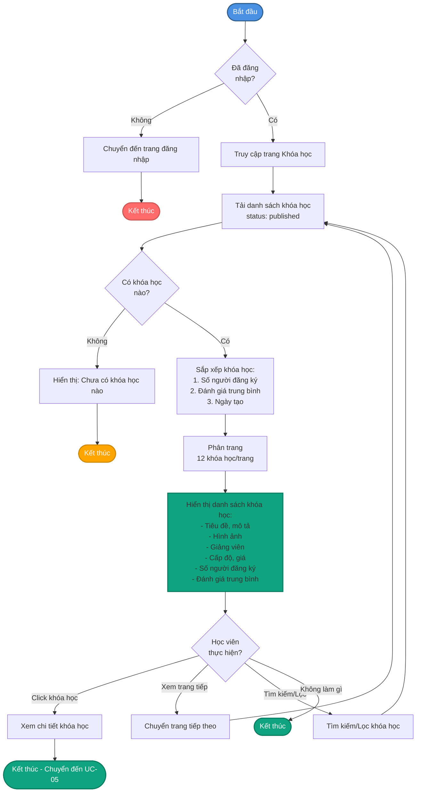
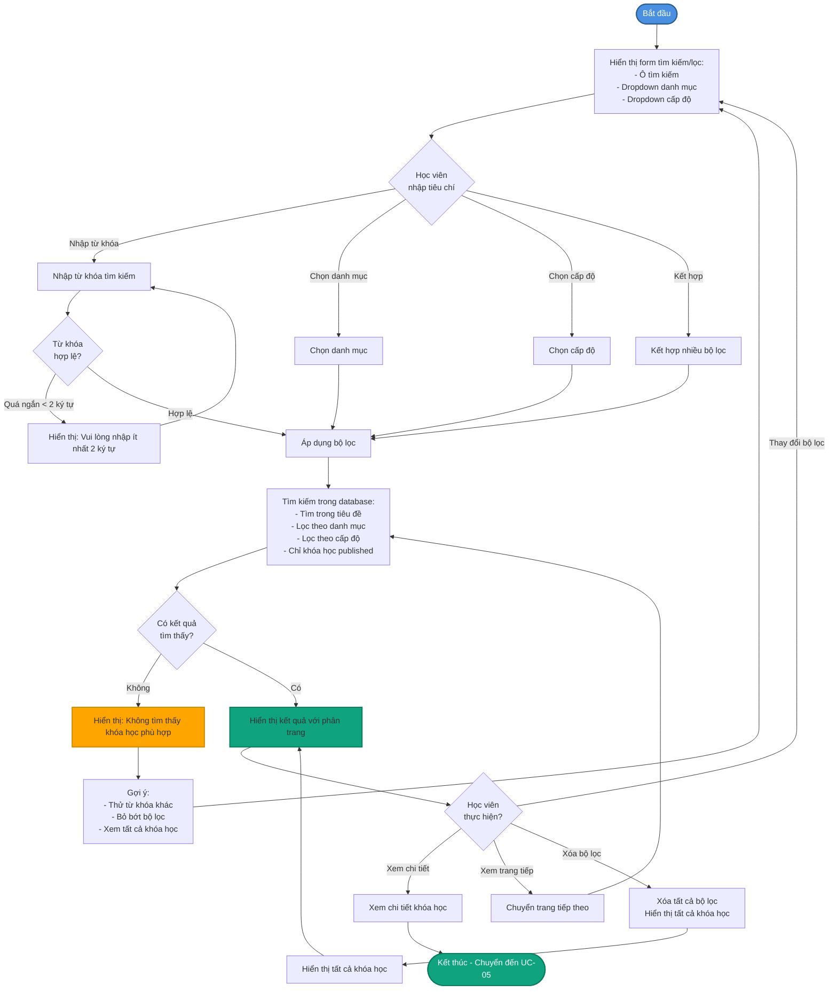
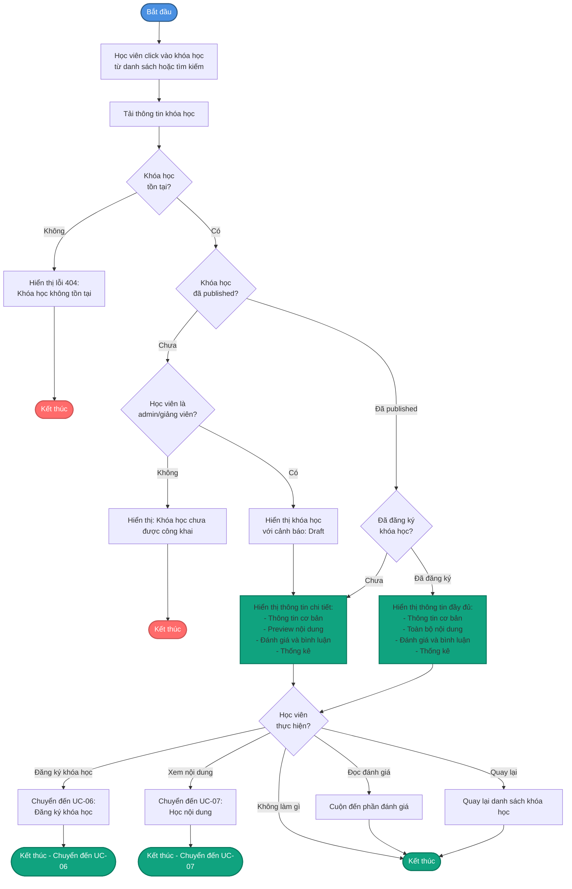
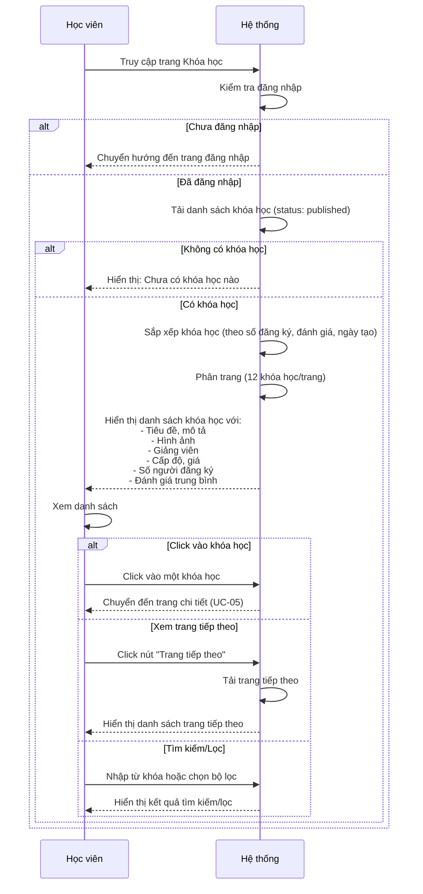
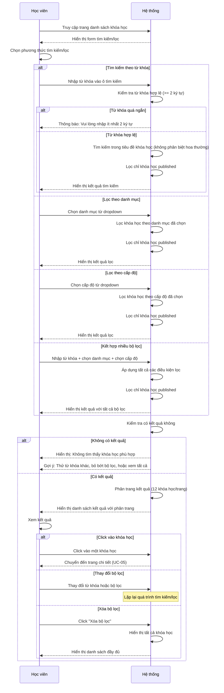
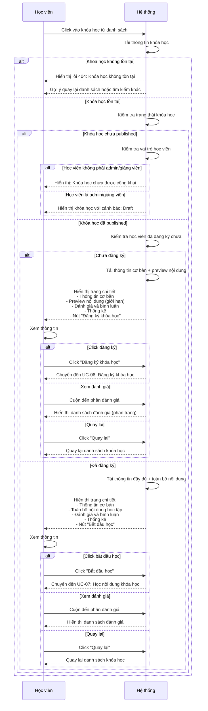

# 3.2. Use Case Khóa học

## UC-03: Xem danh sách khóa học

| Thuộc tính | Mô tả |
|------------|-------|
| **Tên UC sử dụng** | Học viên xem danh sách khóa học |
| **ID** | UC-03 |
| **Tác nhân** | Học viên |
| **Mô tả tóm tắt** | Học viên xem danh sách tất cả các khóa học có sẵn trong hệ thống với phân trang và thông tin cơ bản của từng khóa học |
| **Tiền điều kiện** | - Học viên đã đăng nhập - Học viên đang ở trang danh sách khóa học |
| **Hậu điều kiện** | - Học viên đã xem danh sách khóa học - Học viên có thể xem chi tiết hoặc đăng ký khóa học |
| **Luồng sự kiện** | 1. Học viên truy cập trang "Khóa học" 2. Hệ thống tải danh sách khóa học có trạng thái "published" 3. Hệ thống sắp xếp khóa học theo: số người đăng ký (giảm dần), đánh giá trung bình (giảm dần), ngày tạo (mới nhất) 4. Hệ thống hiển thị danh sách với phân trang (12 khóa học/trang) 5. Mỗi khóa học hiển thị:    - Tiêu đề và mô tả ngắn    - Hình ảnh đại diện    - Tên giảng viên và avatar    - Cấp độ (beginner, intermediate, advanced)    - Giá khóa học    - Số lượng người đã đăng ký    - Đánh giá trung bình (sao) 6. Học viên có thể xem các trang tiếp theo bằng phân trang 7. Học viên có thể click vào khóa học để xem chi tiết |
| **Luồng thay thế** | **2a. Không có khóa học nào:** - Hệ thống hiển thị thông báo "Chưa có khóa học nào" - Hệ thống hiển thị gợi ý tìm kiếm hoặc liên hệ admin  **4a. Lỗi khi tải danh sách:** - Hệ thống thông báo lỗi "Lỗi khi tải danh sách khóa học" - Hệ thống chuyển hướng về trang chủ |

## UC-04: Tìm kiếm và lọc khóa học

| Thuộc tính | Mô tả |
|------------|-------|
| **Tên UC sử dụng** | Học viên tìm kiếm và lọc khóa học |
| **ID** | UC-04 |
| **Tác nhân** | Học viên |
| **Mô tả tóm tắt** | Học viên tìm kiếm khóa học theo từ khóa, danh mục, hoặc cấp độ để tìm khóa học phù hợp với nhu cầu học tập |
| **Tiền điều kiện** | - Học viên đã đăng nhập - Học viên đang ở trang danh sách khóa học |
| **Hậu điều kiện** | - Học viên đã xem kết quả tìm kiếm/lọc - Hệ thống hiển thị danh sách khóa học phù hợp với tiêu chí |
| **Luồng sự kiện** | 1. Học viên truy cập trang danh sách khóa học 2. Học viên có thể:    **2a. Tìm kiếm theo từ khóa:**    - Nhập từ khóa vào ô tìm kiếm (tìm trong tiêu đề khóa học)    - Hệ thống tìm kiếm không phân biệt hoa thường    - Hệ thống hiển thị kết quả khóa học có tiêu đề chứa từ khóa     **2b. Lọc theo danh mục:**    - Chọn danh mục từ dropdown (ví dụ: Lập trình, Toán học, Tiếng Anh)    - Hệ thống hiển thị chỉ các khóa học thuộc danh mục đã chọn     **2c. Lọc theo cấp độ:**    - Chọn cấp độ từ dropdown (Beginner, Intermediate, Advanced)    - Hệ thống hiển thị chỉ các khóa học có cấp độ phù hợp     **2d. Kết hợp nhiều bộ lọc:**    - Học viên có thể kết hợp tìm kiếm + danh mục + cấp độ    - Hệ thống áp dụng tất cả các điều kiện lọc 3. Hệ thống thực hiện tìm kiếm/lọc trong database 4. Hệ thống hiển thị kết quả với phân trang (12 khóa học/trang) 5. Hệ thống giữ nguyên các bộ lọc đã chọn trong URL 6. Học viên có thể xem chi tiết khóa học từ kết quả tìm kiếm |
| **Luồng thay thế** | **3a. Không tìm thấy kết quả:** - Hệ thống hiển thị thông báo "Không tìm thấy khóa học phù hợp" - Hệ thống gợi ý: thử từ khóa khác, bỏ bớt bộ lọc, hoặc xem tất cả khóa học  **2a. Từ khóa tìm kiếm quá ngắn:** - Hệ thống có thể yêu cầu nhập ít nhất 2 ký tự - Hệ thống hiển thị gợi ý từ khóa phổ biến |

## UC-05: Xem chi tiết khóa học

| Thuộc tính | Mô tả |
|------------|-------|
| **Tên UC sử dụng** | Học viên xem chi tiết khóa học |
| **ID** | UC-05 |
| **Tác nhân** | Học viên |
| **Mô tả tóm tắt** | Học viên xem thông tin chi tiết đầy đủ của một khóa học bao gồm nội dung, đánh giá, và thống kê để quyết định đăng ký |
| **Tiền điều kiện** | - Học viên đã đăng nhập - Khóa học tồn tại trong hệ thống - Khóa học có trạng thái "published" |
| **Hậu điều kiện** | - Học viên đã xem chi tiết khóa học - Học viên có đủ thông tin để quyết định đăng ký |
| **Luồng sự kiện** | 1. Học viên click vào một khóa học từ danh sách hoặc từ kết quả tìm kiếm 2. Hệ thống tải thông tin chi tiết khóa học 3. Hệ thống hiển thị trang chi tiết khóa học bao gồm:    **3a. Thông tin cơ bản:**    - Tiêu đề và mô tả đầy đủ    - Hình ảnh đại diện    - Tên giảng viên, avatar, và thông tin giảng viên    - Danh mục và cấp độ    - Giá khóa học (hoặc miễn phí)    - Ngày tạo và cập nhật     **3b. Nội dung khóa học:**    - Danh sách các bài học/nội dung (chỉ hiển thị preview nếu chưa đăng ký)    - Số lượng bài học tổng cộng    - Thời lượng ước tính    - Nếu đã đăng ký: hiển thị đầy đủ danh sách nội dung     **3c. Đánh giá và bình luận:**    - Đánh giá trung bình (sao) và số lượng đánh giá    - Danh sách đánh giá từ học viên khác (phân trang)    - Mỗi đánh giá hiển thị: tên học viên, số sao, nhận xét, ngày đánh giá     **3d. Thống kê:**    - Số lượng người đã đăng ký    - Số lượng bài học    - Tỷ lệ hoàn thành (nếu có) 4. Học viên có thể:    - Xem preview nội dung (nếu có và chưa đăng ký)    - Đọc đánh giá và bình luận từ học viên khác    - Đăng ký khóa học (nếu chưa đăng ký)    - Chuyển đến trang học (nếu đã đăng ký)    - Quay lại danh sách khóa học |
| **Luồng thay thế** | **2a. Khóa học không tồn tại:** - Hệ thống hiển thị lỗi 404 "Khóa học bạn tìm kiếm không tồn tại" - Hệ thống gợi ý quay lại danh sách hoặc tìm kiếm khóa học khác  **2b. Khóa học chưa được publish:** - Nếu học viên không phải admin/giảng viên: Hệ thống hiển thị lỗi "Khóa học chưa được công khai" - Nếu học viên là admin/giảng viên: Hệ thống hiển thị khóa học với cảnh báo "Đang ở chế độ draft"  **3b. Khóa học chưa có nội dung:** - Hệ thống hiển thị thông báo "Khóa học đang được cập nhật nội dung" - Hệ thống vẫn cho phép đăng ký nhưng cảnh báo nội dung sẽ được bổ sung sau |

## Sơ đồ Hoạt động - Xem danh sách khóa học

## Sơ đồ Hoạt động - Tìm kiếm và lọc khóa học

## Sơ đồ Hoạt động - Xem chi tiết khóa học

## Sơ đồ Tuần tự - Xem danh sách khóa học

## Sơ đồ Tuần tự - Tìm kiếm và lọc khóa học

## Sơ đồ Tuần tự - Xem chi tiết khóa học

---

**🏛️ Trường Đại học Công nghệ Thông tin**  
**🌍 Đại học Quốc gia TP. Hồ Chí Minh**
