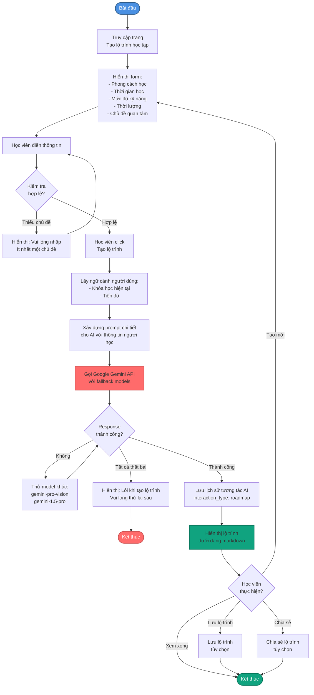
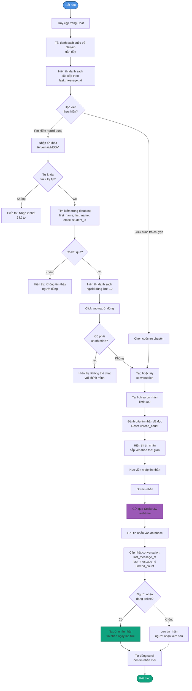
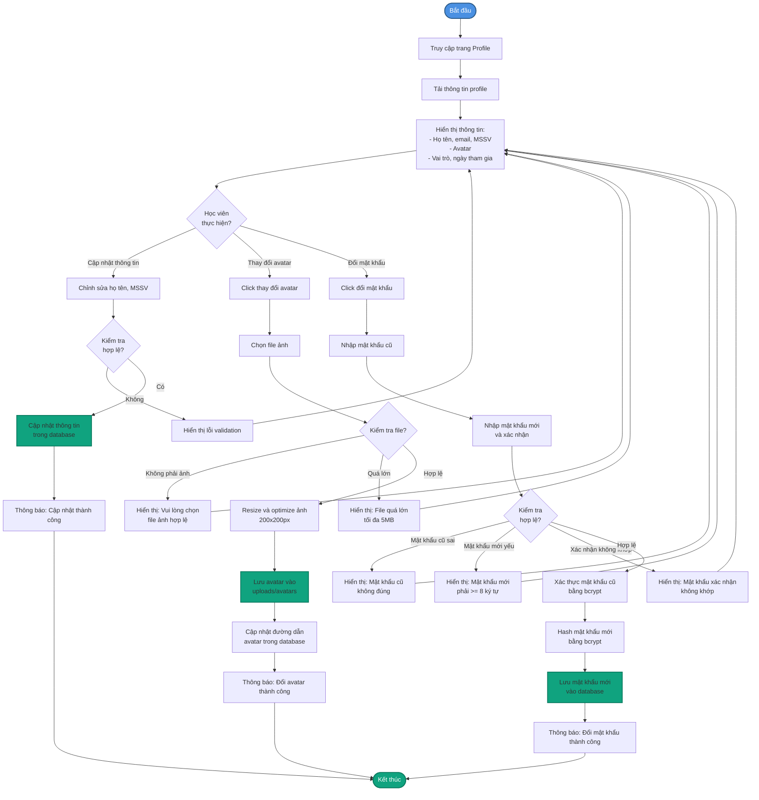
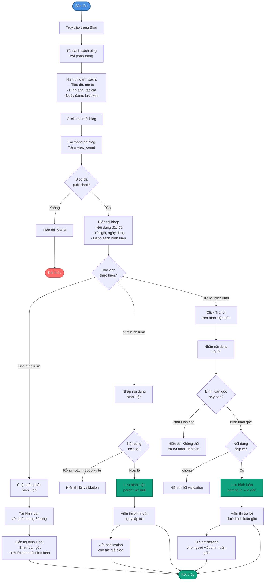
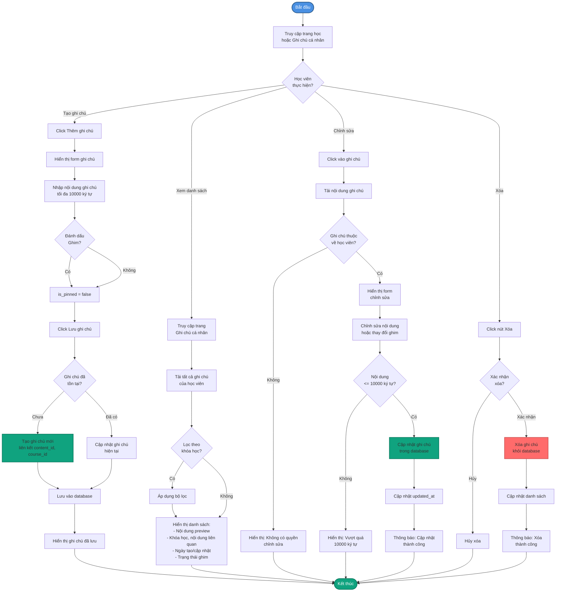
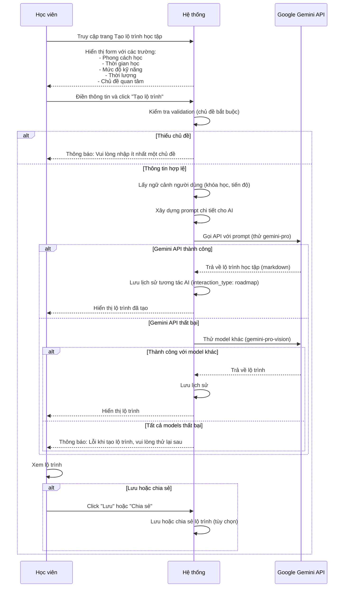
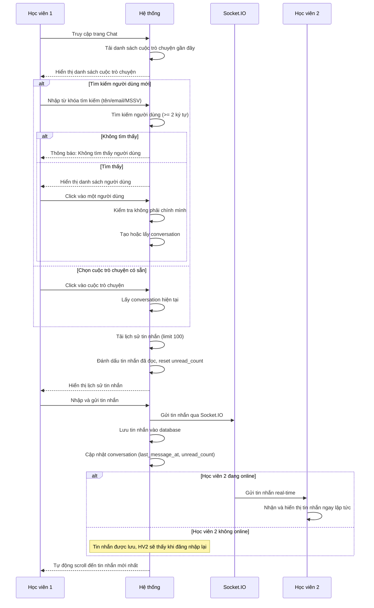
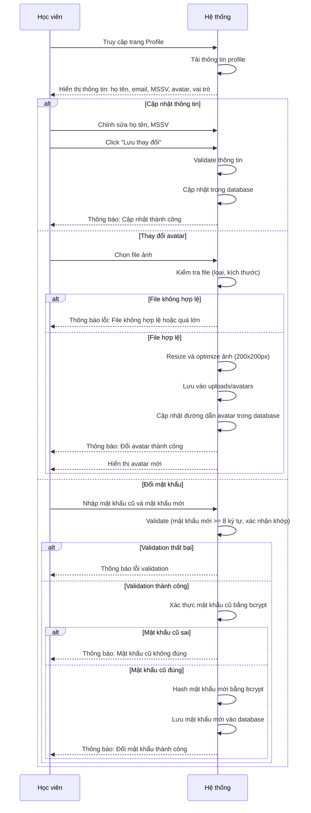
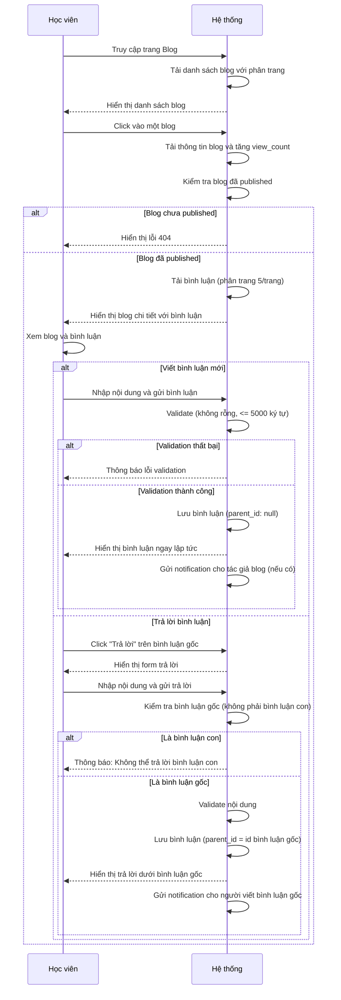
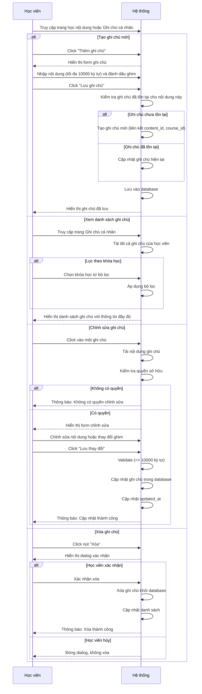

# 3.4. Use Case Tương tác và Quản lý

## UC-11: Tạo lộ trình học tập với AI

| Thuộc tính | Mô tả |
|------------|-------|
| **Tên UC sử dụng** | Học viên tạo lộ trình học tập với AI |
| **ID** | UC-11 |
| **Tác nhân** | Học viên |
| **Mô tả tóm tắt** | Học viên yêu cầu AI tạo lộ trình học tập tùy chỉnh dựa trên mục tiêu, phong cách học, và chủ đề quan tâm để có kế hoạch học tập cá nhân hóa |
| **Tiền điều kiện** | - Học viên đã đăng nhập - Dịch vụ AI (Google Gemini) đang hoạt động |
| **Hậu điều kiện** | - Học viên đã có lộ trình học tập được tạo bởi AI - Lộ trình được lưu trong lịch sử tương tác AI - Học viên có thể lưu hoặc chia sẻ lộ trình |
| **Luồng sự kiện** | 1. Học viên truy cập trang "Tạo lộ trình học tập" 2. Học viên điền thông tin vào form:    - **Phong cách học:** Chọn một hoặc nhiều (videos, exercises, reading)    - **Thời gian học tốt nhất:** Chọn (morning, afternoon, night)    - **Mức độ kỹ năng hiện tại:** Chọn (beginner, intermediate, advanced)    - **Thời lượng khóa học mong muốn:** Nhập số tuần hoặc chọn (2-3 tuần, 4-6 tuần, 8+ tuần)    - **Chủ đề quan tâm:** Nhập danh sách chủ đề (ví dụ: JavaScript, Python, Database) 3. Học viên click "Tạo lộ trình" 4. Hệ thống lấy ngữ cảnh người dùng:    - Khóa học hiện tại đang học    - Tiến độ của từng khóa học    - Tên và vai trò học viên 5. Hệ thống xây dựng prompt chi tiết cho AI với:    - Thông tin người học (từ form và ngữ cảnh)    - Yêu cầu format output (markdown với heading rõ ràng)    - Các phần cần có trong lộ trình 6. Hệ thống gửi yêu cầu đến Google Gemini API (với fallback các model khác) 7. AI tạo lộ trình học tập chi tiết bao gồm:    - **Tổng quan lộ trình:** Mô tả ngắn gọn về lộ trình và mục tiêu học tập    - **Cấu trúc khóa học:** Chia thành các tuần/mô-đun với:      * Tên mô-đun      * Mục tiêu học tập của mô-đun      * Nội dung chi tiết (bài học, bài tập, dự án)      * Thời gian ước tính cho mỗi mô-đun    - **Tài nguyên học tập:** Gợi ý tài liệu, video, bài tập phù hợp    - **Dự án thực hành:** Các dự án để áp dụng kiến thức    - **Đánh giá tiến độ:** Cách kiểm tra và đánh giá sự tiến bộ    - **Lời khuyên học tập:** Mẹo học tập phù hợp với thời gian học 8. Hệ thống lưu lịch sử tương tác AI (interaction_type: 'roadmap') 9. Hệ thống hiển thị lộ trình đã tạo dưới dạng markdown 10. Học viên có thể:     - Đọc và xem lộ trình     - Lưu lộ trình (tùy chọn)     - Chia sẻ lộ trình (tùy chọn)     - Tạo lộ trình mới với thông tin khác |
| **Luồng thay thế** | **2a. Thiếu thông tin bắt buộc (chủ đề quan tâm):** - Hệ thống yêu cầu nhập ít nhất một chủ đề - Hệ thống hiển thị lỗi validation  **6a. AI service không khả dụng:** - Hệ thống thử các model Gemini khác (gemini-pro-vision, gemini-1.5-pro) - Nếu tất cả đều thất bại: Hệ thống thông báo "Lỗi khi tạo lộ trình học tập. Vui lòng thử lại sau." - Hệ thống ghi log lỗi để theo dõi  **7a. AI tạo lộ trình không phù hợp hoặc quá ngắn:** - Học viên có thể tạo lại lộ trình với thông tin chi tiết hơn - Hệ thống có thể gợi ý điều chỉnh các thông tin đầu vào |

## UC-12: Chat với người dùng khác

| Thuộc tính | Mô tả |
|------------|-------|
| **Tên UC sử dụng** | Học viên chat với người dùng khác |
| **ID** | UC-12 |
| **Tác nhân** | Học viên |
| **Mô tả tóm tắt** | Học viên tìm kiếm và chat real-time với người dùng khác trong hệ thống thông qua Socket.IO để trao đổi, hỏi đáp về học tập |
| **Tiền điều kiện** | - Học viên đã đăng nhập - Socket.IO server đang hoạt động |
| **Hậu điều kiện** | - Tin nhắn đã được gửi và lưu vào hệ thống - Người nhận đã nhận tin nhắn real-time - Conversation đã được tạo hoặc cập nhật |
| **Luồng sự kiện** | 1. Học viên truy cập trang Chat 2. Hệ thống hiển thị danh sách các cuộc trò chuyện gần đây (sắp xếp theo last_message_at) 3. Học viên có thể:    **3a. Tìm kiếm người dùng để bắt đầu chat mới:**    - Học viên nhập tên, email, hoặc MSSV vào ô tìm kiếm (tối thiểu 2 ký tự)    - Hệ thống tìm kiếm người dùng (không phân biệt hoa thường, tìm trong first_name, last_name, email, student_id)    - Hệ thống hiển thị danh sách người dùng (limit 10, loại trừ chính học viên)    - Học viên click vào một người dùng để bắt đầu chat     **3b. Tiếp tục cuộc trò chuyện:**    - Học viên click vào một cuộc trò chuyện từ danh sách    - Hệ thống tải lịch sử tin nhắn (limit 100 tin nhắn gần nhất) 4. Hệ thống tạo hoặc lấy conversation giữa hai người dùng:    - Kiểm tra conversation đã tồn tại chưa (theo user1_id và user2_id)    - Nếu chưa có: Tạo conversation mới    - Nếu đã có: Lấy conversation hiện tại 5. Hệ thống hiển thị lịch sử tin nhắn (sắp xếp theo thời gian tăng dần) 6. Hệ thống đánh dấu tin nhắn là đã đọc và reset unread_count 7. Học viên nhập tin nhắn vào ô chat 8. Học viên gửi tin nhắn (Enter hoặc click nút gửi) 9. Hệ thống gửi tin nhắn qua Socket.IO real-time đến người nhận 10. Hệ thống lưu tin nhắn vào database (Message model) 11. Hệ thống cập nhật conversation (last_message_at, last_message_id, unread_count) 12. Người nhận nhận tin nhắn ngay lập tức qua Socket.IO (nếu đang online) 13. Hệ thống tự động scroll đến tin nhắn mới nhất trong giao diện |
| **Luồng thay thế** | **3a. Không tìm thấy người dùng:** - Hệ thống hiển thị thông báo "Không tìm thấy người dùng" - Hệ thống gợi ý thử từ khóa khác hoặc kiểm tra lại thông tin  **3a. Từ khóa tìm kiếm quá ngắn (< 2 ký tự):** - Hệ thống không thực hiện tìm kiếm - Hệ thống hiển thị gợi ý "Nhập ít nhất 2 ký tự để tìm kiếm"  **4a. Học viên cố gắng chat với chính mình:** - Hệ thống thông báo "Bạn không thể chat với chính mình" - Hệ thống chuyển hướng về trang chat  **12a. Người nhận không online:** - Tin nhắn vẫn được lưu vào database - Người nhận sẽ thấy tin nhắn khi đăng nhập lại - Conversation sẽ hiển thị unread_count > 0 |

## UC-13: Xem và quản lý profile

| Thuộc tính | Mô tả |
|------------|-------|
| **Tên UC sử dụng** | Học viên xem và quản lý profile |
| **ID** | UC-13 |
| **Tác nhân** | Học viên |
| **Mô tả tóm tắt** | Học viên xem và cập nhật thông tin cá nhân, avatar, và đổi mật khẩu để quản lý tài khoản của mình |
| **Tiền điều kiện** | - Học viên đã đăng nhập |
| **Hậu điều kiện** | - Thông tin profile đã được cập nhật - Avatar mới đã được lưu và hiển thị - Mật khẩu mới đã được hash và lưu (nếu đổi mật khẩu) |
| **Luồng sự kiện** | 1. Học viên truy cập trang Profile 2. Hệ thống hiển thị thông tin hiện tại:    - Họ tên (first_name, last_name)    - Email (chỉ hiển thị, không thể chỉnh sửa)    - MSSV (student_id)    - Avatar (hình ảnh hoặc initials nếu chưa có)    - Vai trò (role)    - Ngày tham gia (created_at) 3. Học viên có thể thực hiện các thao tác:    **3a. Cập nhật thông tin cá nhân:**    - Học viên chỉnh sửa họ tên, MSSV trong form    - Học viên click "Lưu thay đổi"    - Hệ thống validate thông tin (tên không được rỗng, MSSV format hợp lệ nếu có)    - Hệ thống cập nhật thông tin trong database    - Hệ thống thông báo "Cập nhật thành công"     **3b. Thay đổi avatar:**    - Học viên click "Thay đổi avatar" hoặc click vào avatar hiện tại    - Học viên chọn file ảnh từ máy tính    - Hệ thống kiểm tra file là ảnh (jpg, png, gif, webp)    - Hệ thống kiểm tra kích thước file (ví dụ: tối đa 5MB)    - Hệ thống resize và optimize ảnh (ví dụ: 200x200px)    - Hệ thống lưu avatar vào thư mục uploads/avatars    - Hệ thống cập nhật đường dẫn avatar trong database    - Hệ thống hiển thị avatar mới ngay lập tức    - Hệ thống thông báo "Đổi avatar thành công"     **3c. Đổi mật khẩu:**    - Học viên click "Đổi mật khẩu"    - Học viên nhập mật khẩu cũ    - Học viên nhập mật khẩu mới (và xác nhận mật khẩu mới)    - Hệ thống validate:      * Mật khẩu cũ không được rỗng      * Mật khẩu mới phải đủ mạnh (ví dụ: tối thiểu 8 ký tự)      * Mật khẩu mới và xác nhận phải khớp    - Hệ thống xác thực mật khẩu cũ bằng bcrypt    - Nếu đúng: Hệ thống hash mật khẩu mới bằng bcrypt    - Hệ thống lưu mật khẩu mới vào database    - Hệ thống thông báo "Đổi mật khẩu thành công"    - Hệ thống có thể yêu cầu đăng nhập lại |
| **Luồng thay thế** | **3a. Thông tin không hợp lệ:** - Hệ thống hiển thị lỗi validation (ví dụ: "Tên không được để trống") - Học viên sửa lại và thử lại  **3b. File không phải ảnh:** - Hệ thống từ chối và thông báo "Vui lòng chọn file ảnh hợp lệ (jpg, png, gif, webp)" - Học viên chọn file khác  **3b. File quá lớn:** - Hệ thống thông báo "File quá lớn, vui lòng chọn file nhỏ hơn 5MB" - Học viên chọn file nhỏ hơn hoặc nén ảnh  **3c. Mật khẩu cũ sai:** - Hệ thống thông báo "Mật khẩu cũ không đúng" - Học viên nhập lại mật khẩu cũ  **3c. Mật khẩu mới không đủ mạnh:** - Hệ thống thông báo "Mật khẩu mới phải có ít nhất 8 ký tự" - Học viên nhập mật khẩu mới mạnh hơn  **3c. Mật khẩu mới và xác nhận không khớp:** - Hệ thống thông báo "Mật khẩu xác nhận không khớp" - Học viên nhập lại |

## UC-14: Xem blog và bình luận

| Thuộc tính | Mô tả |
|------------|-------|
| **Tên UC sử dụng** | Học viên xem blog và bình luận |
| **ID** | UC-14 |
| **Tác nhân** | Học viên |
| **Mô tả tóm tắt** | Học viên xem các bài blog về kiến thức và tham gia bình luận, trao đổi với người dùng khác về nội dung blog |
| **Tiền điều kiện** | - Học viên đã đăng nhập - Blog có trạng thái "published" |
| **Hậu điều kiện** | - Học viên đã xem blog - Bình luận đã được lưu và hiển thị (nếu học viên đã bình luận) - View count của blog đã được tăng |
| **Luồng sự kiện** | 1. Học viên truy cập trang Blog 2. Hệ thống hiển thị danh sách bài blog với phân trang (sắp xếp theo ngày đăng giảm dần) 3. Mỗi blog hiển thị: tiêu đề, mô tả ngắn, hình ảnh, tác giả, ngày đăng, số lượt xem 4. Học viên click vào một bài blog để xem chi tiết 5. Hệ thống tải thông tin blog và tăng view_count 6. Hệ thống hiển thị trang chi tiết blog bao gồm:    - **Nội dung bài blog:** Tiêu đề, nội dung đầy đủ (markdown/HTML), hình ảnh    - **Thông tin tác giả:** Tên, avatar, ngày đăng    - **Danh sách bình luận:**      * Bình luận gốc (parent_id = null) với phân trang (5 bình luận/trang)      * Bình luận trả lời (replies) cho mỗi bình luận gốc      * Mỗi bình luận hiển thị: tên người dùng, avatar, nội dung, ngày đăng, số lượt thích      * Sắp xếp: mới nhất (mặc định), cũ nhất, nhiều lượt thích nhất 7. Học viên có thể:    **7a. Đọc bình luận:**    - Cuộn xuống phần bình luận    - Xem các bình luận gốc và trả lời    - Click "Xem thêm" để tải thêm bình luận (phân trang)     **7b. Viết bình luận mới:**    - Học viên nhập nội dung bình luận vào ô textarea    - Học viên click "Gửi bình luận"    - Hệ thống validate: nội dung không được rỗng, tối đa 5000 ký tự    - Hệ thống lưu bình luận vào database (status: 'active', parent_id: null)    - Hệ thống hiển thị bình luận ngay lập tức trong danh sách    - Tác giả bài blog nhận notification (nếu có hệ thống notification)     **7c. Trả lời bình luận:**    - Học viên click "Trả lời" trên một bình luận gốc    - Hệ thống hiển thị form trả lời    - Học viên nhập nội dung trả lời    - Học viên click "Gửi trả lời"    - Hệ thống lưu bình luận với parent_id = id của bình luận gốc    - Hệ thống hiển thị trả lời ngay dưới bình luận gốc    - Người viết bình luận gốc nhận notification (nếu có) |
| **Luồng thay thế** | **4a. Blog không tồn tại hoặc chưa published:** - Hệ thống hiển thị lỗi 404 "Bài viết bạn tìm kiếm không tồn tại" - Hệ thống gợi ý quay lại danh sách blog  **7b. Nội dung bình luận rỗng hoặc quá dài:** - Hệ thống thông báo "Nội dung bình luận không được để trống" hoặc "Bình luận không được vượt quá 5000 ký tự" - Học viên sửa lại nội dung  **7c. Cố gắng trả lời bình luận con (nested reply):** - Hệ thống không cho phép (chỉ cho phép 1 cấp: bình luận gốc → trả lời) - Hệ thống thông báo "Không thể trả lời bình luận con"  **6a. Không có bình luận nào:** - Hệ thống hiển thị "Chưa có bình luận nào. Hãy là người đầu tiên bình luận!" |

## UC-15: Tạo và quản lý ghi chú cá nhân

| Thuộc tính | Mô tả |
|------------|-------|
| **Tên UC sử dụng** | Học viên tạo và quản lý ghi chú cá nhân |
| **ID** | UC-15 |
| **Tác nhân** | Học viên |
| **Mô tả tóm tắt** | Học viên tạo, xem, chỉnh sửa, và xóa ghi chú cá nhân cho từng nội dung học tập để ghi nhớ kiến thức quan trọng |
| **Tiền điều kiện** | - Học viên đã đăng nhập - Học viên đã đăng ký khóa học (nếu ghi chú liên quan đến nội dung khóa học) |
| **Hậu điều kiện** | - Ghi chú đã được tạo, cập nhật hoặc xóa - Ghi chú được liên kết với nội dung học tập cụ thể |
| **Luồng sự kiện** | 1. Học viên truy cập trang học nội dung khóa học hoặc trang "Ghi chú cá nhân" 2. Học viên có thể thực hiện các thao tác:    **2a. Tạo ghi chú mới:**    - Học viên click "Thêm ghi chú" hoặc "Ghi chú cá nhân" trên trang học nội dung    - Hệ thống hiển thị form ghi chú (textarea)    - Học viên nhập nội dung ghi chú (tối đa 10000 ký tự, có thể để trống)    - Học viên có thể đánh dấu "Ghim" (is_pinned) để ưu tiên hiển thị    - Học viên click "Lưu ghi chú"    - Hệ thống kiểm tra ghi chú đã tồn tại cho nội dung này chưa    - Nếu chưa: Hệ thống tạo ghi chú mới (liên kết với content_id và course_id)    - Nếu đã có: Hệ thống cập nhật ghi chú hiện tại    - Hệ thống lưu ghi chú vào database    - Hệ thống hiển thị ghi chú đã lưu     **2b. Xem danh sách ghi chú:**    - Học viên truy cập trang "Ghi chú cá nhân"    - Hệ thống tải tất cả ghi chú của học viên    - Hệ thống hiển thị danh sách ghi chú với:      * Tiêu đề nội dung liên quan      * Tên khóa học      * Nội dung ghi chú (preview hoặc đầy đủ)      * Ngày tạo/cập nhật      * Trạng thái ghim    - Học viên có thể lọc theo khóa học    - Học viên có thể sắp xếp theo: mới nhất, cũ nhất, đã ghim     **2c. Chỉnh sửa ghi chú:**    - Học viên click vào một ghi chú từ danh sách hoặc trên trang học    - Hệ thống hiển thị form chỉnh sửa với nội dung hiện tại    - Học viên chỉnh sửa nội dung hoặc thay đổi trạng thái ghim    - Học viên click "Lưu thay đổi"    - Hệ thống validate: nội dung không vượt quá 10000 ký tự    - Hệ thống cập nhật ghi chú trong database    - Hệ thống cập nhật updated_at    - Hệ thống thông báo "Cập nhật ghi chú thành công"     **2d. Xóa ghi chú:**    - Học viên click nút "Xóa" trên một ghi chú    - Hệ thống xác nhận "Bạn có chắc chắn muốn xóa ghi chú này?"    - Học viên xác nhận    - Hệ thống xóa ghi chú khỏi database    - Hệ thống thông báo "Xóa ghi chú thành công"    - Hệ thống cập nhật danh sách ghi chú |
| **Luồng thay thế** | **2a. Nội dung ghi chú quá dài (> 10000 ký tự):** - Hệ thống thông báo "Ghi chú không được vượt quá 10000 ký tự" - Học viên rút ngắn nội dung  **2c. Ghi chú không tồn tại hoặc không thuộc về học viên:** - Hệ thống thông báo "Ghi chú không tồn tại" hoặc "Bạn không có quyền chỉnh sửa ghi chú này" - Hệ thống trả về lỗi 404 hoặc 403  **2d. Học viên hủy xóa:** - Hệ thống không thực hiện xóa - Hệ thống đóng dialog xác nhận |

## Sơ đồ Hoạt động - Tạo lộ trình học tập với AI

## Sơ đồ Hoạt động - Chat với người dùng khác

## Sơ đồ Hoạt động - Xem và quản lý profile

## Sơ đồ Hoạt động - Xem blog và bình luận

## Sơ đồ Hoạt động - Tạo và quản lý ghi chú cá nhân

## Sơ đồ Tuần tự - Tạo lộ trình học tập với AI

## Sơ đồ Tuần tự - Chat với người dùng khác

## Sơ đồ Tuần tự - Xem và quản lý profile

## Sơ đồ Tuần tự - Xem blog và bình luận

## Sơ đồ Tuần tự - Tạo và quản lý ghi chú cá nhân

---

**🏛️ Trường Đại học Công nghệ Thông tin**  
**🌍 Đại học Quốc gia TP. Hồ Chí Minh**
