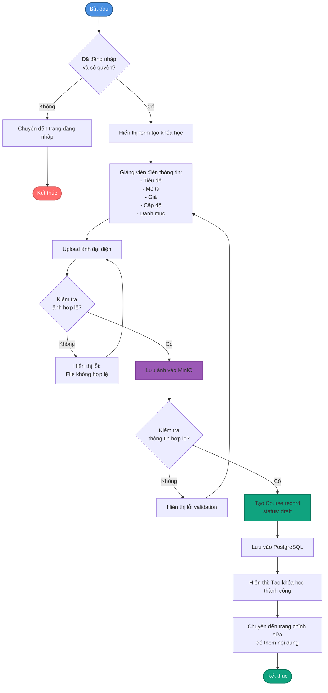
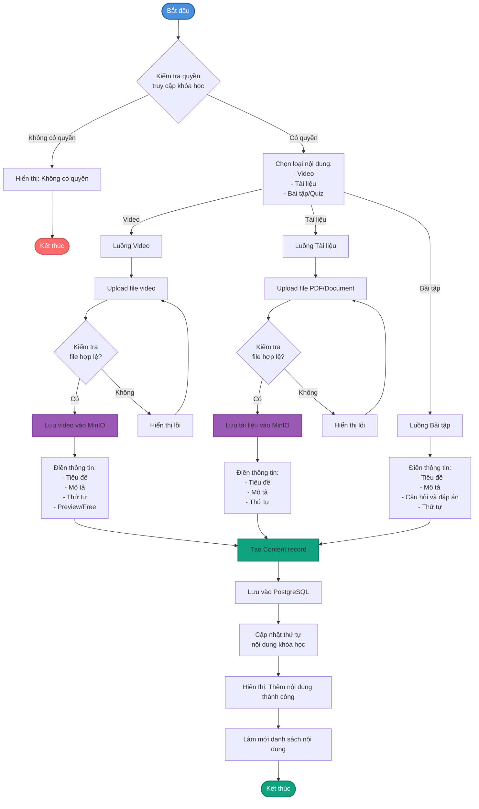
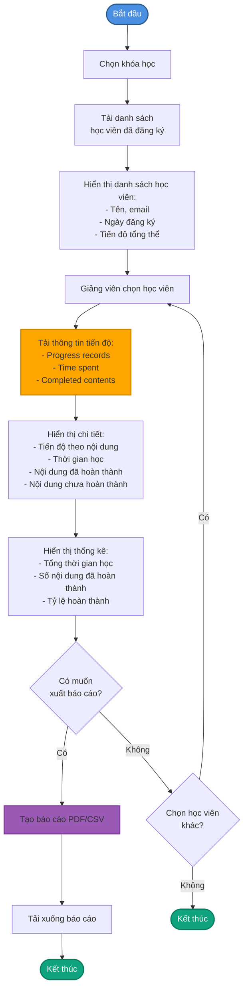
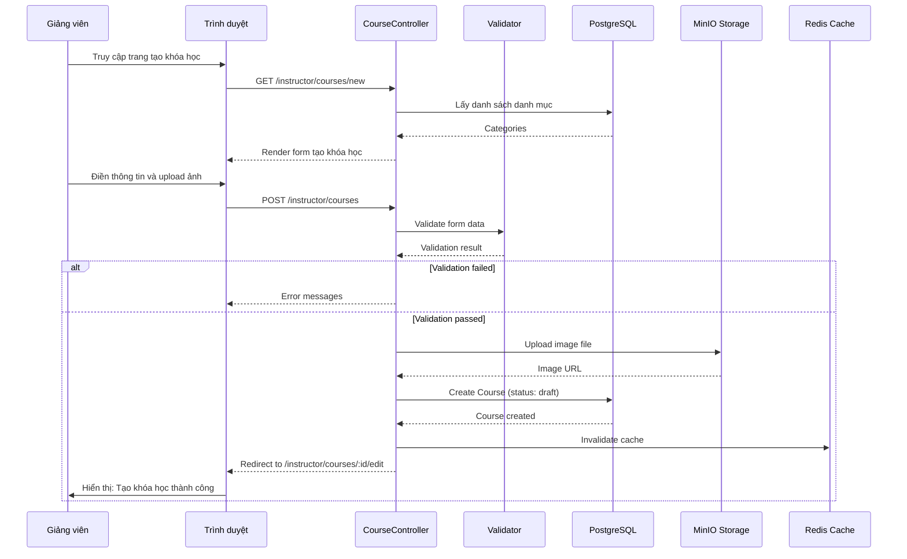
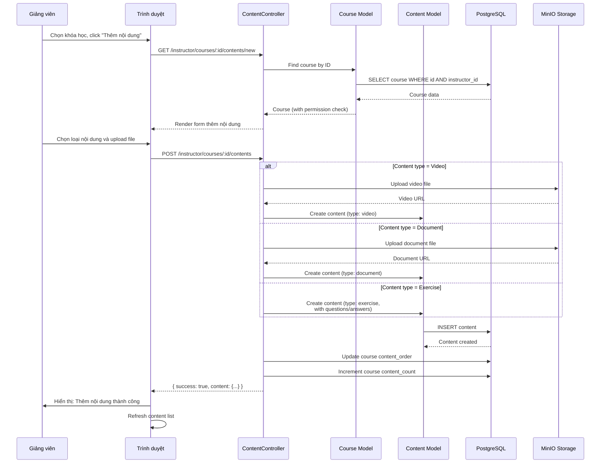
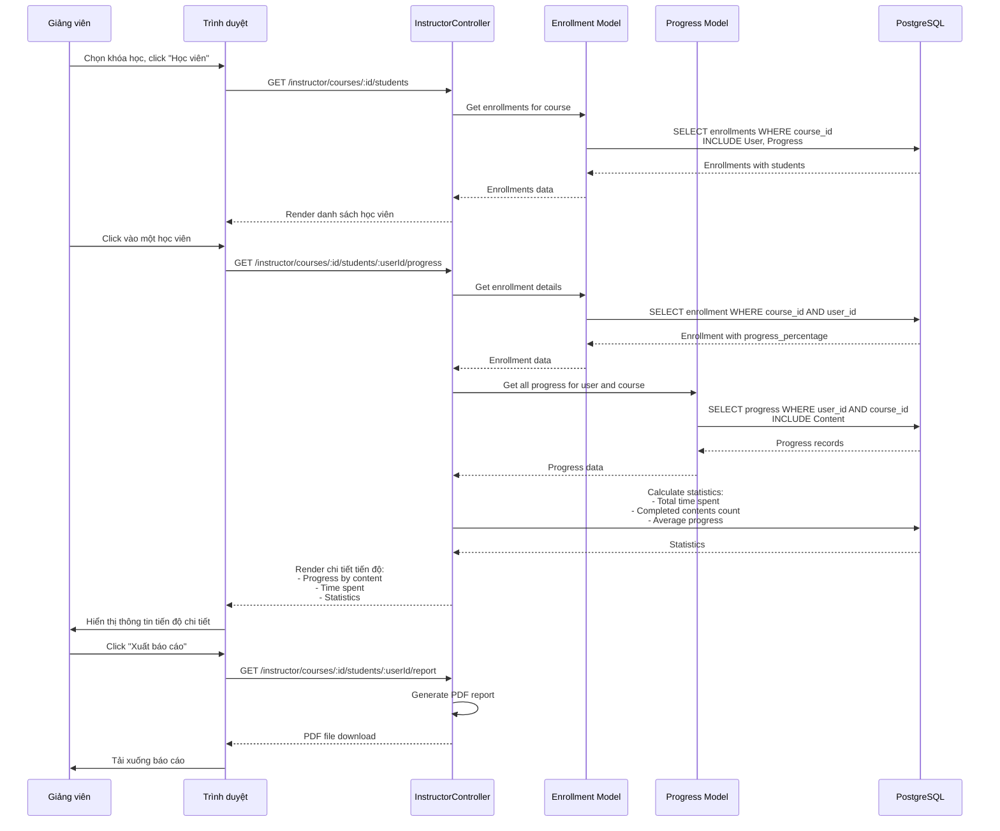

# Mô tả Đối tượng Sử dụng

Hệ thống StudyMate có ba đối tượng sử dụng chính: **học viên (sinh viên)**, **giảng viên**, và **quản trị viên**.

**Quản trị viên** là người có quyền hạn cao nhất trong hệ thống, chịu trách nhiệm quản trị toàn bộ nội dung và hoạt động trên hệ thống. Quản trị viên có thể:

- **Quản lý người dùng**: Xem danh sách, chi tiết, chỉnh sửa, xóa người dùng, phân quyền (student, teacher, lecturer, admin), và quản lý trạng thái tài khoản.

- **Quản lý khóa học**: Tạo, chỉnh sửa, xóa khóa học của bất kỳ giảng viên nào, quản lý danh mục khóa học, thiết lập giá và trạng thái xuất bản.

- **Quản lý nội dung học tập**: Xem, chỉnh sửa, xóa tất cả nội dung (video, tài liệu, bài tập) trong các khóa học, quản lý thứ tự và trạng thái nội dung.

- **Quản lý bài viết blog**: Xem, chỉnh sửa, xóa, kiểm duyệt và xuất bản tất cả bài viết blog trong hệ thống, quản lý danh mục blog.

- **Quản lý đăng ký khóa học**: Xem danh sách tất cả đăng ký, theo dõi tiến độ học tập của học viên, xem chứng chỉ đã cấp.

- **Quản lý danh mục**: Tạo, chỉnh sửa, xóa danh mục khóa học và blog.

- **Quản lý file**: Upload, quản lý và xóa các file trong hệ thống (MinIO object storage).

- **Quản lý liên hệ**: Xem và xử lý các thông tin liên hệ từ người dùng.

- **Quản lý thanh toán**: Xem lịch sử giao dịch, quản lý các khoản thanh toán khóa học.

- **Thống kê và báo cáo**: Xem thống kê tổng quan về hệ thống (số lượng người dùng, khóa học, đăng ký, doanh thu), phân tích xu hướng và hiệu suất.

**Giảng viên** là những người tạo và quản lý khóa học trên hệ thống. Giảng viên có thể:

- **Tạo và quản lý khóa học**: Tạo khóa học mới với thông tin chi tiết (tiêu đề, mô tả, giá, cấp độ, danh mục), chỉnh sửa và xóa khóa học của mình, thiết lập trạng thái xuất bản (draft, published).

- **Quản lý nội dung học tập**: Thêm, chỉnh sửa, xóa nội dung trong khóa học của mình bao gồm video, tài liệu PDF, bài tập, quiz, sắp xếp thứ tự nội dung, thiết lập nội dung miễn phí hoặc preview.

- **Quản lý học viên**: Xem danh sách học viên đã đăng ký khóa học của mình, theo dõi tiến độ học tập của từng học viên, xem thống kê về số lượng đăng ký và hoàn thành.

- **Tạo và quản lý bài viết blog**: Tạo bài viết blog để chia sẻ kiến thức, chỉnh sửa và xóa bài viết của mình, tương tác với học viên thông qua hệ thống bình luận.

- **Theo dõi hiệu suất khóa học**: Xem đánh giá và nhận xét từ học viên, phân tích hiệu quả giảng dạy.

---

## 3.3. Use Case cho Giảng viên

### Tổng quan

Giảng viên là những người tạo và quản lý khóa học trên hệ thống StudyMate, có quyền tạo khóa học, quản lý nội dung học tập, theo dõi học viên, và tương tác với cộng đồng thông qua blog. Các use case được mô tả dưới đây dựa trên các chức năng thực tế được triển khai trong hệ thống.

### Bảng Phân Loại Use Case

| Tên UC | ID | Tác nhân | Mô tả tóm tắt | Tiền điều kiện | Hậu điều kiện | Luồng sự kiện | Luồng thay thế |
|--------|----|----------|---------------|----------------|---------------|---------------|----------------|
| Đăng nhập hệ thống | UC-GV-01 | Giảng viên | Giảng viên đăng nhập vào hệ thống | Có tài khoản với role teacher/lecturer, đã xác thực email | Đã đăng nhập, có thể sử dụng hệ thống | Chọn phương thức → Nhập thông tin → Xác thực → Tạo session/JWT | Thông tin sai, chưa xác thực email |
| Tạo khóa học mới | UC-GV-02 | Giảng viên | Tạo khóa học mới với thông tin chi tiết | Đã đăng nhập, có quyền teacher/lecturer | Khóa học đã được tạo (status: draft) | Điền thông tin → Upload ảnh → Chọn danh mục → Lưu khóa học | Thông tin không hợp lệ, file ảnh quá lớn |
| Chỉnh sửa khóa học | UC-GV-03 | Giảng viên | Chỉnh sửa thông tin khóa học đã tạo | Đã đăng nhập, khóa học thuộc về giảng viên | Thông tin khóa học đã được cập nhật | Chọn khóa học → Chỉnh sửa → Lưu thay đổi | Khóa học không tồn tại, không có quyền |
| Xóa khóa học | UC-GV-04 | Giảng viên | Xóa khóa học đã tạo | Đã đăng nhập, khóa học thuộc về giảng viên | Khóa học đã bị xóa | Chọn khóa học → Xác nhận xóa → Xóa khóa học | Khóa học có học viên đăng ký (cảnh báo) |
| Xuất bản khóa học | UC-GV-05 | Giảng viên | Thay đổi trạng thái khóa học từ draft sang published | Đã đăng nhập, khóa học ở trạng thái draft, có nội dung | Khóa học đã được xuất bản | Chọn khóa học → Click xuất bản → Cập nhật status | Khóa học chưa có nội dung |
| Thêm nội dung vào khóa học | UC-GV-06 | Giảng viên | Thêm video, tài liệu, hoặc bài tập vào khóa học | Đã đăng nhập, khóa học thuộc về giảng viên | Nội dung đã được thêm vào khóa học | Chọn khóa học → Chọn loại nội dung → Upload/Điền thông tin → Lưu | File quá lớn, định dạng không hỗ trợ |
| Chỉnh sửa nội dung | UC-GV-07 | Giảng viên | Chỉnh sửa thông tin nội dung trong khóa học | Đã đăng nhập, nội dung thuộc khóa học của giảng viên | Nội dung đã được cập nhật | Chọn nội dung → Chỉnh sửa → Lưu | Nội dung không tồn tại |
| Xóa nội dung | UC-GV-08 | Giảng viên | Xóa nội dung khỏi khóa học | Đã đăng nhập, nội dung thuộc khóa học của giảng viên | Nội dung đã bị xóa | Chọn nội dung → Xác nhận xóa → Xóa | Nội dung đang được học viên sử dụng |
| Sắp xếp thứ tự nội dung | UC-GV-09 | Giảng viên | Thay đổi thứ tự hiển thị của nội dung trong khóa học | Đã đăng nhập, khóa học có nhiều nội dung | Thứ tự nội dung đã được cập nhật | Kéo thả hoặc nhập số thứ tự → Lưu | - |
| Xem danh sách học viên | UC-GV-10 | Giảng viên | Xem danh sách học viên đã đăng ký khóa học | Đã đăng nhập, khóa học có học viên đăng ký | Đã xem danh sách học viên | Chọn khóa học → Xem danh sách học viên | Không có học viên đăng ký |
| Theo dõi tiến độ học viên | UC-GV-11 | Giảng viên | Xem tiến độ học tập chi tiết của từng học viên | Đã đăng nhập, có học viên đăng ký | Đã xem thông tin tiến độ | Chọn học viên → Xem tiến độ, thời gian học, nội dung đã hoàn thành | Học viên chưa bắt đầu học |
| Xem thống kê khóa học | UC-GV-12 | Giảng viên | Xem thống kê về khóa học (số đăng ký, hoàn thành, đánh giá) | Đã đăng nhập, có khóa học | Đã xem thống kê | Chọn khóa học → Xem dashboard thống kê | - |
| Tạo bài viết blog | UC-GV-13 | Giảng viên | Tạo bài viết blog mới để chia sẻ kiến thức | Đã đăng nhập | Bài viết đã được tạo (status: draft hoặc published) | Viết nội dung → Upload ảnh → Chọn danh mục → Lưu/Xuất bản | Nội dung không hợp lệ |
| Chỉnh sửa bài viết blog | UC-GV-14 | Giảng viên | Chỉnh sửa bài viết blog đã tạo | Đã đăng nhập, bài viết thuộc về giảng viên | Bài viết đã được cập nhật | Chọn bài viết → Chỉnh sửa → Lưu | Bài viết không tồn tại |
| Xóa bài viết blog | UC-GV-15 | Giảng viên | Xóa bài viết blog đã tạo | Đã đăng nhập, bài viết thuộc về giảng viên | Bài viết đã bị xóa | Chọn bài viết → Xác nhận xóa → Xóa | Bài viết có nhiều bình luận (cảnh báo) |
| Xem đánh giá khóa học | UC-GV-16 | Giảng viên | Xem đánh giá và nhận xét từ học viên về khóa học | Đã đăng nhập, khóa học có đánh giá | Đã xem danh sách đánh giá | Chọn khóa học → Xem tab đánh giá → Đọc đánh giá | Không có đánh giá nào |
| Quản lý profile | UC-GV-17 | Giảng viên | Xem và cập nhật thông tin cá nhân, avatar | Đã đăng nhập | Thông tin đã cập nhật | Truy cập profile → Xem/Cập nhật thông tin → Lưu | Mật khẩu cũ sai, file không phải ảnh |
| Xem dashboard giảng viên | UC-GV-18 | Giảng viên | Xem tổng quan về khóa học và hoạt động | Đã đăng nhập | Đã xem dashboard | Truy cập dashboard → Hiển thị thống kê, khóa học, học viên | - |

### Sơ đồ Use Case

```mermaid
graph TB
    GV[👨‍🏫 Giảng viên]
    
    subgraph "Xác thực"
        UC01[UC-GV-01: Đăng nhập hệ thống]
    end
    
    subgraph "Quản lý Khóa học"
        UC02[UC-GV-02: Tạo khóa học]
        UC03[UC-GV-03: Chỉnh sửa khóa học]
        UC04[UC-GV-04: Xóa khóa học]
        UC05[UC-GV-05: Xuất bản khóa học]
    end
    
    subgraph "Quản lý Nội dung"
        UC06[UC-GV-06: Thêm nội dung]
        UC07[UC-GV-07: Chỉnh sửa nội dung]
        UC08[UC-GV-08: Xóa nội dung]
        UC09[UC-GV-09: Sắp xếp thứ tự]
    end
    
    subgraph "Quản lý Học viên"
        UC10[UC-GV-10: Xem danh sách học viên]
        UC11[UC-GV-11: Theo dõi tiến độ]
        UC12[UC-GV-12: Thống kê khóa học]
        UC16[UC-GV-16: Xem đánh giá]
    end
    
    subgraph "Blog và Tương tác"
        UC13[UC-GV-13: Tạo blog]
        UC14[UC-GV-14: Chỉnh sửa blog]
        UC15[UC-GV-15: Xóa blog]
    end
    
    subgraph "Quản lý Cá nhân"
        UC17[UC-GV-17: Quản lý profile]
        UC18[UC-GV-18: Dashboard]
    end
    
    GV --> UC01
    GV --> UC02
    GV --> UC03
    GV --> UC04
    GV --> UC05
    GV --> UC06
    GV --> UC07
    GV --> UC08
    GV --> UC09
    GV --> UC10
    GV --> UC11
    GV --> UC12
    GV --> UC13
    GV --> UC14
    GV --> UC15
    GV --> UC16
    GV --> UC17
    GV --> UC18
    
    UC06 -.Upload.-> MinIO[📦 MinIO Storage]
    UC13 -.Upload.-> MinIO
    UC17 -.Upload.-> MinIO
    
    style GV fill:#4A90E2,stroke:#2E5C8A,stroke-width:3px,color:#fff
    style UC02 fill:#10A37F,stroke:#0A7A5F,stroke-width:2px
    style UC06 fill:#FF6B6B,stroke:#CC5555,stroke-width:2px
    style UC11 fill:#FFA500,stroke:#CC8800,stroke-width:2px
```

### Sơ đồ Hoạt động (Activity Diagram)

#### UC-GV-02: Tạo khóa học mới

#### UC-GV-06: Thêm nội dung vào khóa học

#### UC-GV-11: Theo dõi tiến độ học viên

### Sơ đồ Tuần tự (Sequence Diagram)

#### UC-GV-02: Tạo khóa học mới

#### UC-GV-06: Thêm nội dung vào khóa học

#### UC-GV-11: Theo dõi tiến độ học viên

## UC-GV-01: Đăng nhập hệ thống

**Mô tả:** Giảng viên đăng nhập vào hệ thống bằng email/mật khẩu hoặc Google OAuth.

**Actor:** Giảng viên

**Preconditions:**
- Giảng viên đã có tài khoản trong hệ thống với role `teacher` hoặc `lecturer`
- Tài khoản đã được xác thực email

**Flow chính:**
1. Giảng viên truy cập trang đăng nhập
2. Giảng viên chọn phương thức đăng nhập:
   - **2a. Đăng nhập bằng email/mật khẩu:**
     2a.1. Giảng viên nhập email và mật khẩu
     2a.2. Hệ thống xác thực thông tin
     2a.3. Hệ thống kiểm tra role có phải teacher/lecturer không
     2a.4. Hệ thống tạo session và JWT token
   - **2b. Đăng nhập bằng Google OAuth:**
     2b.1. Giảng viên click "Đăng nhập với Google"
     2b.2. Hệ thống chuyển hướng đến Google OAuth
     2b.3. Giảng viên xác nhận quyền truy cập
     2b.4. Google trả về thông tin người dùng
     2b.5. Hệ thống tạo hoặc cập nhật tài khoản với role phù hợp
3. Hệ thống chuyển hướng đến dashboard giảng viên

**Postconditions:**
- Giảng viên đã đăng nhập và có thể sử dụng các chức năng của giảng viên

**Alternative flows:**
- 2a.2a. Thông tin đăng nhập sai: Hệ thống thông báo lỗi
- 2a.2b. Tài khoản chưa xác thực email: Hệ thống yêu cầu xác thực email trước
- 2a.2c. Tài khoản không có quyền teacher/lecturer: Hệ thống từ chối đăng nhập

## UC-GV-02: Tạo khóa học mới

**Mô tả:** Giảng viên tạo khóa học mới với thông tin chi tiết.

**Actor:** Giảng viên

**Preconditions:**
- Giảng viên đã đăng nhập
- Giảng viên có quyền teacher/lecturer

**Flow chính:**
1. Giảng viên truy cập trang "Tạo khóa học"
2. Giảng viên điền thông tin khóa học:
   - Tiêu đề
   - Mô tả (có thể dùng rich text editor)
   - Giá (có thể miễn phí = 0)
   - Cấp độ (beginner, intermediate, advanced)
   - Danh mục
3. Giảng viên upload ảnh đại diện cho khóa học
4. Hệ thống kiểm tra và validate thông tin
5. Hệ thống lưu ảnh vào MinIO storage
6. Hệ thống tạo khóa học với status = "draft"
7. Hệ thống chuyển hướng đến trang chỉnh sửa khóa học để thêm nội dung

**Postconditions:**
- Khóa học mới đã được tạo với status "draft"
- Giảng viên có thể thêm nội dung vào khóa học

**Alternative flows:**
- 4a. Thông tin không hợp lệ: Hệ thống hiển thị lỗi validation
- 4b. File ảnh quá lớn hoặc không đúng định dạng: Hệ thống yêu cầu upload lại

## UC-GV-03: Chỉnh sửa khóa học

**Mô tả:** Giảng viên chỉnh sửa thông tin khóa học đã tạo.

**Actor:** Giảng viên

**Preconditions:**
- Giảng viên đã đăng nhập
- Khóa học tồn tại và thuộc về giảng viên

**Flow chính:**
1. Giảng viên truy cập trang danh sách khóa học của mình
2. Giảng viên click vào khóa học cần chỉnh sửa
3. Giảng viên click "Chỉnh sửa"
4. Hệ thống hiển thị form với thông tin hiện tại
5. Giảng viên chỉnh sửa thông tin (tiêu đề, mô tả, giá, cấp độ, danh mục, ảnh)
6. Giảng viên lưu thay đổi
7. Hệ thống validate và cập nhật thông tin
8. Hệ thống hiển thị thông báo thành công

**Postconditions:**
- Thông tin khóa học đã được cập nhật

**Alternative flows:**
- 3a. Khóa học không tồn tại: Hệ thống hiển thị lỗi 404
- 3b. Khóa học không thuộc về giảng viên: Hệ thống từ chối truy cập

## UC-GV-04: Xóa khóa học

**Mô tả:** Giảng viên xóa khóa học đã tạo.

**Actor:** Giảng viên

**Preconditions:**
- Giảng viên đã đăng nhập
- Khóa học tồn tại và thuộc về giảng viên

**Flow chính:**
1. Giảng viên truy cập trang danh sách khóa học
2. Giảng viên click vào khóa học cần xóa
3. Giảng viên click "Xóa khóa học"
4. Hệ thống hiển thị cảnh báo và yêu cầu xác nhận
5. Nếu khóa học có học viên đăng ký, hệ thống cảnh báo
6. Giảng viên xác nhận xóa
7. Hệ thống kiểm tra số lượng học viên đăng ký
8. Hệ thống xóa khóa học (soft delete hoặc hard delete tùy cấu hình)
9. Hệ thống hiển thị thông báo thành công

**Postconditions:**
- Khóa học đã bị xóa khỏi hệ thống

**Alternative flows:**
- 7a. Khóa học có nhiều học viên đăng ký: Hệ thống cảnh báo mạnh hơn, yêu cầu xác nhận lại

## UC-GV-05: Xuất bản khóa học

**Mô tả:** Giảng viên thay đổi trạng thái khóa học từ draft sang published để học viên có thể đăng ký.

**Actor:** Giảng viên

**Preconditions:**
- Giảng viên đã đăng nhập
- Khóa học ở trạng thái "draft"
- Khóa học có ít nhất một nội dung học tập

**Flow chính:**
1. Giảng viên truy cập trang chỉnh sửa khóa học
2. Giảng viên click "Xuất bản khóa học"
3. Hệ thống kiểm tra khóa học có nội dung không
4. Nếu có nội dung, hệ thống cập nhật status = "published"
5. Hệ thống cập nhật published_at = now()
6. Hệ thống hiển thị thông báo thành công
7. Khóa học xuất hiện trong danh sách khóa học công khai

**Postconditions:**
- Khóa học đã được xuất bản và học viên có thể đăng ký

**Alternative flows:**
- 3a. Khóa học chưa có nội dung: Hệ thống yêu cầu thêm nội dung trước khi xuất bản

## UC-GV-06: Thêm nội dung vào khóa học

**Mô tả:** Giảng viên thêm video, tài liệu, hoặc bài tập vào khóa học.

**Actor:** Giảng viên

**Preconditions:**
- Giảng viên đã đăng nhập
- Khóa học thuộc về giảng viên

**Flow chính:**
1. Giảng viên truy cập trang quản lý nội dung của khóa học
2. Giảng viên click "Thêm nội dung"
3. Giảng viên chọn loại nội dung:
   - **3a. Video:**
     3a.1. Upload file video
     3a.2. Điền tiêu đề, mô tả
     3a.3. Chọn thứ tự hiển thị
     3a.4. Thiết lập có phải preview/free không
   - **3b. Tài liệu:**
     3b.1. Upload file PDF/document
     3b.2. Điền tiêu đề, mô tả
     3b.3. Chọn thứ tự hiển thị
   - **3c. Bài tập/Quiz:**
     3c.1. Điền tiêu đề, mô tả
     3c.2. Thêm câu hỏi và đáp án
     3c.3. Thiết lập điểm số
     3c.4. Chọn thứ tự hiển thị
4. Giảng viên lưu nội dung
5. Hệ thống upload file vào MinIO (nếu có)
6. Hệ thống tạo Content record
7. Hệ thống cập nhật thứ tự nội dung của khóa học
8. Hệ thống hiển thị thông báo thành công

**Postconditions:**
- Nội dung đã được thêm vào khóa học

**Alternative flows:**
- 3a.1a. File quá lớn: Hệ thống yêu cầu upload file nhỏ hơn
- 3a.1b. Định dạng file không hỗ trợ: Hệ thống yêu cầu upload lại với định dạng đúng

## UC-GV-07: Chỉnh sửa nội dung

**Mô tả:** Giảng viên chỉnh sửa thông tin nội dung trong khóa học.

**Actor:** Giảng viên

**Preconditions:**
- Giảng viên đã đăng nhập
- Nội dung tồn tại và thuộc khóa học của giảng viên

**Flow chính:**
1. Giảng viên truy cập trang quản lý nội dung
2. Giảng viên click vào nội dung cần chỉnh sửa
3. Giảng viên click "Chỉnh sửa"
4. Hệ thống hiển thị form với thông tin hiện tại
5. Giảng viên chỉnh sửa thông tin (tiêu đề, mô tả, thứ tự, file mới nếu cần)
6. Giảng viên lưu thay đổi
7. Hệ thống validate và cập nhật
8. Hệ thống hiển thị thông báo thành công

**Postconditions:**
- Nội dung đã được cập nhật

**Alternative flows:**
- 2a. Nội dung không tồn tại: Hệ thống hiển thị lỗi 404

## UC-GV-08: Xóa nội dung

**Mô tả:** Giảng viên xóa nội dung khỏi khóa học.

**Actor:** Giảng viên

**Preconditions:**
- Giảng viên đã đăng nhập
- Nội dung tồn tại và thuộc khóa học của giảng viên

**Flow chính:**
1. Giảng viên truy cập trang quản lý nội dung
2. Giảng viên click vào nội dung cần xóa
3. Giảng viên click "Xóa"
4. Hệ thống yêu cầu xác nhận
5. Giảng viên xác nhận xóa
6. Hệ thống kiểm tra nội dung có đang được học viên sử dụng không
7. Hệ thống xóa nội dung (và file trong MinIO nếu có)
8. Hệ thống cập nhật thứ tự nội dung còn lại
9. Hệ thống hiển thị thông báo thành công

**Postconditions:**
- Nội dung đã bị xóa khỏi khóa học

**Alternative flows:**
- 6a. Nội dung đang được học viên sử dụng: Hệ thống cảnh báo nhưng vẫn cho phép xóa

## UC-GV-09: Sắp xếp thứ tự nội dung

**Mô tả:** Giảng viên thay đổi thứ tự hiển thị của nội dung trong khóa học.

**Actor:** Giảng viên

**Preconditions:**
- Giảng viên đã đăng nhập
- Khóa học có nhiều nội dung

**Flow chính:**
1. Giảng viên truy cập trang quản lý nội dung
2. Giảng viên sử dụng kéo thả (drag & drop) hoặc nhập số thứ tự
3. Hệ thống cập nhật order_number cho từng nội dung
4. Hệ thống lưu thay đổi
5. Hệ thống hiển thị thông báo thành công

**Postconditions:**
- Thứ tự nội dung đã được cập nhật

## UC-GV-10: Xem danh sách học viên

**Mô tả:** Giảng viên xem danh sách học viên đã đăng ký khóa học của mình.

**Actor:** Giảng viên

**Preconditions:**
- Giảng viên đã đăng nhập
- Khóa học có học viên đăng ký

**Flow chính:**
1. Giảng viên truy cập trang quản lý khóa học
2. Giảng viên chọn khóa học
3. Giảng viên click "Học viên" hoặc "Danh sách học viên"
4. Hệ thống hiển thị danh sách học viên với thông tin:
   - Tên, email, MSSV
   - Ngày đăng ký
   - Tiến độ tổng thể (%)
   - Trạng thái (active, completed)
5. Giảng viên có thể tìm kiếm, lọc, và sắp xếp danh sách

**Postconditions:**
- Giảng viên đã xem danh sách học viên

**Alternative flows:**
- 3a. Không có học viên đăng ký: Hệ thống hiển thị thông báo "Chưa có học viên đăng ký"

## UC-GV-11: Theo dõi tiến độ học viên

**Mô tả:** Giảng viên xem tiến độ học tập chi tiết của từng học viên.

**Actor:** Giảng viên

**Preconditions:**
- Giảng viên đã đăng nhập
- Có học viên đã đăng ký khóa học

**Flow chính:**
1. Giảng viên truy cập trang danh sách học viên
2. Giảng viên click vào một học viên
3. Hệ thống hiển thị thông tin chi tiết:
   - Thông tin học viên
   - Tiến độ theo từng nội dung (not_started, in_progress, completed)
   - Thời gian học tập (time_spent)
   - Nội dung đã hoàn thành
   - Nội dung chưa hoàn thành
   - Thống kê: tổng thời gian, số nội dung hoàn thành, tỷ lệ hoàn thành
4. Giảng viên có thể xuất báo cáo PDF/CSV

**Postconditions:**
- Giảng viên đã xem thông tin tiến độ chi tiết

**Alternative flows:**
- 2a. Học viên chưa bắt đầu học: Hệ thống hiển thị "Học viên chưa bắt đầu học"

## UC-GV-12: Xem thống kê khóa học

**Mô tả:** Giảng viên xem thống kê tổng quan về khóa học.

**Actor:** Giảng viên

**Preconditions:**
- Giảng viên đã đăng nhập
- Có khóa học

**Flow chính:**
1. Giảng viên truy cập trang quản lý khóa học
2. Giảng viên chọn khóa học
3. Giảng viên click "Thống kê" hoặc "Dashboard"
4. Hệ thống hiển thị thống kê:
   - Số lượng học viên đăng ký
   - Số lượng học viên đang học
   - Số lượng học viên đã hoàn thành
   - Tỷ lệ hoàn thành trung bình
   - Đánh giá trung bình (rating)
   - Số lượng đánh giá
   - Biểu đồ tiến độ theo thời gian
5. Giảng viên có thể xem thống kê chi tiết hơn

**Postconditions:**
- Giảng viên đã xem thống kê khóa học

## UC-GV-13: Tạo bài viết blog

**Mô tả:** Giảng viên tạo bài viết blog mới để chia sẻ kiến thức.

**Actor:** Giảng viên

**Preconditions:**
- Giảng viên đã đăng nhập

**Flow chính:**
1. Giảng viên truy cập trang "Blog" hoặc "Bài viết của tôi"
2. Giảng viên click "Tạo bài viết mới"
3. Giảng viên điền thông tin:
   - Tiêu đề
   - Nội dung (rich text editor)
   - Upload ảnh đại diện (tùy chọn)
   - Chọn danh mục blog
   - Tags (tùy chọn)
4. Giảng viên chọn:
   - Lưu nháp (draft) hoặc
   - Xuất bản ngay (published)
5. Hệ thống lưu bài viết
6. Hệ thống hiển thị thông báo thành công

**Postconditions:**
- Bài viết đã được tạo và lưu

**Alternative flows:**
- 3a. Nội dung không hợp lệ: Hệ thống yêu cầu chỉnh sửa

## UC-GV-14: Chỉnh sửa bài viết blog

**Mô tả:** Giảng viên chỉnh sửa bài viết blog đã tạo.

**Actor:** Giảng viên

**Preconditions:**
- Giảng viên đã đăng nhập
- Bài viết tồn tại và thuộc về giảng viên

**Flow chính:**
1. Giảng viên truy cập trang "Bài viết của tôi"
2. Giảng viên click vào bài viết cần chỉnh sửa
3. Giảng viên click "Chỉnh sửa"
4. Hệ thống hiển thị form với nội dung hiện tại
5. Giảng viên chỉnh sửa nội dung
6. Giảng viên lưu thay đổi
7. Hệ thống cập nhật bài viết
8. Hệ thống hiển thị thông báo thành công

**Postconditions:**
- Bài viết đã được cập nhật

**Alternative flows:**
- 2a. Bài viết không tồn tại: Hệ thống hiển thị lỗi 404

## UC-GV-15: Xóa bài viết blog

**Mô tả:** Giảng viên xóa bài viết blog đã tạo.

**Actor:** Giảng viên

**Preconditions:**
- Giảng viên đã đăng nhập
- Bài viết tồn tại và thuộc về giảng viên

**Flow chính:**
1. Giảng viên truy cập trang "Bài viết của tôi"
2. Giảng viên click vào bài viết cần xóa
3. Giảng viên click "Xóa"
4. Hệ thống yêu cầu xác nhận
5. Nếu bài viết có nhiều bình luận, hệ thống cảnh báo
6. Giảng viên xác nhận xóa
7. Hệ thống xóa bài viết
8. Hệ thống hiển thị thông báo thành công

**Postconditions:**
- Bài viết đã bị xóa

**Alternative flows:**
- 5a. Bài viết có nhiều bình luận: Hệ thống cảnh báo mạnh hơn

## UC-GV-16: Xem đánh giá khóa học

**Mô tả:** Giảng viên xem đánh giá và nhận xét từ học viên về khóa học.

**Actor:** Giảng viên

**Preconditions:**
- Giảng viên đã đăng nhập
- Khóa học có đánh giá từ học viên

**Flow chính:**
1. Giảng viên truy cập trang quản lý khóa học
2. Giảng viên chọn khóa học
3. Giảng viên click "Đánh giá" hoặc "Reviews"
4. Hệ thống hiển thị danh sách đánh giá:
   - Số sao (1-5)
   - Nhận xét từ học viên
   - Tên học viên (ẩn danh hoặc công khai tùy cấu hình)
   - Ngày đánh giá
   - Đánh giá trung bình tổng thể
5. Giảng viên có thể lọc theo số sao, sắp xếp theo ngày

**Postconditions:**
- Giảng viên đã xem đánh giá khóa học

**Alternative flows:**
- 3a. Không có đánh giá nào: Hệ thống hiển thị "Chưa có đánh giá nào"

## UC-GV-17: Quản lý profile

**Mô tả:** Giảng viên xem và cập nhật thông tin cá nhân, avatar.

**Actor:** Giảng viên

**Preconditions:**
- Giảng viên đã đăng nhập

**Flow chính:**
1. Giảng viên truy cập trang Profile
2. Hệ thống hiển thị thông tin hiện tại:
   - Họ tên, email, MSSV
   - Avatar
   - Vai trò (teacher/lecturer)
   - Ngày tham gia
   - Số khóa học đã tạo
3. Giảng viên có thể:
   - **Cập nhật thông tin:** Chỉnh sửa họ tên, MSSV
   - **Thay đổi avatar:** Upload ảnh mới
   - **Đổi mật khẩu:** Nhập mật khẩu cũ và mật khẩu mới
4. Giảng viên lưu thay đổi
5. Hệ thống cập nhật thông tin
6. Hệ thống hiển thị thông báo thành công

**Postconditions:**
- Thông tin profile đã được cập nhật

**Alternative flows:**
- 3c. Mật khẩu cũ sai: Hệ thống thông báo lỗi
- 3b. File không phải ảnh: Hệ thống từ chối và yêu cầu upload lại

## UC-GV-18: Xem dashboard giảng viên

**Mô tả:** Giảng viên xem dashboard tổng quan về khóa học và hoạt động.

**Actor:** Giảng viên

**Preconditions:**
- Giảng viên đã đăng nhập

**Flow chính:**
1. Giảng viên truy cập trang Dashboard
2. Hệ thống hiển thị:
   - **Thống kê tổng quan:**
     - Tổng số khóa học đã tạo
     - Số khóa học đã xuất bản
     - Số khóa học ở trạng thái draft
     - Tổng số học viên đăng ký
     - Tổng số đánh giá nhận được
     - Đánh giá trung bình
   - **Khóa học gần đây:** Danh sách khóa học được truy cập gần nhất
   - **Hoạt động:** Lịch sử các hoạt động gần đây
   - **Biểu đồ:** Thống kê theo thời gian
3. Giảng viên có thể click vào bất kỳ khóa học nào để quản lý

**Postconditions:**
- Giảng viên đã xem dashboard tổng quan

---

**Học viên** là đối tượng người dùng chính của hệ thống, có thể đăng ký và tham gia các khóa học. Học viên có thể:

- **Tìm kiếm và đăng ký khóa học**: Tìm kiếm khóa học theo từ khóa, danh mục, cấp độ, xem chi tiết khóa học (mô tả, nội dung, giảng viên, đánh giá), đăng ký khóa học miễn phí hoặc thanh toán để đăng ký khóa học có phí. Sau khi thanh toán thành công, hệ thống tự động kích hoạt quyền truy cập.

- **Học nội dung khóa học**: Xem video bài giảng với khả năng lưu vị trí xem, đọc tài liệu PDF, làm bài tập và quiz, đánh dấu hoàn thành nội dung, theo dõi tiến độ học tập theo thời gian thực.

- **Sử dụng AI hỗ trợ học tập**: Tương tác với AI chatbot để đặt câu hỏi và nhận giải đáp, nhận gợi ý khóa học phù hợp dựa trên sở thích và lịch sử học tập, yêu cầu AI tạo lộ trình học tập tùy chỉnh dựa trên mục tiêu và phong cách học.

- **Theo dõi tiến độ và thống kê**: Xem dashboard tổng quan về tiến độ học tập, xem thống kê chi tiết (số khóa học đã đăng ký, đang học, đã hoàn thành, thời gian học tập, tiến độ trung bình), xem chứng chỉ khi hoàn thành khóa học.

- **Tương tác và cộng đồng**: Đọc các bài viết blog về kiến thức, bình luận vào bài viết và trả lời bình luận, chat real-time với người dùng khác trong hệ thống, tìm kiếm người dùng để bắt đầu cuộc trò chuyện.

- **Quản lý cá nhân**: Tạo và quản lý ghi chú cá nhân cho khóa học hoặc nội dung, đánh giá và để lại nhận xét cho khóa học đã học, cập nhật thông tin profile và avatar, quản lý tài khoản (đổi mật khẩu, cài đặt).

---

**🏛️ Trường Đại học Công nghệ Thông tin**  
**🌍 Đại học Quốc gia TP. Hồ Chí Minh**
