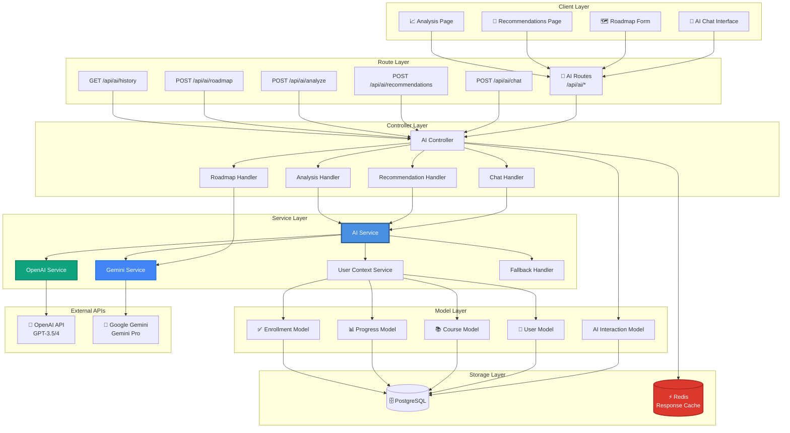
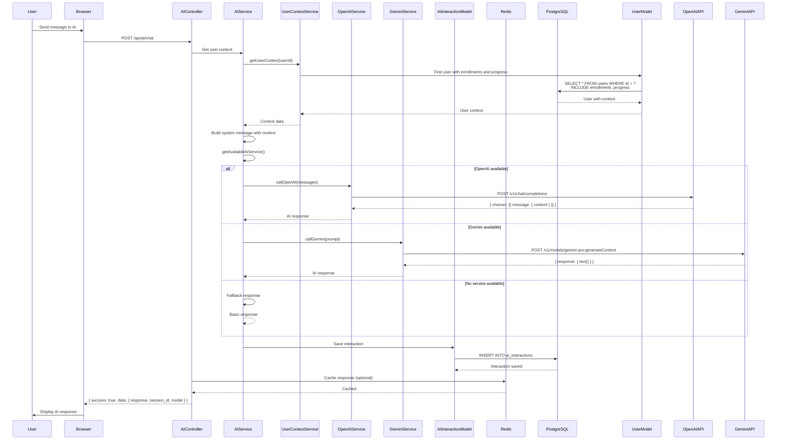
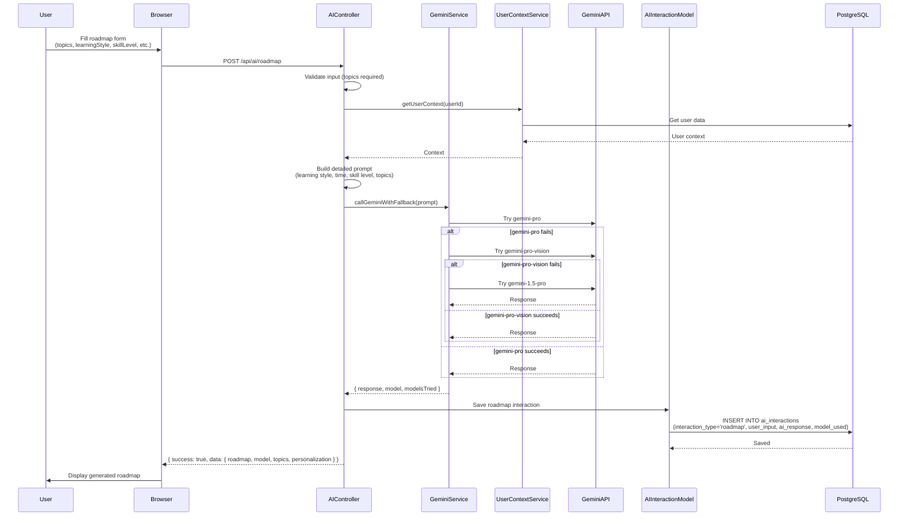
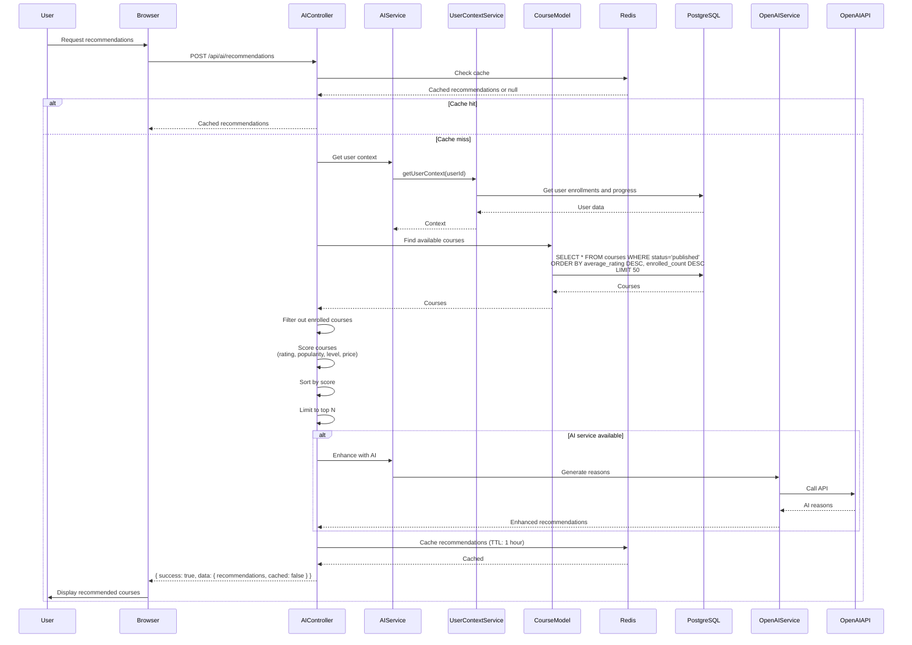
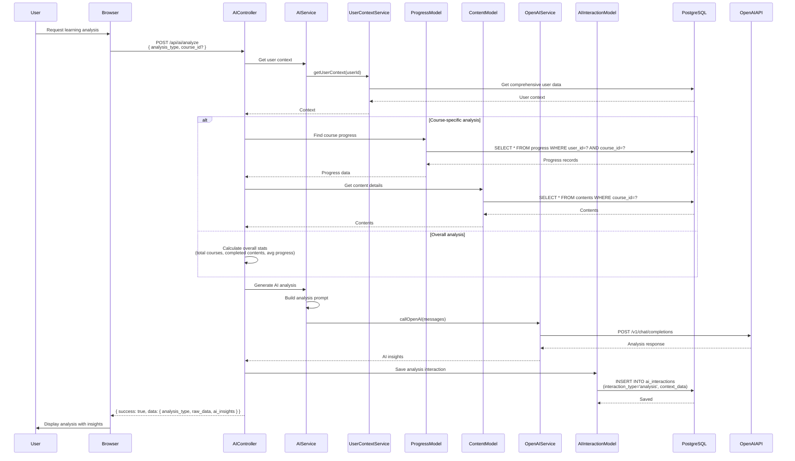
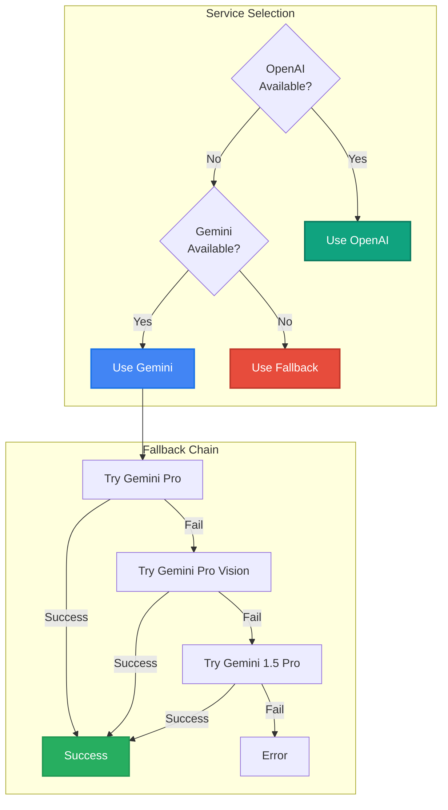
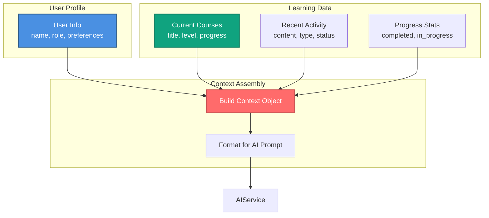

# 🤖 Kiến Trúc Dịch Vụ AI - StudyMate

**Ngày tạo:** 2026-01-02  
**Phiên bản:** 1.0.0

---

## 📋 Tổng Quan

Hệ thống AI tích hợp nhiều tính năng:
- **AI Chatbot** - Trợ lý học tập thông minh
- **Course Recommendations** - Gợi ý khóa học cá nhân hóa
- **Learning Analysis** - Phân tích tiến độ học tập
- **Learning Roadmap** - Tạo lộ trình học tập cá nhân hóa
- **Content Suggestions** - Gợi ý nội dung học tập

Hỗ trợ **OpenAI GPT** và **Google Gemini** với fallback mechanism.

---

## 🏗️ 1. Component Architecture



---

## 💬 2. AI Chat Flow



---

## 🗺️ 3. Roadmap Generation Flow



---

## 🎯 4. Course Recommendation Flow



---

## 📈 5. Learning Analysis Flow



---

## 🔄 6. AI Service Fallback Strategy



---

## 📊 7. User Context Building



---

## 📊 8. Data Models

### AIInteraction Model
```javascript
{
  id: UUID (Primary Key),
  user_id: UUID (Foreign Key -> users.id),
  interaction_type: ENUM('chat', 'recommendation', 'analysis', 'roadmap'),
  user_input: Text (Required),
  ai_response: Text (Required),
  model_used: String (e.g., 'gpt-3.5-turbo', 'gemini-pro'),
  tokens_used: Integer (Default: 0),
  response_time: Integer (milliseconds),
  rating: Integer (1-5, Optional),
  context_data: JSON (Optional),
  session_id: String (Optional),
  created_at: Date,
  updated_at: Date
}
```

---

## 🔗 9. API Endpoints

| Method | Endpoint | Description | Auth Required |
|--------|----------|-------------|---------------|
| POST | `/api/ai/chat` | Chat with AI | Yes |
| POST | `/api/ai/recommendations` | Get course recommendations | Yes |
| POST | `/api/ai/analyze` | Analyze learning progress | Yes |
| POST | `/api/ai/roadmap` | Generate learning roadmap | Yes |
| GET | `/api/ai/history` | Get AI interaction history | Yes |
| POST | `/api/ai/interactions/:id/rate` | Rate AI response | Yes |
| GET | `/roadmap` | Roadmap page | Yes |
| GET | `/roadmap/history` | Roadmap history page | Yes |
| GET | `/roadmap/:id` | Roadmap detail page | Yes |

---

## 📝 Ghi Chú

### AI Service Priority
1. **OpenAI GPT-3.5/4** - Primary service (if available)
2. **Google Gemini Pro** - Fallback service
3. **Gemini Pro Vision** - Secondary fallback
4. **Gemini 1.5 Pro** - Tertiary fallback
5. **Basic Fallback** - Simple responses if all fail

### Caching Strategy
- **Recommendations**: Cache for 1 hour per user
- **Analysis**: No caching (real-time data)
- **Chat**: No caching (conversational)
- **Roadmap**: No caching (personalized)

### Token Management
- **OpenAI**: Track prompt_tokens, completion_tokens, total_tokens
- **Gemini**: Estimate tokens (1 token ≈ 4 characters)
- **Logging**: All token usage logged to database

### Performance Optimization
- **Context Caching**: Cache user context for 5 minutes
- **Batch Requests**: Group multiple API calls when possible
- **Rate Limiting**: Limit AI requests per user
- **Response Streaming**: Support for streaming responses (future)

---

**Tác giả:** StudyMate Development Team  
**Cập nhật:** 2026-01-02

