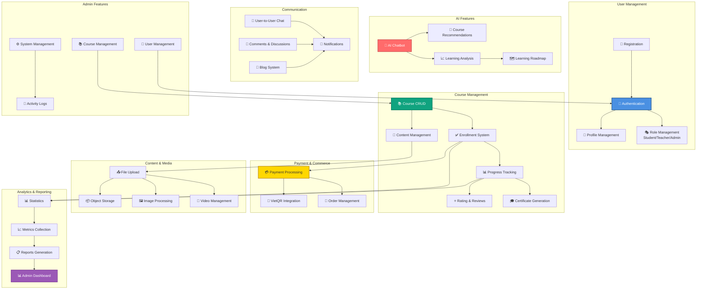
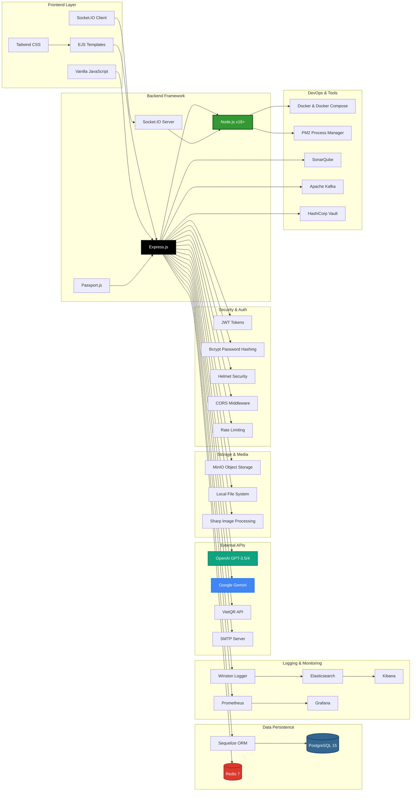
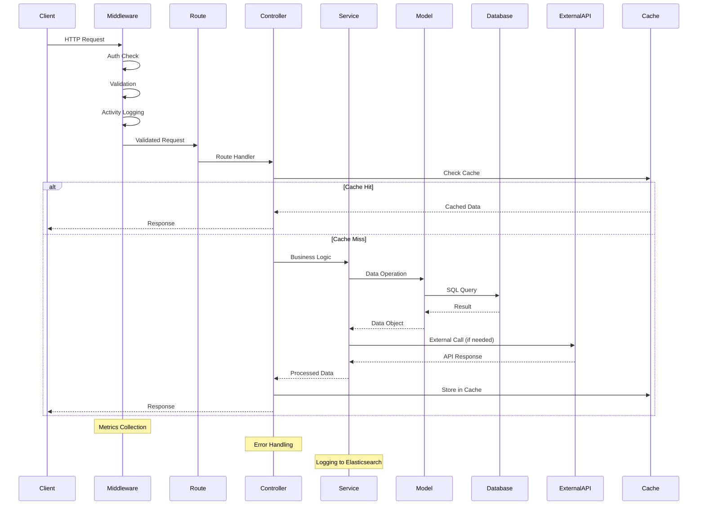
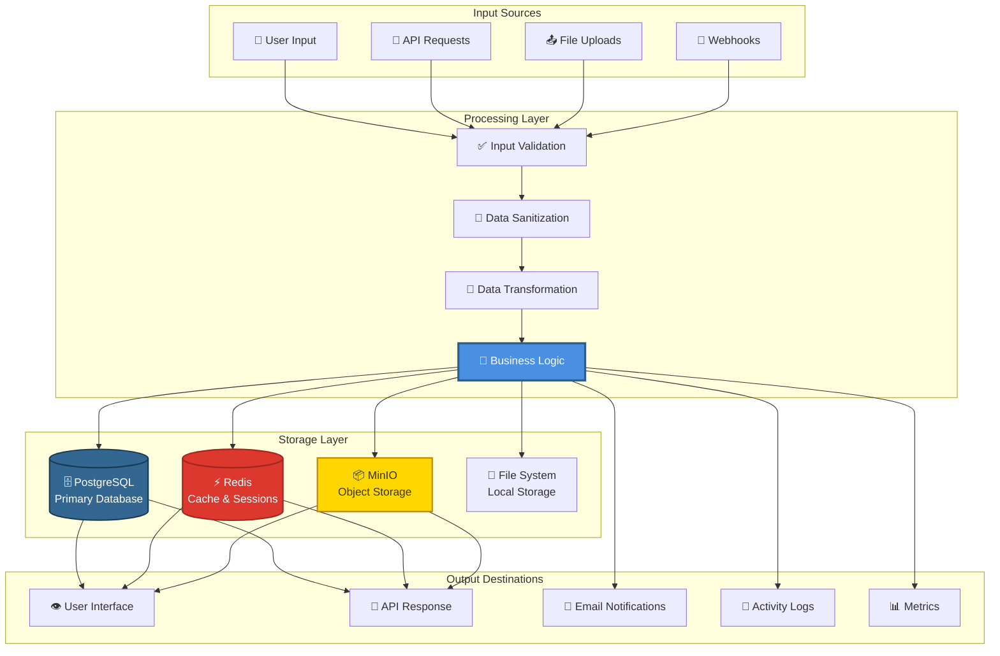
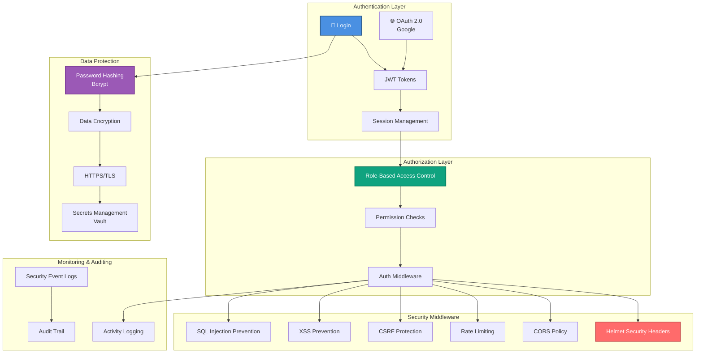
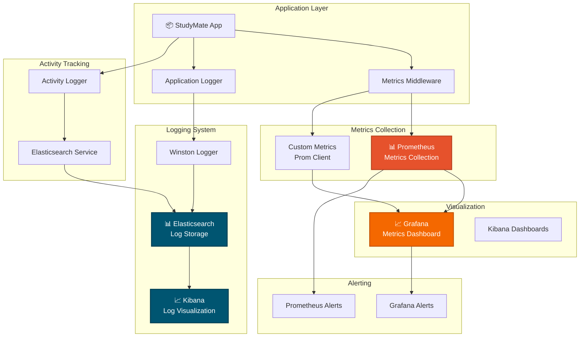
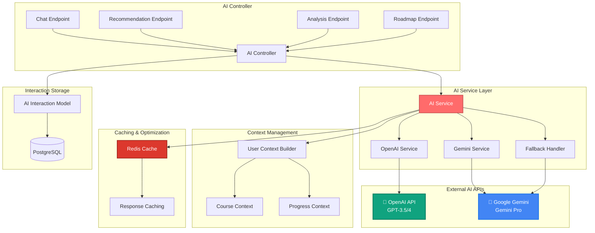

# 🏗️ Sơ Đồ Kiến Trúc Tổng Quan - StudyMate AI

**Ngày tạo:** 2026-01-02  
**Phiên bản:** 1.0.0

---

## 📊 1. Kiến Trúc Tổng Quan Hệ Thống

```mermaid
graph TB
    subgraph "Client Layer"
        Browser[🌐 Web Browser]
        Mobile[📱 Mobile App]
    end

    subgraph "Application Layer - Node.js/Express"
        App[📦 StudyMate App<br/>Port: 3000]
        
        subgraph "Middleware"
            AuthMW[🔐 Auth Middleware]
            ValidMW[✅ Validation]
            LogMW[📝 Activity Logger]
            MetricsMW[📊 Metrics]
            ErrorMW[⚠️ Error Handler]
        end
        
        subgraph "Routes"
            AuthRoute[🔑 Auth Routes]
            CourseRoute[📚 Course Routes]
            AIRoute[🤖 AI Routes]
            ChatRoute[💬 Chat Routes]
            AdminRoute[👨‍💼 Admin Routes]
            APIRoute[🔌 API Routes]
        end
        
        subgraph "Controllers"
            AuthCtrl[Auth Controller]
            CourseCtrl[Course Controller]
            AICtrl[AI Controller]
            ChatCtrl[Chat Controller]
            AdminCtrl[Admin Controller]
        end
        
        subgraph "Services"
            AIService[🤖 AI Service<br/>OpenAI/Gemini]
            EmailService[📧 Email Service]
            MinIOService[📦 MinIO Service]
            VietQRService[💳 VietQR Service]
            CertService[🎓 Certificate Service]
            ElasticService[📊 Elasticsearch Service]
            VaultService[🔐 Vault Service]
        end
    end

    subgraph "Data Layer"
        PostgreSQL[(🗄️ PostgreSQL<br/>Port: 5432)]
        Redis[(⚡ Redis Cache<br/>Port: 6379)]
    end

    subgraph "External Services"
        OpenAI[🤖 OpenAI API]
        Gemini[🤖 Google Gemini API]
        SMTP[📧 SMTP Server]
        VietQR[💳 VietQR API]
    end

    subgraph "Infrastructure - Docker"
        subgraph "Storage"
            MinIO[📦 MinIO<br/>Port: 9000/9001]
        end
        
        subgraph "Monitoring & Logging"
            Elasticsearch[📊 Elasticsearch<br/>Port: 9200]
            Kibana[📈 Kibana<br/>Port: 5601]
            Prometheus[📊 Prometheus<br/>Port: 9090]
            Grafana[📈 Grafana<br/>Port: 3001]
        end
        
        subgraph "Message Queue"
            Kafka[📨 Kafka<br/>Port: 9092]
            Zookeeper[🐘 Zookeeper<br/>Port: 2181]
            KafkaUI[📊 Kafka UI<br/>Port: 8080]
        end
        
        subgraph "DevOps Tools"
            SonarQube[🔍 SonarQube<br/>Port: 9002]
            Vault[🔐 HashiCorp Vault<br/>Port: 8200]
        end
    end

    Browser --> App
    Mobile --> App
    
    App --> AuthMW
    App --> ValidMW
    App --> LogMW
    App --> MetricsMW
    App --> ErrorMW
    
    AuthMW --> AuthRoute
    ValidMW --> CourseRoute
    LogMW --> AIRoute
    MetricsMW --> ChatRoute
    ErrorMW --> AdminRoute
    
    AuthRoute --> AuthCtrl
    CourseRoute --> CourseCtrl
    AIRoute --> AICtrl
    ChatRoute --> ChatCtrl
    AdminRoute --> AdminCtrl
    
    AuthCtrl --> PostgreSQL
    CourseCtrl --> PostgreSQL
    AICtrl --> AIService
    ChatCtrl --> PostgreSQL
    
    AIService --> OpenAI
    AIService --> Gemini
    AIService --> Redis
    
    EmailService --> SMTP
    VietQRService --> VietQR
    CertService --> MinIO
    ElasticService --> Elasticsearch
    
    App --> PostgreSQL
    App --> Redis
    App --> MinIO
    App --> Elasticsearch
    
    LogMW --> ElasticService
    MetricsMW --> Prometheus
    
    Prometheus --> Grafana
    Elasticsearch --> Kibana
    
    App -.-> Kafka
    Kafka --> Zookeeper
    
    style App fill:#4A90E2,stroke:#2E5C8A,stroke-width:3px,color:#fff
    style PostgreSQL fill:#336791,stroke:#1A3A52,stroke-width:2px,color:#fff
    style Redis fill:#DC382D,stroke:#A0261E,stroke-width:2px,color:#fff
    style MinIO fill:#FFD700,stroke:#B8860B,stroke-width:2px
    style Elasticsearch fill:#005571,stroke:#003D52,stroke-width:2px,color:#fff
    style OpenAI fill:#10A37F,stroke:#0A7A5F,stroke-width:2px,color:#fff
    style Gemini fill:#4285F4,stroke:#1A73E8,stroke-width:2px,color:#fff
```

---

## 🎯 2. Kiến Trúc Chức Năng (Functional Architecture)

---

## 🔧 3. Technology Stack Architecture

---

## 🔄 4. Request Flow Architecture

---

## 📦 5. Data Flow Architecture

---

## 🔐 6. Security Architecture

---

## 📊 7. Monitoring & Observability Architecture

---

## 🔄 8. AI Service Integration Architecture

---

## 📝 Ghi Chú

### Ports Summary
- **Application:** 3000
- **PostgreSQL:** 5432
- **Redis:** 6379
- **MinIO:** 9000 (API), 9001 (Console)
- **Elasticsearch:** 9200
- **Kibana:** 5601
- **Prometheus:** 9090
- **Grafana:** 3001
- **Kafka:** 9092
- **Zookeeper:** 2181
- **Kafka UI:** 8080
- **SonarQube:** 9002
- **Vault:** 8200

### Key Design Patterns
1. **MVC Pattern:** Routes → Controllers → Models
2. **Service Layer:** Business logic separation
3. **Middleware Chain:** Request processing pipeline
4. **Repository Pattern:** Data access abstraction
5. **Strategy Pattern:** AI service fallback mechanism

### Scalability Considerations
- Horizontal scaling with PM2 cluster mode
- Database connection pooling
- Redis caching for performance
- Message queue (Kafka) for async processing
- Stateless authentication (JWT)

---

**Tác giả:** StudyMate Development Team  
**Cập nhật:** 2026-01-02

