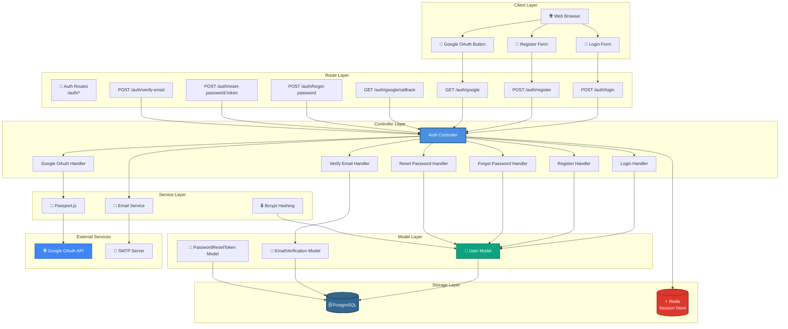
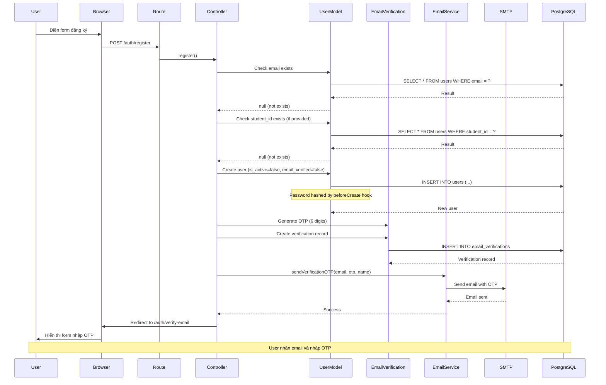
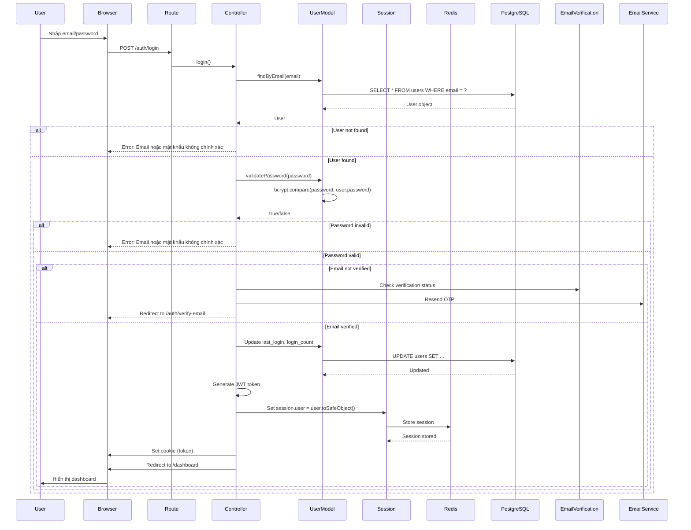
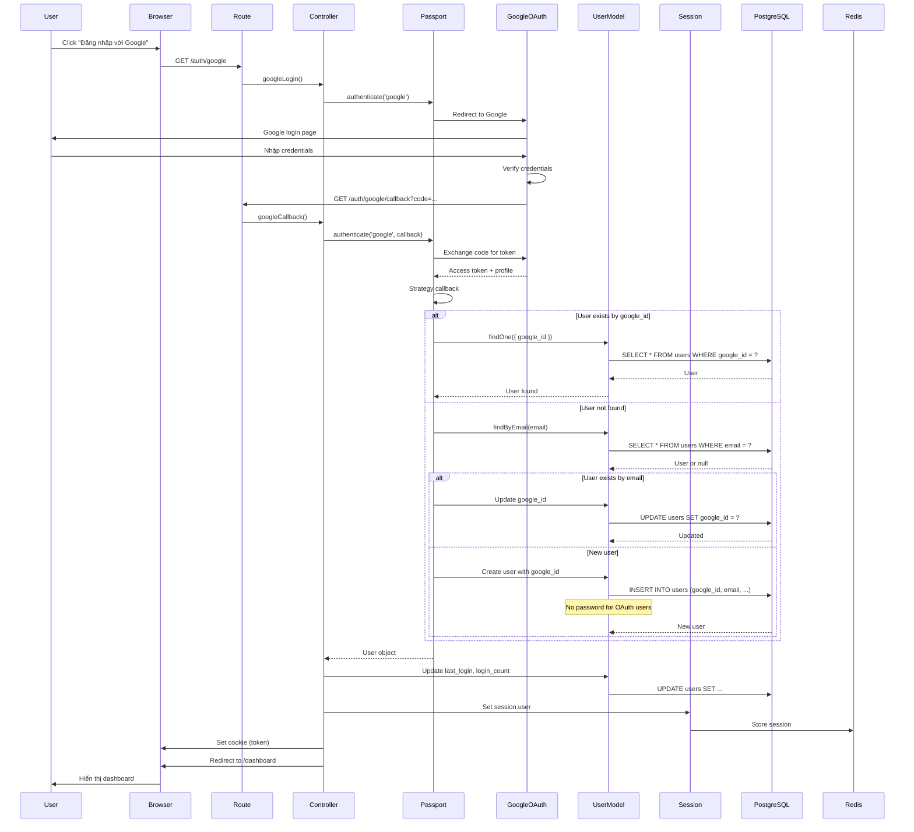
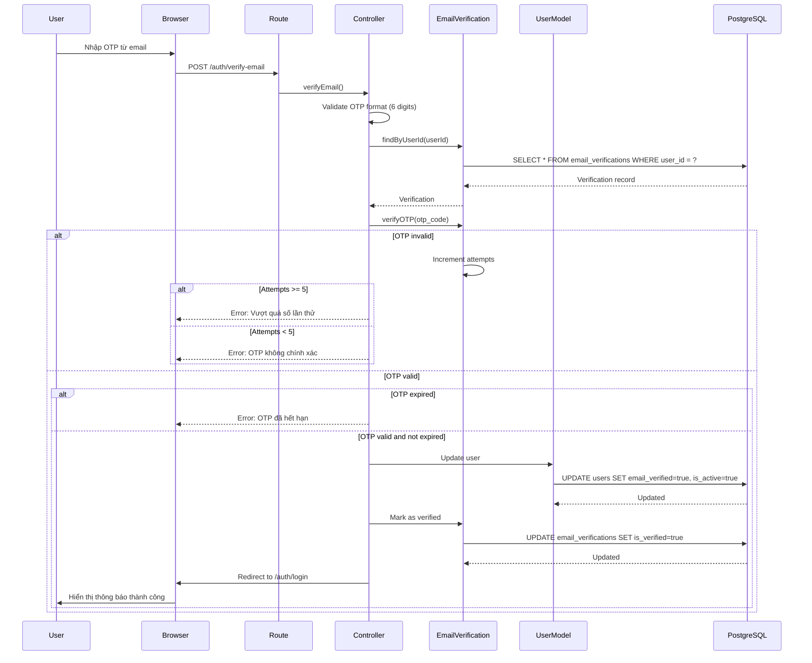
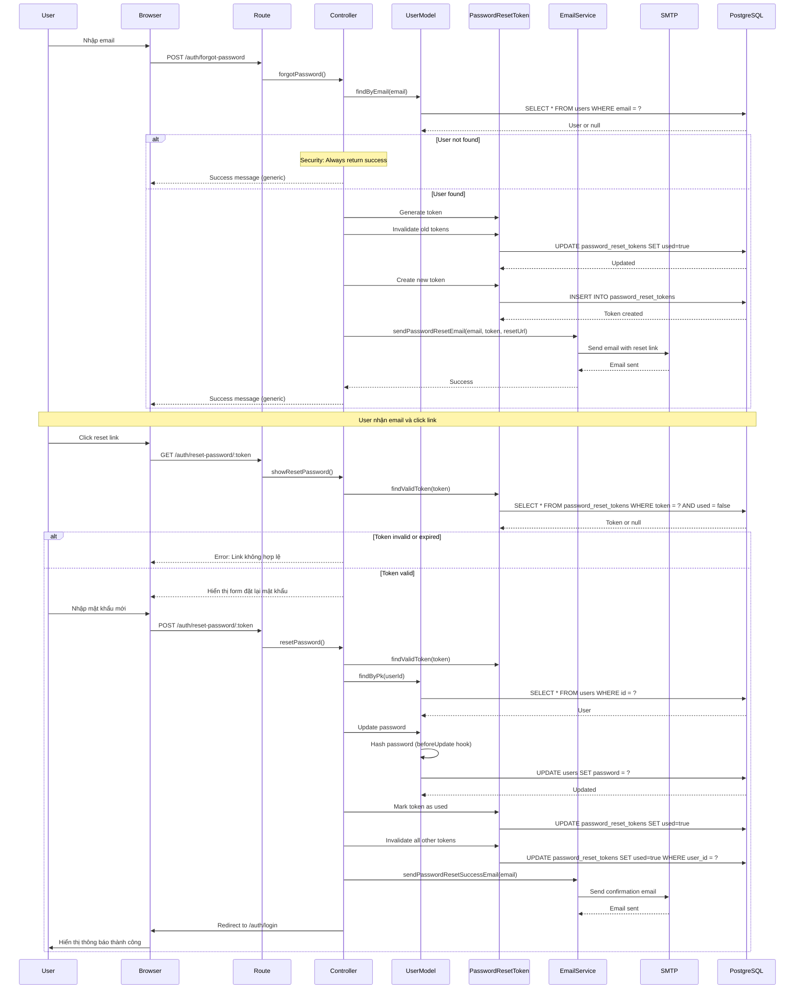

# 🔐 Kiến Trúc Hệ Thống Xác Thực - StudyMate

**Ngày tạo:** 2026-01-02  
**Phiên bản:** 1.0.0

---

## 📋 Tổng Quan

Hệ thống xác thực của StudyMate hỗ trợ nhiều phương thức:
- **Email/Password Authentication** - Đăng nhập truyền thống
- **Google OAuth 2.0** - Đăng nhập bằng tài khoản Google
- **Email Verification** - Xác thực email bằng OTP
- **Password Reset** - Đặt lại mật khẩu qua email
- **Session & JWT** - Quản lý phiên đăng nhập

---

## 🏗️ 1. Component Architecture



---

## 🔄 2. Registration Flow Sequence



---

## 🔐 3. Login Flow Sequence



---

## 🌐 4. Google OAuth Flow Sequence



---

## 📧 5. Email Verification Flow



---

## 🔑 6. Password Reset Flow



---

## 🎭 7. Role-Based Access Control (RBAC)

```mermaid
graph TB
    subgraph "User Roles"
        Student[👨‍🎓 Student<br/>Default role]
        Teacher[👨‍🏫 Teacher<br/>Can create courses]
        Lecturer[👨‍🏫 Lecturer<br/>Can create courses]
        Admin[👨‍💼 Admin<br/>Full access]
        SystemAdmin[⚙️ System Admin<br/>System management]
    end

    subgraph "Permission Matrix"
        ViewCourses[📚 View Courses]
        EnrollCourses[✅ Enroll Courses]
        CreateCourses[➕ Create Courses]
        EditOwnCourses[✏️ Edit Own Courses]
        EditAllCourses[✏️ Edit All Courses]
        ManageUsers[👥 Manage Users]
        ManageSystem[⚙️ Manage System]
        AccessAdmin[🔐 Access Admin Panel]
    end

    Student --> ViewCourses
    Student --> EnrollCourses
    
    Teacher --> ViewCourses
    Teacher --> EnrollCourses
    Teacher --> CreateCourses
    Teacher --> EditOwnCourses
    
    Lecturer --> ViewCourses
    Lecturer --> EnrollCourses
    Lecturer --> CreateCourses
    Lecturer --> EditOwnCourses
    
    Admin --> ViewCourses
    Admin --> EnrollCourses
    Admin --> CreateCourses
    Admin --> EditAllCourses
    Admin --> ManageUsers
    Admin --> AccessAdmin
    
    SystemAdmin --> ViewCourses
    SystemAdmin --> EnrollCourses
    SystemAdmin --> CreateCourses
    SystemAdmin --> EditAllCourses
    SystemAdmin --> ManageUsers
    SystemAdmin --> ManageSystem
    SystemAdmin --> AccessAdmin

    style Student fill:#4A90E2,stroke:#2E5C8A,stroke-width:2px,color:#fff
    style Teacher fill:#10A37F,stroke:#0A7A5F,stroke-width:2px,color:#fff
    style Lecturer fill:#10A37F,stroke:#0A7A5F,stroke-width:2px,color:#fff
    style Admin fill:#FF6B6B,stroke:#CC5555,stroke-width:2px,color:#fff
    style SystemAdmin fill:#9B59B6,stroke:#7D3C98,stroke-width:2px,color:#fff
```



---

## 🔒 8. Security Mechanisms

```mermaid
graph TB
    subgraph "Password Security"
        Bcrypt[Bcrypt Hashing<br/>Salt rounds: 12]
        PasswordValidation[Password Validation<br/>Min length, complexity]
        PasswordHistory[Password History<br/>Prevent reuse]
    end

    subgraph "Session Security"
        HttpOnlyCookies[HttpOnly Cookies<br/>Prevent XSS]
        SecureCookies[Secure Cookies<br/>HTTPS only in production]
        SessionExpiry[Session Expiry<br/>24 hours default]
        SessionRegeneration[Session Regeneration<br/>On login]
    end

    subgraph "Token Security"
        JWTSecret[JWT Secret<br/>Strong random key]
        TokenExpiry[Token Expiry<br/>24h default, 7d with remember_me]
        TokenRefresh[Token Refresh<br/>On activity]
    end

    subgraph "Rate Limiting"
        LoginRateLimit[Login Rate Limit<br/>5 attempts per 15 min]
        RegisterRateLimit[Register Rate Limit<br/>3 per hour per IP]
        PasswordResetLimit[Password Reset Limit<br/>3 per hour per email]
    end

    subgraph "Email Security"
        OTPExpiry[OTP Expiry<br/>15 minutes]
        OTPAttempts[OTP Attempts<br/>Max 5 attempts]
        OTPFormat[OTP Format<br/>6 digits, numeric]
    end

    subgraph "Data Protection"
        InputSanitization[Input Sanitization<br/>XSS prevention]
        SQLInjectionPrevention[SQL Injection Prevention<br/>Sequelize parameterized queries]
        CSRFProtection[CSRF Protection<br/>CSRF tokens]
    end

    Bcrypt --> PasswordValidation
    PasswordValidation --> PasswordHistory
    
    HttpOnlyCookies --> SecureCookies
    SecureCookies --> SessionExpiry
    SessionExpiry --> SessionRegeneration
    
    JWTSecret --> TokenExpiry
    TokenExpiry --> TokenRefresh
    
    LoginRateLimit --> RegisterRateLimit
    RegisterRateLimit --> PasswordResetLimit
    
    OTPExpiry --> OTPAttempts
    OTPAttempts --> OTPFormat
    
    InputSanitization --> SQLInjectionPrevention
    SQLInjectionPrevention --> CSRFProtection

    style Bcrypt fill:#9B59B6,stroke:#7D3C98,stroke-width:2px,color:#fff
    style HttpOnlyCookies fill:#4A90E2,stroke:#2E5C8A,stroke-width:2px,color:#fff
    style JWTSecret fill:#10A37F,stroke:#0A7A5F,stroke-width:2px,color:#fff
    style LoginRateLimit fill:#FF6B6B,stroke:#CC5555,stroke-width:2px,color:#fff
```



---

## 📊 9. Data Models

### User Model
```javascript
{
  id: UUID (Primary Key),
  student_id: String (Unique, Optional),
  email: String (Unique, Required),
  password: String (Hashed, Optional for OAuth),
  google_id: String (Unique, Optional),
  first_name: String (Required),
  last_name: String (Required),
  role: ENUM('student', 'teacher', 'lecturer', 'admin', 'system_admin'),
  is_active: Boolean (Default: true),
  email_verified: Boolean (Default: false),
  email_verified_at: Date (Optional),
  avatar: String (Optional),
  phone: String (Optional),
  last_login: Date (Optional),
  login_count: Integer (Default: 0),
  created_at: Date,
  updated_at: Date
}
```

### EmailVerification Model
```javascript
{
  id: UUID (Primary Key),
  user_id: UUID (Foreign Key -> users.id),
  email: String (Required),
  otp_code: String (6 digits),
  is_verified: Boolean (Default: false),
  attempts: Integer (Default: 0),
  expires_at: Date (15 minutes from creation),
  created_at: Date,
  updated_at: Date
}
```

### PasswordResetToken Model
```javascript
{
  id: UUID (Primary Key),
  user_id: UUID (Foreign Key -> users.id),
  token: String (Unique, Random token),
  used: Boolean (Default: false),
  expires_at: Date (1 hour from creation),
  created_at: Date,
  updated_at: Date
}
```

---

## 🔗 10. API Endpoints

| Method | Endpoint | Description | Auth Required |
|--------|----------|-------------|---------------|
| GET | `/auth/login` | Show login form | No |
| POST | `/auth/login` | Process login | No |
| GET | `/auth/register` | Show register form | No |
| POST | `/auth/register` | Process registration | No |
| GET | `/auth/google` | Initiate Google OAuth | No |
| GET | `/auth/google/callback` | Google OAuth callback | No |
| GET | `/auth/forgot-password` | Show forgot password form | No |
| POST | `/auth/forgot-password` | Request password reset | No |
| GET | `/auth/reset-password/:token` | Show reset password form | No |
| POST | `/auth/reset-password/:token` | Process password reset | No |
| GET | `/auth/verify-email` | Show email verification form | No |
| POST | `/auth/verify-email` | Verify email with OTP | No |
| POST | `/auth/resend-otp` | Resend OTP code | No |
| POST | `/auth/logout` | Logout user | Yes |

---

## 📝 Ghi Chú

### Security Best Practices
1. **Password Hashing**: Sử dụng bcrypt với 12 salt rounds
2. **Session Management**: HttpOnly cookies, secure flag trong production
3. **Rate Limiting**: Giới hạn số lần thử đăng nhập, đăng ký
4. **Email Verification**: Bắt buộc xác thực email trước khi kích hoạt tài khoản
5. **Token Expiry**: OTP hết hạn sau 15 phút, reset token sau 1 giờ
6. **Input Validation**: Validate và sanitize tất cả input từ user

### Error Handling
- Không tiết lộ thông tin chi tiết về lỗi (email không tồn tại, password sai)
- Logging tất cả authentication attempts để audit
- User-friendly error messages bằng tiếng Việt

### Performance Considerations
- Session storage trong Redis để scale horizontally
- JWT tokens cho API calls (stateless)
- Database indexes trên email, student_id, google_id

---

**Tác giả:** StudyMate Development Team  
**Cập nhật:** 2026-01-02

