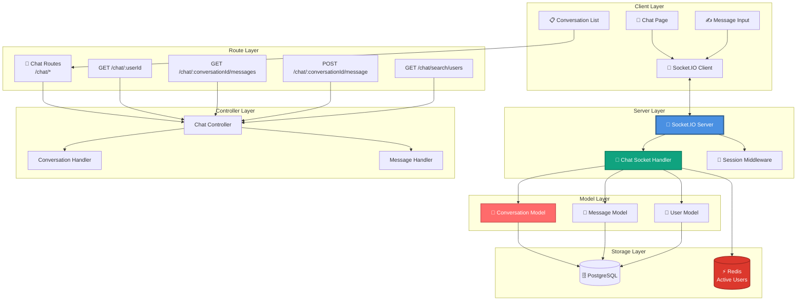
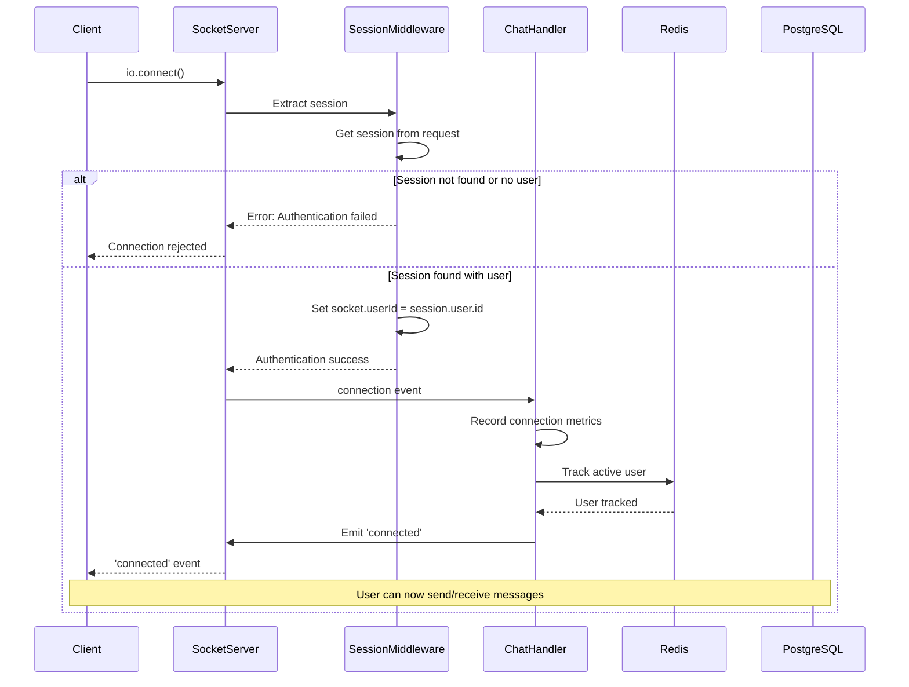
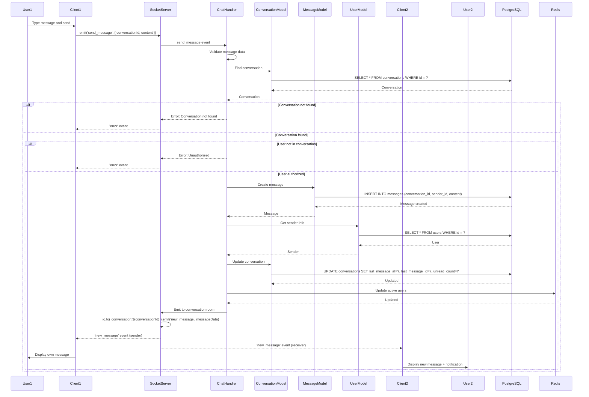
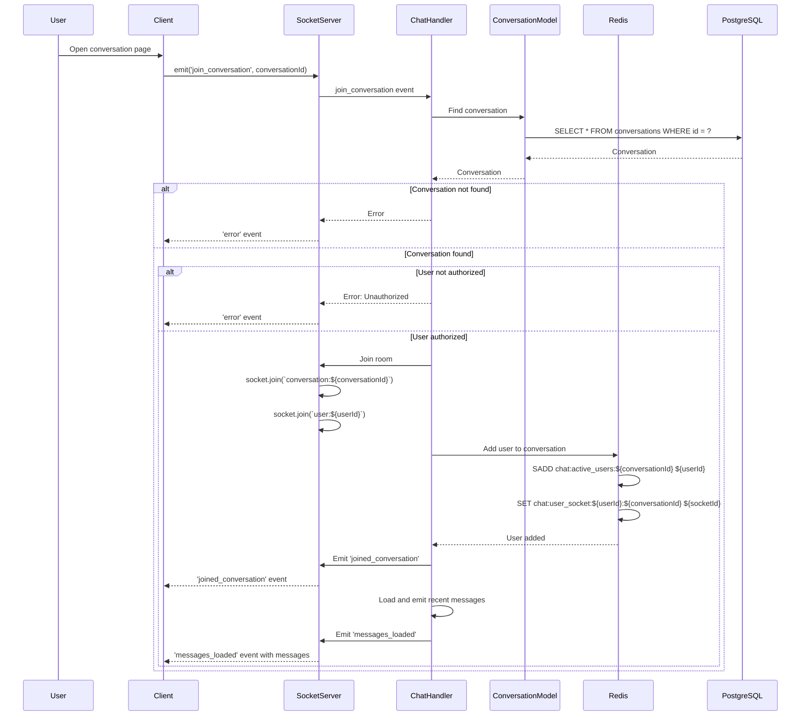
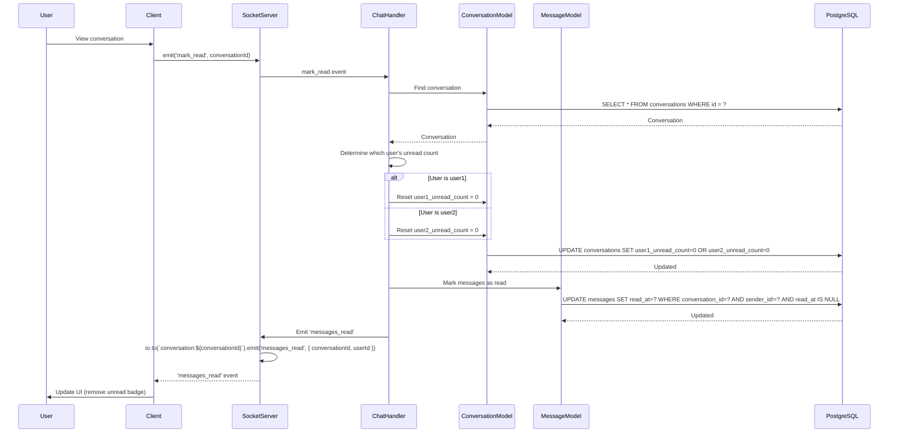
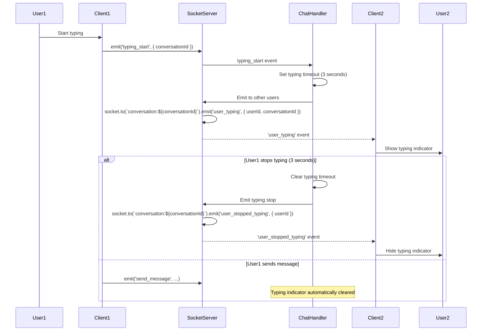
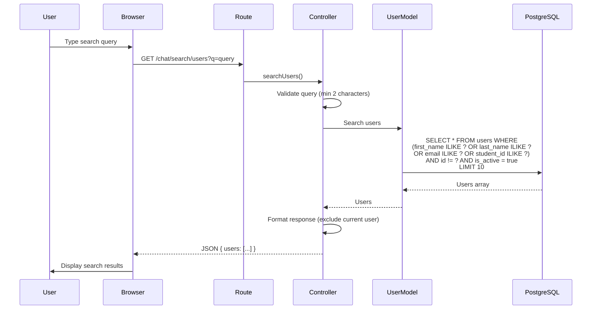

# 💬 Kiến Trúc Hệ Thống Chat - StudyMate

**Ngày tạo:** 2026-01-02  
**Phiên bản:** 1.0.0

---

## 📋 Tổng Quan

Hệ thống chat real-time sử dụng **Socket.IO** cho phép:
- **User-to-User Chat** - Chat giữa các users
- **Real-time Messaging** - Gửi/nhận tin nhắn tức thời
- **Conversation Management** - Quản lý cuộc trò chuyện
- **Typing Indicators** - Hiển thị đang gõ
- **Read Receipts** - Đánh dấu đã đọc
- **Active Users Tracking** - Theo dõi users đang online

---

## 🏗️ 1. Component Architecture



---

## 🔌 2. Socket.IO Connection Flow



---

## 💬 3. Send Message Flow



---

## 📋 4. Join Conversation Flow



---

## 👀 5. Mark Messages as Read Flow



---

## ⌨️ 6. Typing Indicator Flow



---

## 🔍 7. Search Users Flow



---

## 📊 8. Active Users Tracking

```mermaid
graph TB
    subgraph "Redis Keys"
        ActiveUsersKey[chat:active_users:${conversationId}<br/>SET of userIds]
        UserSocketKey[chat:user_socket:${userId}:${conversationId}<br/>socketId]
        SocketUserKey[chat:socket_user:${socketId}<br/>userId:conversationId]
    end

    subgraph "Operations"
        AddUser[Add User<br/>SADD, SET with TTL]
        RemoveUser[Remove User<br/>SREM, DEL]
        GetActiveUsers[Get Active Users<br/>SMEMBERS]
        Cleanup[Cleanup on Disconnect<br/>Remove all user keys]
    end

    subgraph "Events"
        Connection[Socket Connection]
        Disconnection[Socket Disconnection]
        JoinConversation[Join Conversation]
        LeaveConversation[Leave Conversation]
    end

    Connection --> AddUser
    Disconnection --> Cleanup
    JoinConversation --> AddUser
    LeaveConversation --> RemoveUser
    
    AddUser --> ActiveUsersKey
    AddUser --> UserSocketKey
    AddUser --> SocketUserKey
    
    RemoveUser --> ActiveUsersKey
    RemoveUser --> UserSocketKey
    RemoveUser --> SocketUserKey
    
    GetActiveUsers --> ActiveUsersKey

    style ActiveUsersKey fill:#DC382D,stroke:#A0261E,stroke-width:2px,color:#fff
    style AddUser fill:#10A37F,stroke:#0A7A5F,stroke-width:2px,color:#fff
    style RemoveUser fill:#E74C3C,stroke:#C0392B,stroke-width:2px,color:#fff
```

---

## 📊 9. Data Models

### Conversation Model
```javascript
{
  id: UUID (Primary Key),
  user1_id: UUID (Foreign Key -> users.id),
  user2_id: UUID (Foreign Key -> users.id),
  last_message_at: Date,
  last_message_id: UUID (Foreign Key -> messages.id),
  user1_unread_count: Integer (Default: 0),
  user2_unread_count: Integer (Default: 0),
  created_at: Date,
  updated_at: Date
}
```

### Message Model
```javascript
{
  id: UUID (Primary Key),
  conversation_id: UUID (Foreign Key -> conversations.id),
  sender_id: UUID (Foreign Key -> users.id),
  content: Text (Required),
  read_at: Date (Optional),
  created_at: Date,
  updated_at: Date
}
```

---

## 🔗 10. Socket.IO Events

### Client → Server Events

| Event | Payload | Description |
|-------|---------|-------------|
| `join_conversation` | `{ conversationId }` | Join a conversation room |
| `leave_conversation` | `{ conversationId }` | Leave a conversation room |
| `send_message` | `{ conversationId, content }` | Send a message |
| `mark_read` | `{ conversationId }` | Mark messages as read |
| `typing_start` | `{ conversationId }` | User started typing |
| `typing_stop` | `{ conversationId }` | User stopped typing |

### Server → Client Events

| Event | Payload | Description |
|-------|---------|-------------|
| `connected` | `{ userId, socketId }` | Socket connected successfully |
| `new_message` | `{ id, conversationId, senderId, content, createdAt, sender }` | New message received |
| `messages_loaded` | `{ messages: [...] }` | Recent messages loaded |
| `messages_read` | `{ conversationId, userId }` | Messages marked as read |
| `user_typing` | `{ userId, conversationId }` | User is typing |
| `user_stopped_typing` | `{ userId, conversationId }` | User stopped typing |
| `conversation_updated` | `{ conversationId, lastMessage, unreadCount }` | Conversation updated |
| `error` | `{ message, code }` | Error occurred |

---

## 🔗 11. HTTP API Endpoints

| Method | Endpoint | Description | Auth Required |
|--------|----------|-------------|---------------|
| GET | `/chat` | Get all conversations | Yes |
| GET | `/chat/search/users?q=query` | Search users for chat | Yes |
| GET | `/chat/:userId` | Get or create conversation with user | Yes |
| GET | `/chat/:conversationId/messages` | Get messages for conversation | Yes |
| POST | `/chat/:conversationId/message` | Send message (HTTP fallback) | Yes |

---

## 📝 Ghi Chú

### Socket.IO Configuration
- **CORS**: Allow all origins with credentials
- **Session Middleware**: Share Express session with Socket.IO
- **Transports**: WebSocket with polling fallback
- **Room Management**: One room per conversation, one per user

### Redis Usage
- **Active Users**: Track users currently in conversations
- **Socket Mapping**: Map userId+conversationId to socketId
- **TTL**: 24 hours for all Redis keys
- **Fallback**: In-memory tracking if Redis unavailable

### Performance Considerations
- **Message Pagination**: Load messages in batches (50 per page)
- **Lazy Loading**: Load conversations on demand
- **Caching**: Cache user info in Redis
- **Connection Pooling**: Reuse database connections

### Security
- **Authentication**: Required for all socket connections
- **Authorization**: Users can only access their conversations
- **Input Validation**: Validate all message content
- **Rate Limiting**: Limit message sending rate

---

**Tác giả:** StudyMate Development Team  
**Cập nhật:** 2026-01-02

