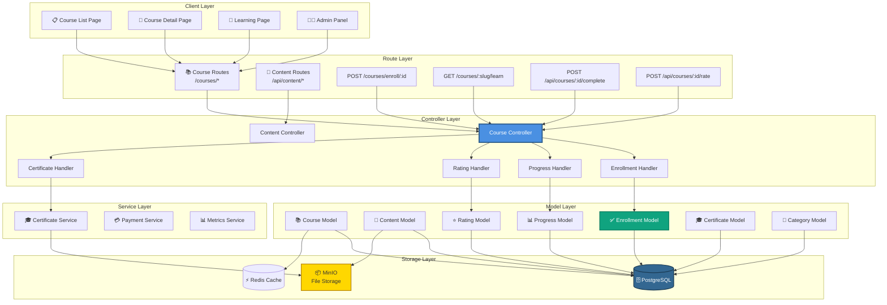
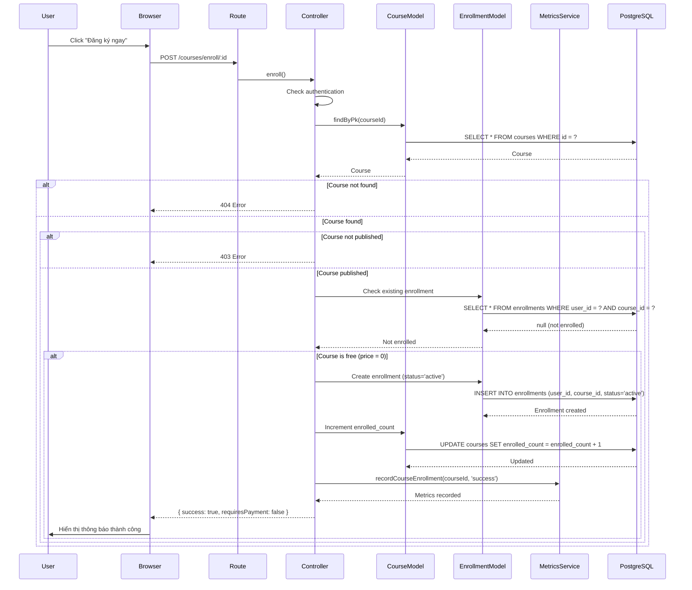
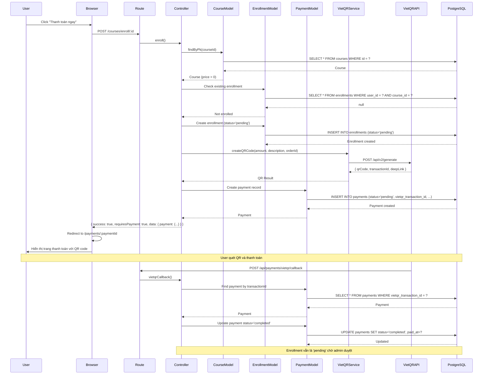
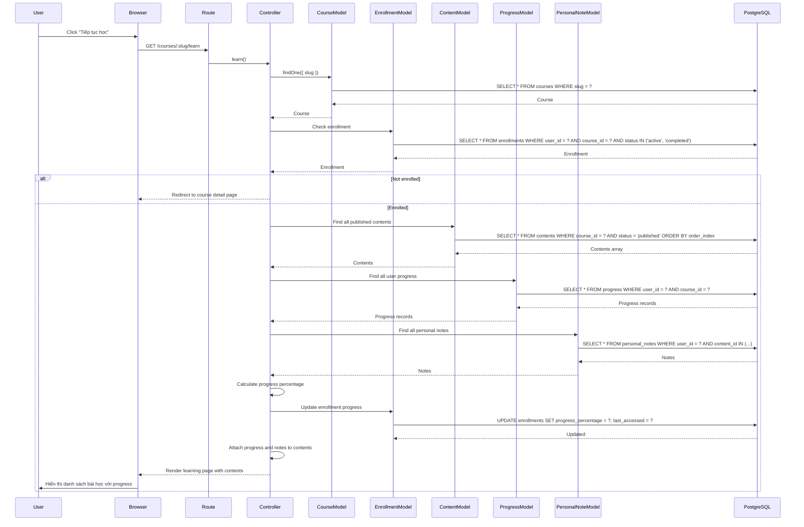
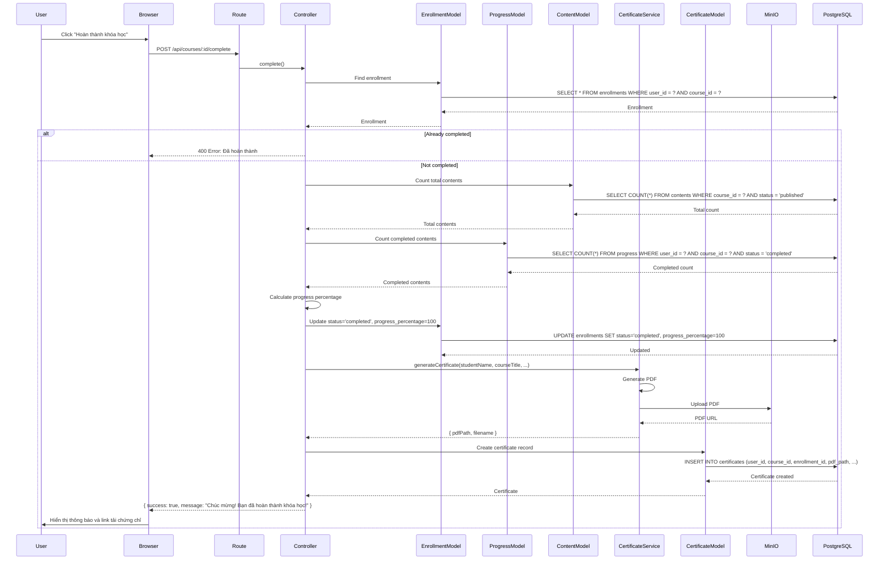
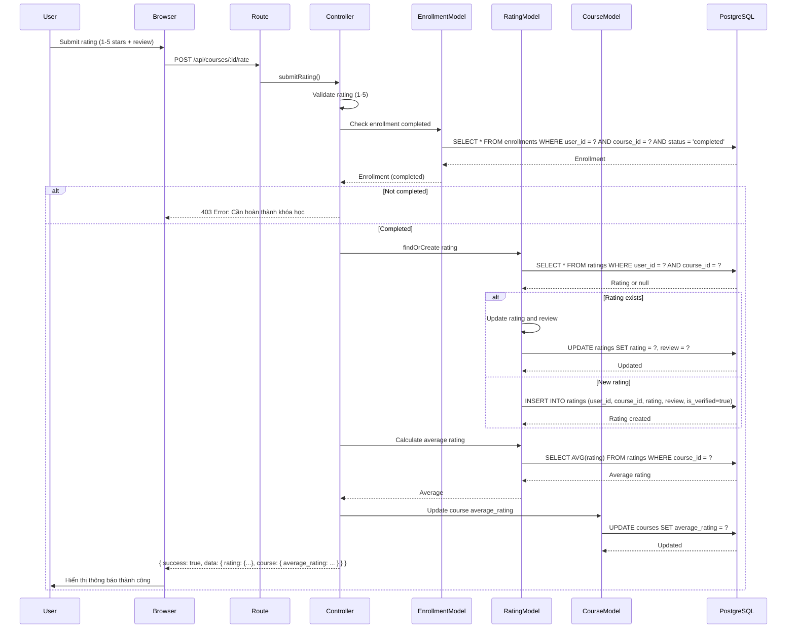
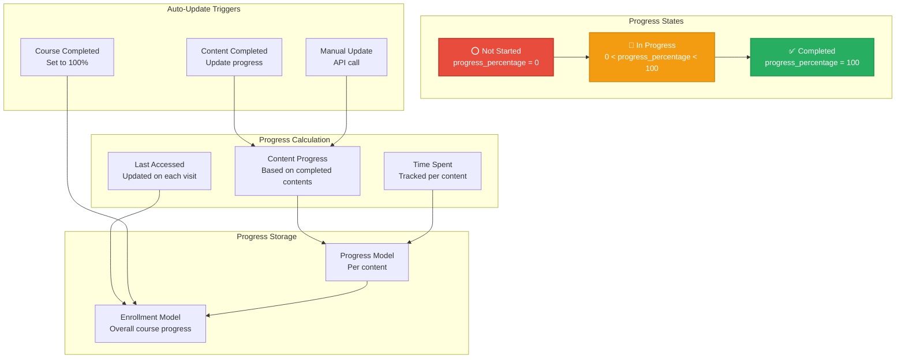
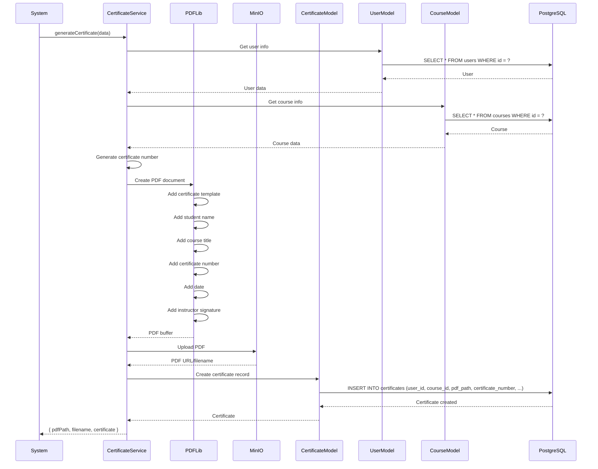

# 📚 Kiến Trúc Quản Lý Khóa Học - StudyMate

**Ngày tạo:** 2026-01-02  
**Phiên bản:** 1.0.0

---

## 📋 Tổng Quan

Hệ thống quản lý khóa học bao gồm:
- **Course Management** - Tạo, sửa, xóa khóa học
- **Content Management** - Quản lý nội dung khóa học (video, text, quiz)
- **Enrollment System** - Đăng ký khóa học (free/paid)
- **Progress Tracking** - Theo dõi tiến độ học tập
- **Rating & Reviews** - Đánh giá khóa học
- **Certificate Generation** - Tự động tạo chứng chỉ khi hoàn thành

---

## 🏗️ 1. Component Architecture



---

## 🔄 2. Course Enrollment Flow (Free Course)



---

## 💳 3. Course Enrollment Flow (Paid Course)



---

## 📖 4. Learning Flow Sequence



---

## ✅ 5. Complete Course Flow



---

## ⭐ 6. Rating & Review Flow



---

## 📊 7. Progress Tracking Architecture



---

## 🎓 8. Certificate Generation Flow



---

## 📊 9. Data Models

### Course Model
```javascript
{
  id: UUID (Primary Key),
  title: String (Required),
  slug: String (Unique, Required),
  description: Text,
  short_description: String(500),
  thumbnail: String,
  instructor_id: UUID (Foreign Key -> users.id),
  level: ENUM('beginner', 'intermediate', 'advanced', 'expert'),
  price: Decimal(10,2) (Default: 0),
  status: ENUM('draft', 'published', 'archived'),
  category_id: UUID (Foreign Key -> categories.id),
  enrolled_count: Integer (Default: 0),
  average_rating: Decimal(3,2),
  created_at: Date,
  updated_at: Date
}
```

### Enrollment Model
```javascript
{
  id: UUID (Primary Key),
  user_id: UUID (Foreign Key -> users.id),
  course_id: UUID (Foreign Key -> courses.id),
  status: ENUM('pending', 'active', 'completed', 'dropped'),
  enrolled_at: Date (Default: NOW),
  progress_percentage: Decimal(5,2) (Default: 0),
  total_time_spent: Integer (Default: 0, seconds),
  last_accessed: Date,
  created_at: Date,
  updated_at: Date
}
```

### Progress Model
```javascript
{
  id: UUID (Primary Key),
  user_id: UUID (Foreign Key -> users.id),
  course_id: UUID (Foreign Key -> courses.id),
  content_id: UUID (Foreign Key -> contents.id),
  status: ENUM('not_started', 'in_progress', 'completed'),
  progress_percentage: Decimal(5,2) (Default: 0),
  time_spent: Integer (Default: 0, seconds),
  last_accessed: Date,
  completed_at: Date,
  created_at: Date,
  updated_at: Date
}
```

### Rating Model
```javascript
{
  id: UUID (Primary Key),
  user_id: UUID (Foreign Key -> users.id),
  course_id: UUID (Foreign Key -> courses.id),
  rating: Integer (1-5, Required),
  review: Text (Optional),
  is_verified: Boolean (Default: false),
  created_at: Date,
  updated_at: Date
}
```

### Certificate Model
```javascript
{
  id: UUID (Primary Key),
  user_id: UUID (Foreign Key -> users.id),
  course_id: UUID (Foreign Key -> courses.id),
  enrollment_id: UUID (Foreign Key -> enrollments.id),
  certificate_number: String (Unique, Required),
  pdf_path: String (Required),
  metadata: JSON (Optional),
  issued_at: Date (Default: NOW),
  created_at: Date,
  updated_at: Date
}
```

---

## 🔗 10. API Endpoints

| Method | Endpoint | Description | Auth Required |
|--------|----------|-------------|---------------|
| GET | `/courses` | List all courses | No |
| GET | `/courses/:slug` | Get course details | No |
| POST | `/courses/enroll/:id` | Enroll in course | Yes |
| GET | `/courses/:slug/learn` | Learning page | Yes (Enrolled) |
| GET | `/courses/:slug/preview/:contentId` | Preview free content | No |
| POST | `/api/courses/:id/complete` | Complete course | Yes |
| POST | `/api/courses/:id/rate` | Submit rating | Yes (Completed) |
| GET | `/api/courses/:id/progress` | Get progress | Yes |
| PUT | `/api/content/:id/progress` | Update content progress | Yes |

---

## 📝 Ghi Chú

### Enrollment Status Flow
1. **pending** - Chờ thanh toán (paid courses) hoặc chờ admin duyệt
2. **active** - Đã kích hoạt, user có thể học
3. **completed** - Đã hoàn thành khóa học
4. **dropped** - Đã hủy/ngừng học

### Progress Calculation
- **Content Level**: Mỗi content có progress riêng (0-100%)
- **Course Level**: Tính dựa trên số content đã hoàn thành / tổng số content
- **Auto-complete**: Enrollment tự động chuyển sang 'completed' khi progress = 100%

### Certificate Generation
- Tự động tạo khi user hoàn thành khóa học
- PDF được lưu trong MinIO
- Certificate number format: `CERT-YYYYMMDD-XXXXXX`
- Metadata chứa thông tin student, course, instructor

---

**Tác giả:** StudyMate Development Team  
**Cập nhật:** 2026-01-02

