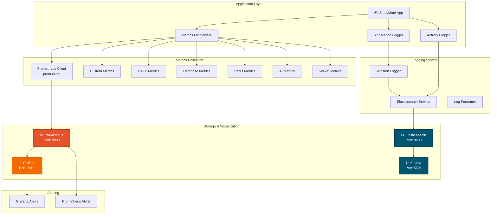
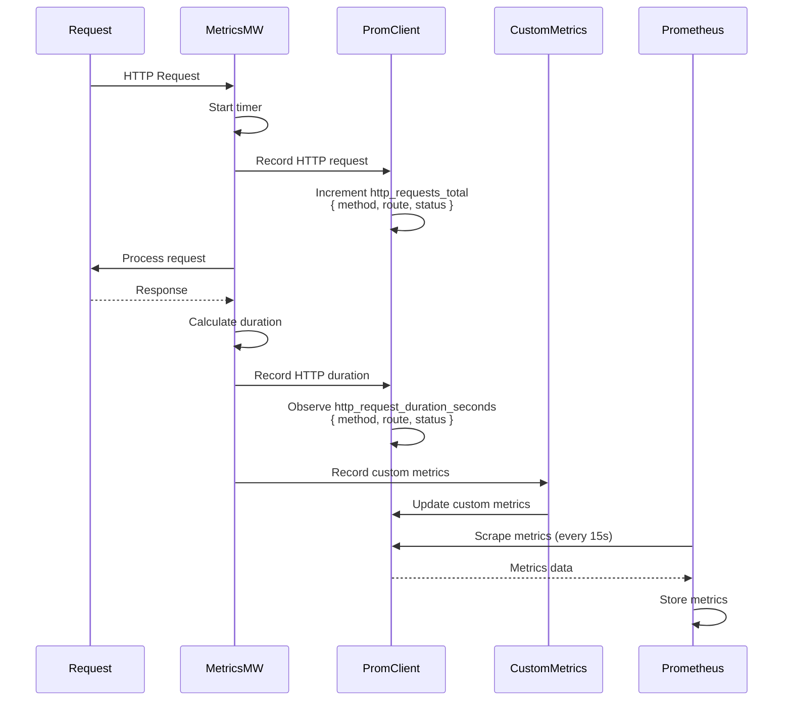
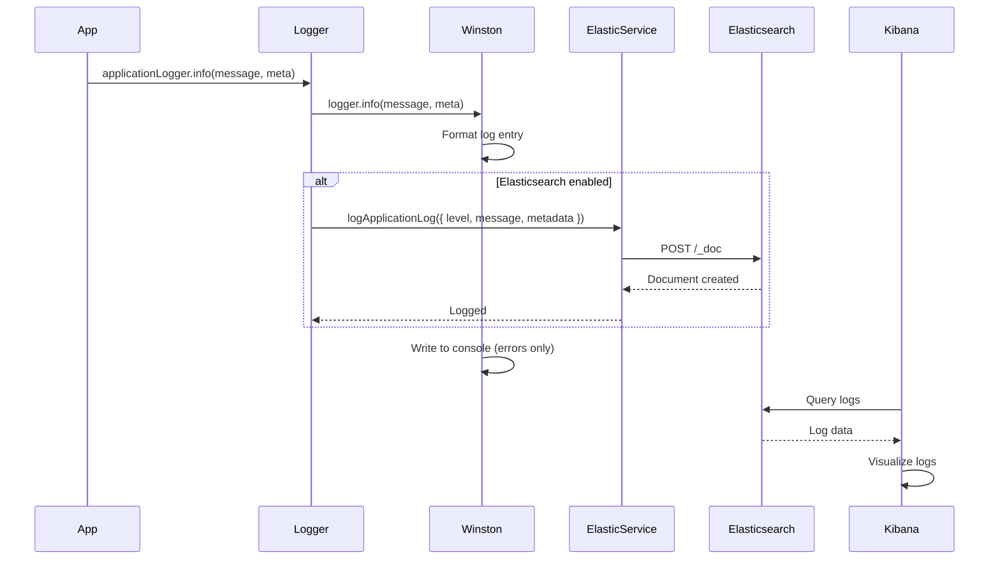
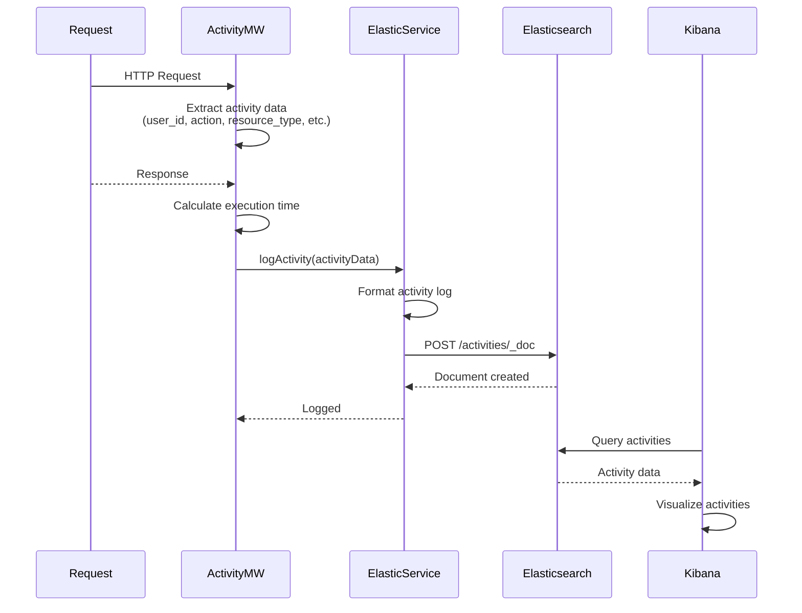
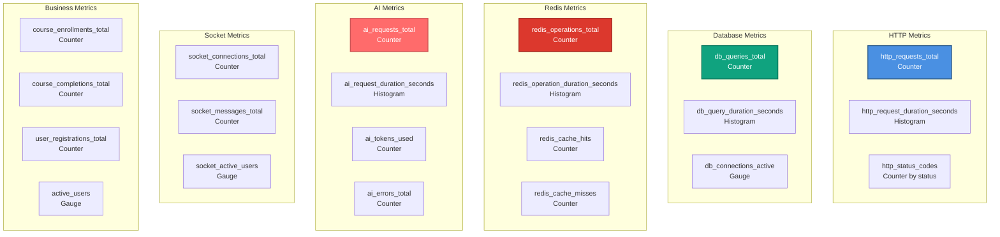
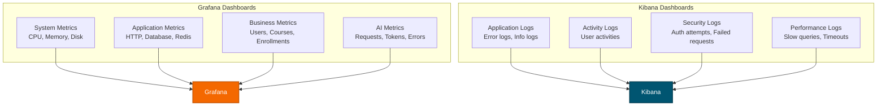
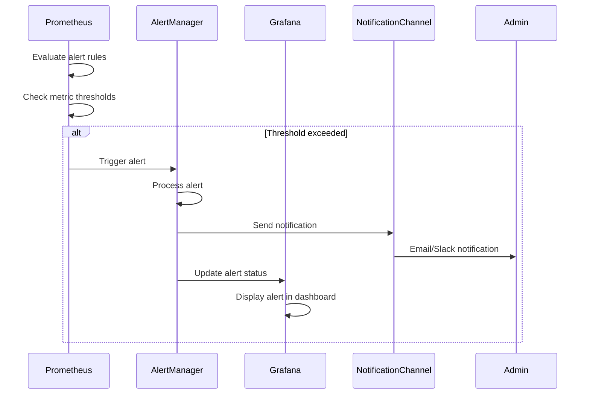

# 📊 Kiến Trúc Giám Sát và Quan Sát - StudyMate

**Ngày tạo:** 2026-01-02  
**Phiên bản:** 1.0.0

---

## 📋 Tổng Quan

Hệ thống giám sát và quan sát bao gồm:
- **Metrics Collection** - Thu thập metrics với Prometheus
- **Logging System** - Ghi log với Winston + Elasticsearch
- **Activity Tracking** - Theo dõi hoạt động người dùng
- **Visualization** - Hiển thị với Grafana và Kibana
- **Alerting** - Cảnh báo khi có vấn đề

---

## 🏗️ 1. Component Architecture



---

## 📊 2. Metrics Collection Flow



---

## 📝 3. Logging Flow



---

## 📋 4. Activity Logging Flow



---

## 📊 5. Metrics Types



---

## 📈 6. Dashboard Structure



---

## 🔔 7. Alerting Flow



---

## 📊 8. Log Structure

### Application Log
```javascript
{
  level: 'info' | 'error' | 'warn' | 'debug',
  message: String,
  timestamp: ISO8601,
  metadata: {
    type: 'application' | 'api' | 'database' | 'ai' | 'socket',
    operation: String,
    userId: UUID (Optional),
    execution_time_ms: Number (Optional),
    // ... additional context
  }
}
```

### Activity Log
```javascript
{
  user_id: UUID (Optional),
  action: String (e.g., 'enroll_course', 'complete_content'),
  route_name: String,
  route_path: String,
  route_base: String,
  resource_type: String (e.g., 'course', 'content'),
  resource_id: UUID (Optional),
  ip_address: String,
  user_agent: String,
  session_id: String,
  execution_time_ms: Number,
  details: JSON (Optional),
  timestamp: ISO8601
}
```

---

## 🔗 9. Metrics Endpoints

| Method | Endpoint | Description | Auth Required |
|--------|----------|-------------|---------------|
| GET | `/metrics` | Prometheus metrics endpoint | No (Public) |
| GET | `/health` | Health check endpoint | No (Public) |

---

## 📝 Ghi Chú

### Metrics Collection
- **Scrape Interval**: Prometheus scrapes every 15 seconds
- **Retention**: Metrics retained for 30 days
- **Cardinality**: Limit label cardinality to prevent explosion

### Logging Best Practices
- **Structured Logging**: All logs in JSON format
- **Log Levels**: Use appropriate levels (info, error, warn, debug)
- **No PII**: Avoid logging sensitive information
- **Context**: Include relevant context in metadata

### Performance Considerations
- **Async Logging**: Logs sent asynchronously to Elasticsearch
- **Batching**: Batch logs when possible
- **Sampling**: Sample high-volume logs if needed
- **Indexing**: Proper index management in Elasticsearch

### Alert Rules Examples
- **High Error Rate**: Error rate > 5% in 5 minutes
- **Slow Response Time**: P95 latency > 2 seconds
- **Database Issues**: DB connection pool > 80% full
- **AI Service Down**: AI error rate > 50% in 1 minute

---

**Tác giả:** StudyMate Development Team  
**Cập nhật:** 2026-01-02

