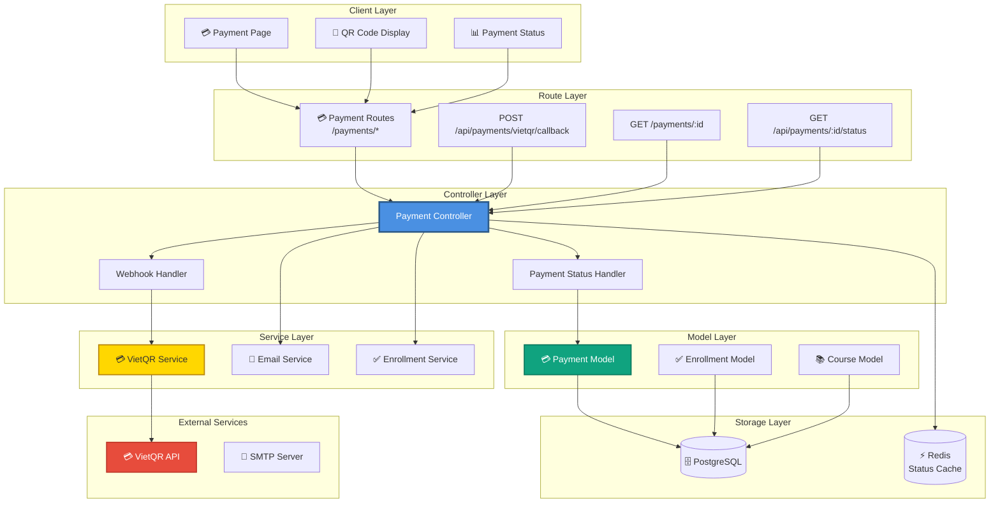
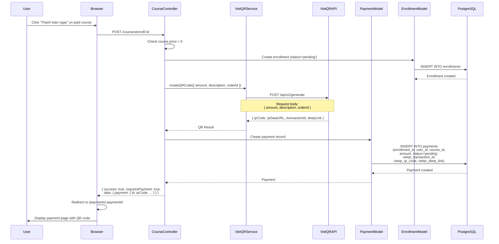
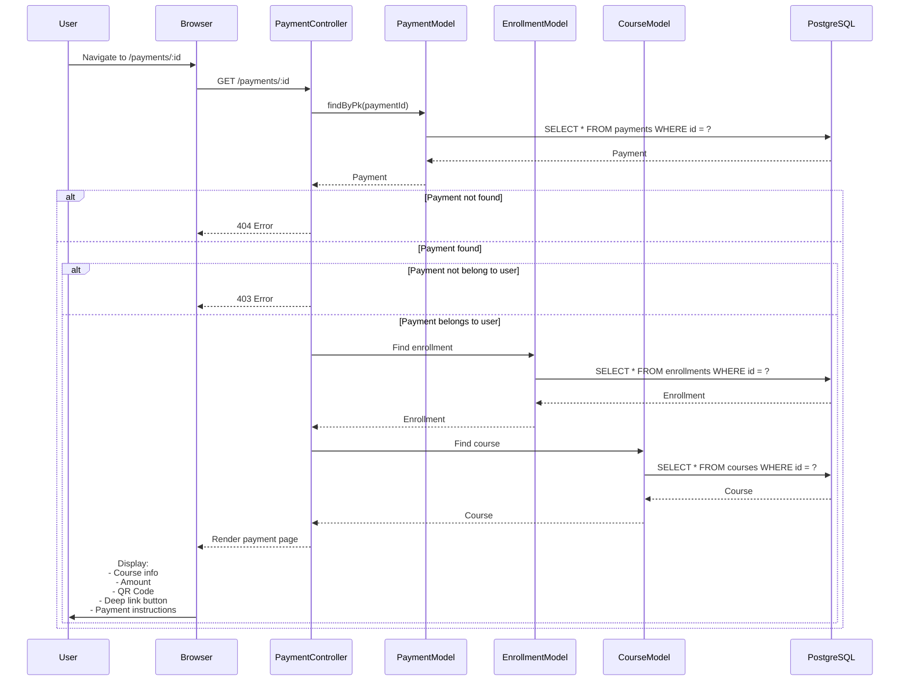
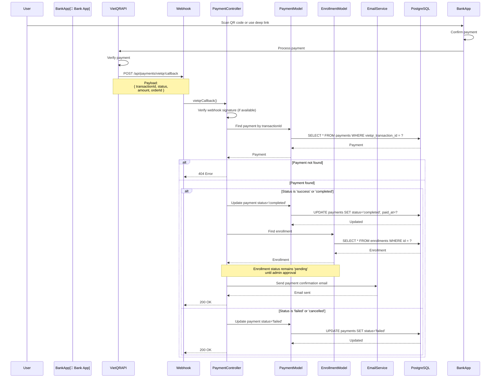
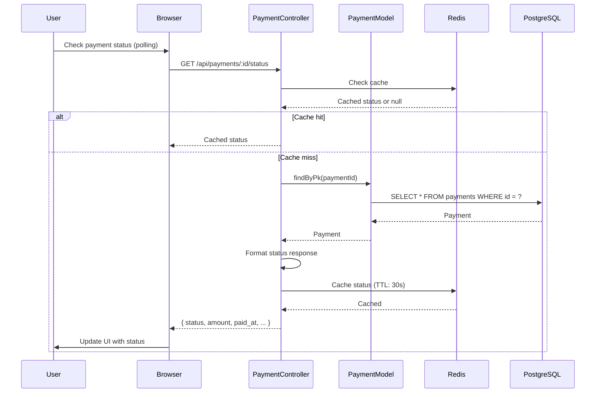
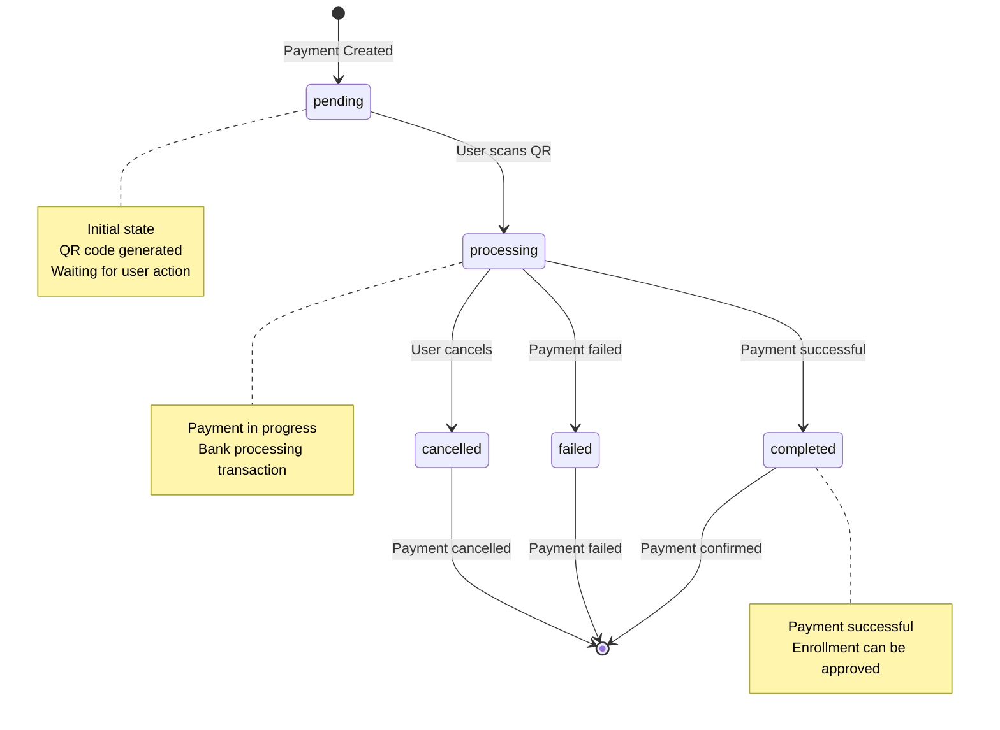
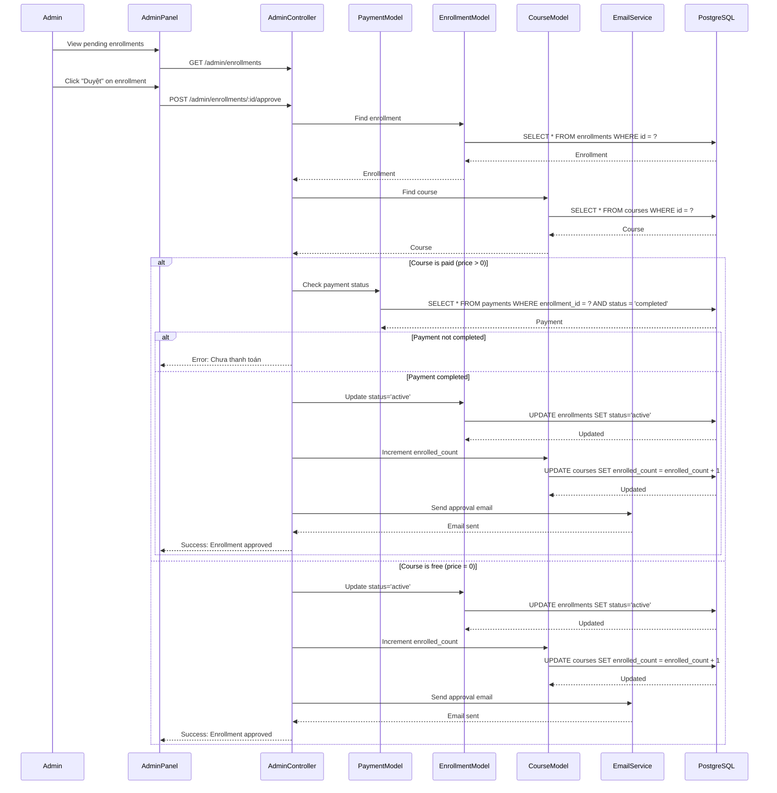

# 💳 Kiến Trúc Hệ Thống Thanh Toán - StudyMate

**Ngày tạo:** 2026-01-02  
**Phiên bản:** 1.0.0

---

## 📋 Tổng Quan

Hệ thống thanh toán tích hợp với **VietQR** để xử lý thanh toán cho khóa học có phí:
- **QR Code Generation** - Tạo mã QR để quét thanh toán
- **Payment Tracking** - Theo dõi trạng thái thanh toán
- **Webhook Callback** - Nhận callback từ VietQR khi thanh toán thành công
- **Payment Verification** - Xác minh và cập nhật trạng thái enrollment

---

## 🏗️ 1. Component Architecture



---

## 🔄 2. Payment Creation Flow



---

## 📱 3. Payment Page Flow



---

## 💰 4. Payment Processing Flow



---

## 🔍 5. Payment Status Check Flow



---

## 📊 6. Payment States Diagram



---

## 🔄 7. Enrollment Approval Flow (After Payment)



---

## 📊 8. Data Models

### Payment Model
```javascript
{
  id: UUID (Primary Key),
  enrollment_id: UUID (Foreign Key -> enrollments.id),
  user_id: UUID (Foreign Key -> users.id),
  course_id: UUID (Foreign Key -> courses.id),
  amount: Decimal(10,2) (Required),
  payment_method: String (Default: 'vietqr'),
  status: ENUM('pending', 'processing', 'completed', 'failed', 'cancelled'),
  vietqr_transaction_id: String (Unique, Optional),
  vietqr_qr_code: String (QR code image URL),
  vietqr_deep_link: String (Deep link for bank app),
  payment_data: JSON (Additional payment info),
  paid_at: Date (Optional),
  created_at: Date,
  updated_at: Date
}
```

---

## 🔗 9. API Endpoints

| Method | Endpoint | Description | Auth Required |
|--------|----------|-------------|---------------|
| GET | `/payments/:id` | Get payment details | Yes (Owner) |
| GET | `/api/payments/:id/status` | Check payment status | Yes (Owner) |
| POST | `/api/payments/vietqr/callback` | VietQR webhook callback | No (Public) |
| GET | `/admin/payments` | List all payments (Admin) | Yes (Admin) |
| GET | `/admin/payments/:id` | Get payment details (Admin) | Yes (Admin) |

---

## 📝 Ghi Chú

### Payment Status Flow
1. **pending** - Payment created, QR code generated, waiting for user
2. **processing** - User scanned QR, bank processing transaction
3. **completed** - Payment successful, enrollment can be approved
4. **failed** - Payment failed (insufficient funds, etc.)
5. **cancelled** - User cancelled payment

### VietQR Integration
- **QR Code**: Static QR code image URL
- **Deep Link**: `vietqr://` protocol link to open bank app directly
- **Transaction ID**: Unique identifier from VietQR
- **Webhook**: Callback URL to receive payment status updates

### Security Considerations
1. **Webhook Verification**: Verify webhook signature (if provided by VietQR)
2. **Idempotency**: Handle duplicate webhook calls
3. **Amount Verification**: Verify payment amount matches course price
4. **Status Updates**: Only update status from lower to higher states

### Error Handling
- **Payment Timeout**: Handle cases where payment takes too long
- **Webhook Failures**: Retry mechanism for failed webhooks
- **Status Sync**: Periodic sync with VietQR API to check payment status

---

**Tác giả:** StudyMate Development Team  
**Cập nhật:** 2026-01-02

