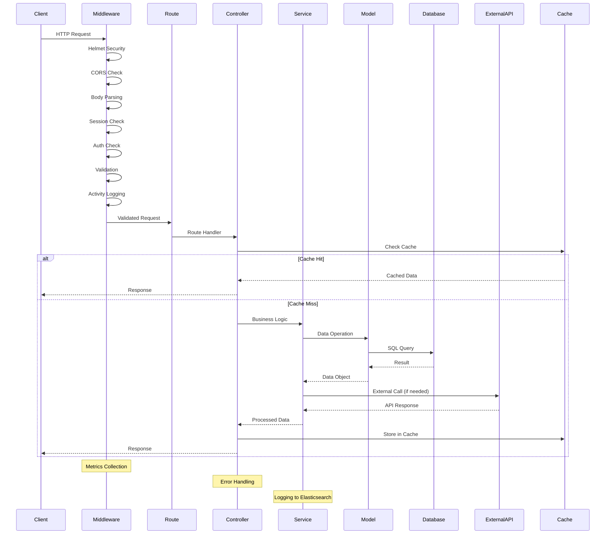
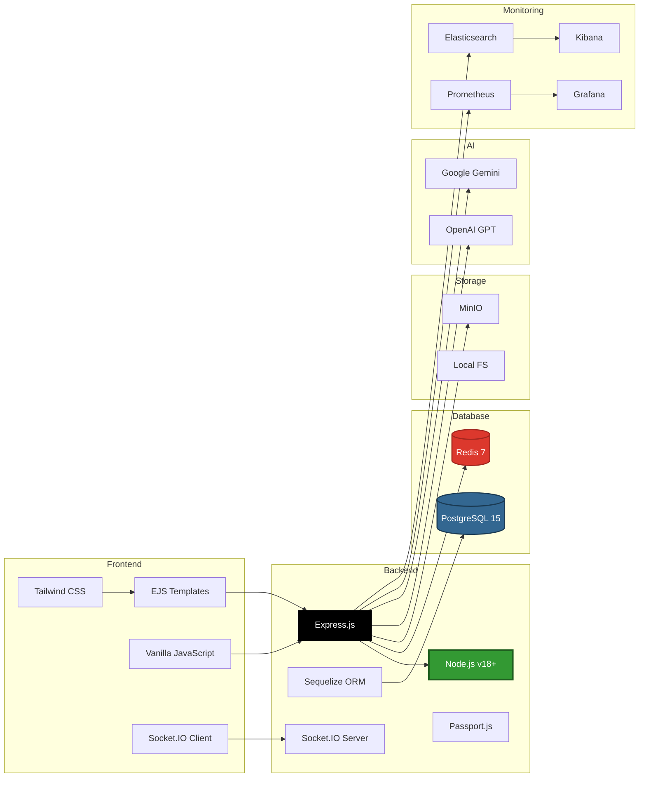
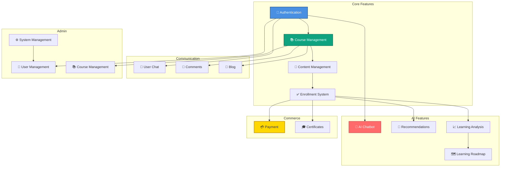
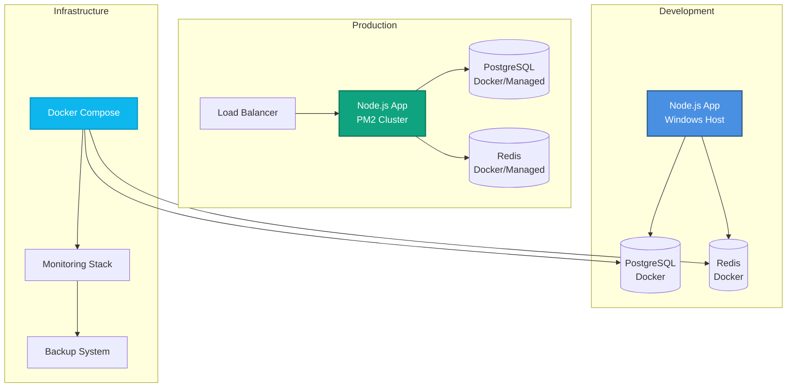

# 🏗️ Tổng Quan Kiến Trúc Hệ Thống - StudyMate

**Ngày tạo:** 2026-01-02  
**Phiên bản:** 1.0.0

---

## 📋 Tổng Quan

StudyMate là nền tảng học tập thông minh được xây dựng với kiến trúc MVC, sử dụng Node.js/Express, PostgreSQL, Redis, và tích hợp nhiều dịch vụ bên ngoài.

---

## 🏗️ 1. System Architecture Overview

```mermaid
graph TB
    subgraph "Client Layer"
        Browser[🌐 Web Browser]
        Mobile[📱 Mobile App]
    end

    subgraph "Application Layer - Node.js/Express"
        App[📦 StudyMate App<br/>Port: 3000]
        
        subgraph "Middleware Stack"
            Helmet[🔒 Helmet Security]
            CORS[🌐 CORS]
            BodyParser[📝 Body Parser]
            Session[🍪 Session Management]
            Passport[🔐 Passport Auth]
            AuthMW[🔐 Auth Middleware]
            ValidMW[✅ Validation]
            LogMW[📝 Activity Logger]
            MetricsMW[📊 Metrics]
            ErrorMW[⚠️ Error Handler]
        end
        
        subgraph "Route Layer"
            AuthRoute[🔑 Auth Routes]
            CourseRoute[📚 Course Routes]
            AIRoute[🤖 AI Routes]
            ChatRoute[💬 Chat Routes]
            AdminRoute[👨‍💼 Admin Routes]
            APIRoute[🔌 API Routes]
        end
        
        subgraph "Controller Layer"
            AuthCtrl[Auth Controller]
            CourseCtrl[Course Controller]
            AICtrl[AI Controller]
            ChatCtrl[Chat Controller]
            AdminCtrl[Admin Controller]
        end
        
        subgraph "Service Layer"
            AIService[🤖 AI Service]
            EmailService[📧 Email Service]
            MinIOService[📦 MinIO Service]
            VietQRService[💳 VietQR Service]
            CertService[🎓 Certificate Service]
            ElasticService[📊 Elasticsearch Service]
        end
    end

    subgraph "Data Layer"
        PostgreSQL[(🗄️ PostgreSQL<br/>Port: 5432)]
        Redis[(⚡ Redis Cache<br/>Port: 6379)]
    end

    subgraph "External Services"
        OpenAI[🤖 OpenAI API]
        Gemini[🤖 Google Gemini API]
        SMTP[📧 SMTP Server]
        VietQR[💳 VietQR API]
        GoogleOAuth[🌐 Google OAuth]
    end

    subgraph "Infrastructure - Docker"
        MinIO[📦 MinIO<br/>Port: 9000/9001]
        Elasticsearch[📊 Elasticsearch<br/>Port: 9200]
        Kibana[📈 Kibana<br/>Port: 5601]
        Prometheus[📊 Prometheus<br/>Port: 9090]
        Grafana[📈 Grafana<br/>Port: 3001]
        Kafka[📨 Kafka<br/>Port: 9092]
        SonarQube[🔍 SonarQube<br/>Port: 9002]
        Vault[🔐 HashiCorp Vault<br/>Port: 8200]
    end

    Browser --> App
    Mobile --> App
    
    App --> Helmet
    App --> CORS
    App --> BodyParser
    App --> Session
    App --> Passport
    App --> AuthMW
    App --> ValidMW
    App --> LogMW
    App --> MetricsMW
    App --> ErrorMW
    
    AuthMW --> AuthRoute
    ValidMW --> CourseRoute
    LogMW --> AIRoute
    MetricsMW --> ChatRoute
    ErrorMW --> AdminRoute
    
    AuthRoute --> AuthCtrl
    CourseRoute --> CourseCtrl
    AIRoute --> AICtrl
    ChatRoute --> ChatCtrl
    AdminRoute --> AdminCtrl
    
    AuthCtrl --> PostgreSQL
    CourseCtrl --> PostgreSQL
    AICtrl --> AIService
    ChatCtrl --> PostgreSQL
    
    AIService --> OpenAI
    AIService --> Gemini
    AIService --> Redis
    
    EmailService --> SMTP
    VietQRService --> VietQR
    CertService --> MinIO
    ElasticService --> Elasticsearch
    
    App --> PostgreSQL
    App --> Redis
    App --> MinIO
    App --> Elasticsearch
    
    LogMW --> ElasticService
    MetricsMW --> Prometheus
    
    Prometheus --> Grafana
    Elasticsearch --> Kibana
    
    Passport --> GoogleOAuth
    
    style App fill:#4A90E2,stroke:#2E5C8A,stroke-width:3px,color:#fff
    style PostgreSQL fill:#336791,stroke:#1A3A52,stroke-width:2px,color:#fff
    style Redis fill:#DC382D,stroke:#A0261E,stroke-width:2px,color:#fff
    style MinIO fill:#FFD700,stroke:#B8860B,stroke-width:2px
    style Elasticsearch fill:#005571,stroke:#003D52,stroke-width:2px,color:#fff
    style OpenAI fill:#10A37F,stroke:#0A7A5F,stroke-width:2px,color:#fff
    style Gemini fill:#4285F4,stroke:#1A73E8,stroke-width:2px,color:#fff
```



---

## 🔄 2. Request Flow Architecture



---

## 📦 3. Technology Stack



---

## 🎯 4. Feature Modules



---

## 📊 5. Ports Summary

| Service | Port | Description |
|---------|------|-------------|
| Application | 3000 | Main application server |
| PostgreSQL | 5432 | Primary database |
| Redis | 6379 | Cache and session store |
| MinIO API | 9000 | Object storage API |
| MinIO Console | 9001 | MinIO admin console |
| Elasticsearch | 9200 | Log storage |
| Kibana | 5601 | Log visualization |
| Prometheus | 9090 | Metrics collection |
| Grafana | 3001 | Metrics visualization |
| Kafka | 9092 | Message queue |
| Zookeeper | 2181 | Kafka coordination |
| Kafka UI | 8080 | Kafka management UI |
| SonarQube | 9002 | Code quality analysis |
| Vault | 8200 | Secrets management |

---

## 🔗 6. Key Design Patterns

1. **MVC Pattern**: Routes → Controllers → Models
2. **Service Layer**: Business logic separation
3. **Middleware Chain**: Request processing pipeline
4. **Repository Pattern**: Data access abstraction
5. **Strategy Pattern**: AI service fallback mechanism
6. **Observer Pattern**: Socket.IO event handling

---

## 📝 7. File Structure

```
studymate/
├── app.js                 # Main application entry
├── index.js              # Alternative entry point
├── config/               # Configuration files
│   ├── database.js       # Database config
│   ├── logger.js         # Logging config
│   ├── passport.js       # Passport config
│   └── redis.js          # Redis config
├── controllers/          # Business logic (MVC)
│   ├── admin/           # Admin controllers
│   ├── authController.js
│   ├── courseController.js
│   ├── aiController.js
│   └── chatController.js
├── routes/              # Route definitions
│   ├── auth.js
│   ├── courses.js
│   ├── ai.js
│   └── chat.js
├── models/              # Sequelize models
│   ├── User.js
│   ├── Course.js
│   ├── Enrollment.js
│   └── ...
├── services/            # External services
│   ├── aiService.js
│   ├── emailService.js
│   ├── vietQRService.js
│   └── ...
├── middleware/          # Express middleware
│   ├── auth.js
│   ├── errorHandler.js
│   ├── activityLogger.js
│   └── metrics.js
├── views/               # EJS templates
│   ├── layouts/
│   ├── pages/
│   └── partials/
└── public/              # Static assets
    ├── css/
    ├── js/
    └── images/
```

---

## 🚀 8. Deployment Architecture



---

## 📝 Ghi Chú

### Scalability Considerations
- **Horizontal Scaling**: PM2 cluster mode for multiple processes
- **Database Pooling**: Connection pooling for PostgreSQL
- **Redis Caching**: Reduce database load
- **Stateless Auth**: JWT tokens for API calls
- **Message Queue**: Kafka for async processing

### Security Measures
- **Helmet**: Security headers
- **CORS**: Cross-origin resource sharing
- **Rate Limiting**: Prevent abuse
- **Input Validation**: Sanitize all inputs
- **SQL Injection Prevention**: Sequelize parameterized queries
- **XSS Prevention**: Escape user content

### Performance Optimization
- **Caching**: Redis for frequently accessed data
- **Database Indexes**: Optimize queries
- **Lazy Loading**: Load content on demand
- **Asset Optimization**: Minify CSS/JS
- **CDN**: Static assets via CDN (production)

---

**Tác giả:** StudyMate Development Team  
**Cập nhật:** 2026-01-02

